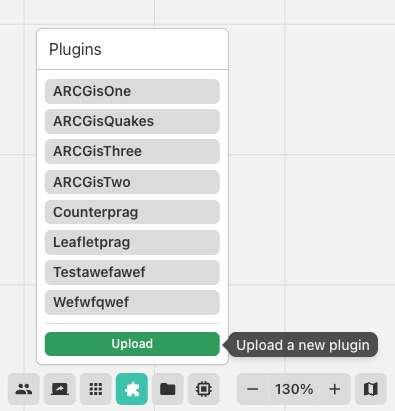
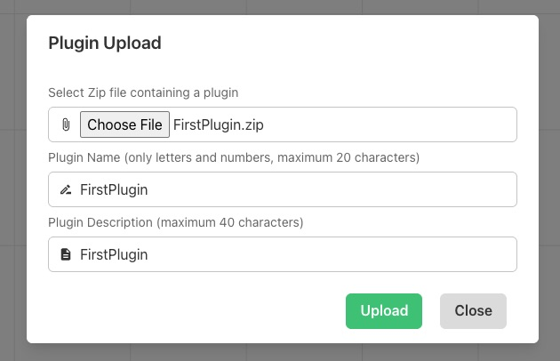
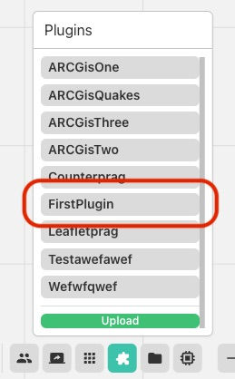
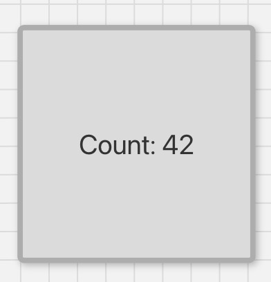
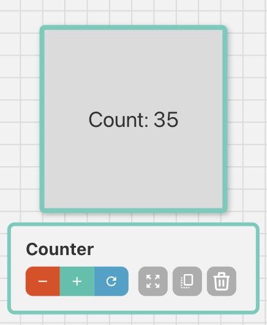

# Application Development

SAGE3 supports two types of applications: **Plugin Applications** (developed externally and uploaded as a ZIP) and **Integrated Applications** (developed inside the SAGE3 source code). This page covers both.

---

## Plugin Applications

Plugin apps are web applications developed outside the SAGE3 codebase and uploaded to a SAGE3 server. They run inside an isolated iframe on the board. Any web framework is supported (Vanilla JS, React, Vue, Svelte, etc.).

The optional `@sage3/sageplugin` npm package lets your plugin sync state across all connected users.

**Key requirement:** All asset paths in your `index.html` must be **relative** (e.g. `./script.js` not `/script.js`), so the app loads correctly when hosted inside SAGE3.

---

### Building a Plugin with TypeScript / Vite

1. **Create a new Vite project:**

```bash
npm create vite@latest my-sage3-plugin
# Select: Vanilla → TypeScript (or any framework)
```

2. **Install and configure:**

```bash
cd my-sage3-plugin
npm install
```

Create or update `vite.config.ts` to set relative paths and a consistent output folder:

```typescript
import { defineConfig } from 'vite';

export default defineConfig({
  base: './',
  build: {
    outDir: './dist/sage3_plugin_app',
  },
});
```

3. **(Optional) Add the SAGE3 plugin library:**

```bash
npm install @sage3/sageplugin
```

4. **Use the plugin API to sync state:**

```typescript
import { SAGE3Plugin } from '@sage3/sageplugin';

type MyState = { count: number };

const s3 = new SAGE3Plugin<MyState>();

// React to state changes from other users
s3.subscribeToUpdates((state) => {
  const count = state.data.state.count;
  document.getElementById('counter')!.innerText = String(count);
});

// Push a state update to all users
document.getElementById('increment')!.addEventListener('click', () => {
  const current = s3.state.data.state.count;
  s3.update({ state: { count: current + 1 } });
});
```

5. **Build:**

```bash
npm run build
```

The output is in `dist/sage3_plugin_app/`. It must contain an `index.html`.

6. **ZIP the folder:**

```bash
cd dist
zip -r my-sage3-plugin.zip sage3_plugin_app/
```

---

### Building a Plugin with Plain JavaScript

No build step required. Create a folder with your HTML, CSS, and JS files. Use relative paths and load scripts as modules:

```html
<script type="module" src="./index.js"></script>
```

Optionally, load the plugin library directly from a CDN:

```javascript
import { SAGE3Plugin } from 'https://unpkg.com/@sage3/sageplugin@latest/src/lib/sageplugin.js';
```

ZIP the folder and upload.

---

### Building a Unity WebGL Plugin

1. Set Build Target to WebGL in Unity.
2. Disable compression: **Player Settings → Publishing Settings → Compression Format → Disabled**.
3. Build the project.
4. ZIP the Build output folder.
5. Upload (see below).

---

### Uploading a Plugin

1. Open SAGE3 and navigate to a board.
2. Open the **Plugin Menu** from the main toolbar at the bottom and click **Upload**.



3. Select your `.zip` file. Enter a name and description. Click **Upload**.



4. If successful your plugin should be listed in the **Plugins Menu**.



5. Click your Plugin to open an instance on the board.


---

## Integrated Applications

Integrated apps are built directly into the SAGE3 source code and compiled into the main webapp bundle. They have full access to SAGE3 stores, hooks, and UI components — and appear alongside the built-in apps in the Applications panel.

### Prerequisites

- Clone the repo and complete [Development Setup](Development-setup.md)
- Have the backend services and webstack running

---

### Scaffolding a New App

From the `webstack/` directory, run:

```bash
yarn newapp
```

Answer the prompts:

```
✔ App name: MyApp
✔ Developer name: Your Name
✔ State variable name: value
✔ Data type: number
✔ Default value: 0
```

This creates:

```
libs/applications/src/lib/apps/MyApp/
  MyApp.tsx      # AppComponent + ToolbarComponent
  index.ts       # Schema, initial state, display name
  styling.css    # App-specific CSS
```

The app is automatically registered in the app registry and will appear in the Applications panel in dev mode immediately (restart `yarn webapp` if it doesn't appear).

> To reset or repair the app registry: `yarn regen`

---

### App File Structure

#### `index.ts` — Schema and Metadata

Defines the app's state shape using [Zod](https://github.com/colinhacks/zod), its default values, and its display name.

```typescript
import { z } from 'zod';

export const schema = z.object({
  count: z.number(),
  // Add executeInfo if you want Python-side execution triggers
  executeInfo: z.object({
    executeFunc: z.string(),
    params: z.any(),
  }),
});
export type state = z.infer<typeof schema>;

export const init: Partial<state> = {
  count: 42,
  executeInfo: { executeFunc: '', params: {} },
};

export const name = 'Counter';
```

The four exports — `schema`, `state`, `init`, and `name` — are required. The generator adds your app to the shared `apps.ts`, `types.ts`, and `initialValues.ts` files automatically.

---

#### `MyApp.tsx` — React Components

Every app exports two components: `AppComponent` (the window) and `ToolbarComponent` (the toolbar shown below the app when selected). A `GroupedToolbarComponent` for multi-select actions is optional.

```typescript
export default { AppComponent, ToolbarComponent, GroupedToolbarComponent };
```

Both components receive the full application element as a React prop (`props: App`) and return a `JSX.Element`. The prop includes the app's state, position, size, and the system-managed fields `_id`, `_createdAt`, `_updatedAt`, `_updatedBy`, and `_createdBy`.

---

### App Schema Reference

Every SAGE3 app instance is stored in the `apps` collection with the following shape:

```typescript
type AppSchema = {
  title: string;       // Display title in the app title bar
  roomId: string;      // Room the app belongs to
  boardId: string;     // Board the app is placed on
  position: { x: number; y: number; z: number };
  size: { width: number; height: number; depth: number };
  rotation: { x: number; y: number; z: number };
  type: AppName;       // e.g. 'Stickie', 'PDFViewer', 'Counter'
  state: AppState;     // Your app's custom state
  raised: boolean;     // Whether the app is raised above others
};
```

Every document in SAGEBase also gets these system-managed fields added automatically — do not write to them:

```typescript
{
  _id: string;         // Unique identifier
  _createdAt: number;  // Unix timestamp (ms)
  _updatedAt: number;
  _createdBy: string;  // User ID
  _updatedBy: string;
}
```

---

### Accessing State

Extract the typed state at the start of each component:

```typescript
function AppComponent(props: App): JSX.Element {
  const s = props.data.state as AppState;
  // s.count is typed as number — hover in VSCode to inspect
}
```

**Wrapping your UI in `AppWindow`:**

```typescript
return (
  <AppWindow app={props}>
    <Box width="100%" height="100%" display="flex" alignItems="center" justifyContent="center">
      <Text fontSize="5xl">Count: {s.count}</Text>
    </Box>
  </AppWindow>
);
```

`AppWindow` handles window move/resize/scale and the app title bar. Always wrap your component in it.



---

### Updating State

Use `updateState` from `useAppStore`. Only send the fields that changed — the update is merged with the existing state:

```typescript
const updateState = useAppStore((state) => state.updateState);

updateState(props._id, { count: s.count + 1 });
```

Updates are broadcast to all connected users automatically. React re-renders when the updated state arrives back from the server.

---

### Reacting to State Changes with `useEffect`

**Run code once when the app mounts:**

```typescript
useEffect(() => {
  // Runs once when the component is first rendered
}, []);
```

**Run code when a specific state field changes:**

```typescript
useEffect(() => {
  // Runs every time assetid changes on the server
}, [props.data.state.assetid]);
```

> **Important:** Do not update SAGE3 state inside a `useEffect` that depends on SAGE3 state, or you will create an infinite update loop. Only update state in response to direct user actions (button clicks, input changes).

---

### Toolbar

The toolbar appears below the app when it is selected. Put your most-used controls there. SAGE3 automatically adds Zoom, Duplicate, and Close buttons — your controls appear alongside them.

```typescript
function ToolbarComponent(props: App): JSX.Element {
  const s = props.data.state as AppState;
  const updateState = useAppStore((state) => state.updateState);

  return (
    <ButtonGroup isAttached size="xs" colorScheme="teal">
      <Tooltip label="Decrease" placement="top" hasArrow openDelay={400}>
        <Button onClick={() => updateState(props._id, { count: s.count - 1 })}>
          <MdRemove />
        </Button>
      </Tooltip>
      <Tooltip label="Increase" placement="top" hasArrow openDelay={400}>
        <Button onClick={() => updateState(props._id, { count: s.count + 1 })}>
          <MdAdd />
        </Button>
      </Tooltip>
    </ButtonGroup>
  );
}
```



---

### SAGE3 State vs. Local React State

This is the most important concept to internalize when building integrated apps:

| | SAGE3 State (`updateState`) | React Local State (`useState`) |
|---|---|---|
| **Storage** | Redis — persisted on the server | In-memory — per client only |
| **Sync** | Broadcast to all connected users | Not shared |
| **Use for** | Anything that should be visible to other users | Loading indicators, local form values, UI-only toggles |

Never use `useState` for values that need to be shared. Never use `updateState` for values that are purely local UI state.

---

### Creating Other Apps from Your App

```typescript
const createApp = useAppStore((state) => state.create);

createApp({
  title: 'New Stickie',
  roomId: props.data.roomId,
  boardId: props.data.boardId,
  position: { x: props.data.position.x + props.data.size.width + 20, y: props.data.position.y, z: 0 },
  size: { width: 400, height: 300, depth: 0 },
  rotation: { x: 0, y: 0, z: 0 },
  type: 'Stickie',
  state: { text: 'Auto-created note', color: 'yellow', fontSize: 24, lock: false },
  raised: true,
});
```

---

### Available Stores

Your app components import stores and hooks from `@sage3/frontend`. Here are the most commonly used:

```typescript
import {
  useAppStore,      // CRUD on apps + updateState
  useUIStore,       // Board UI state: scale, position, selected app
  useAssetStore,    // Assets in the current room
  useUsersStore,    // All connected users
  usePresenceStore, // Live user cursors and viewports
  useConfigStore,   // Server configuration
  useUser,          // Current user profile
  useRouteNav,      // Navigation helpers
  useHotkeys,       // Register keyboard shortcuts
} from '@sage3/frontend';
```

---

#### AppStore

The primary store for working with apps on the board.

```typescript
const createApp  = useAppStore((state) => state.create);
const updateApp  = useAppStore((state) => state.update);   // position/size/raised
const deleteApp  = useAppStore((state) => state.delete);
const updateState = useAppStore((state) => state.updateState); // your app's data
const duplicateApps = useAppStore((state) => state.duplicateApps);
const apps = useAppStore((state) => state.apps); // all apps on the board
```

Use `updateState` to change your app's data fields. Use `updateApp` to change position, size, or `raised`.

---

#### UIStore

Contains the current board's UI state — scale, viewport position, selected app, panel visibility, whiteboard settings, lasso state, and more.

```typescript
// Current zoom level (1.0 = 100%)
const scale = useUIStore((state) => state.scale);

// Current board scroll position in board coordinates
const boardPosition = useUIStore((state) => state.boardPosition);

// The currently selected app's ID (empty string if none)
const selectedAppId = useUIStore((state) => state.selectedAppId);
```

The UIStore is defined in `webstack/libs/frontend/src/lib/stores/ui.ts` and is used internally by `AppWindow` and the board layers. Read from it freely; write to it only through its provided setters.

---

#### AssetStore

Provides access to all files uploaded to the current room.

```typescript
const assets = useAssetStore((state) => state.assets);
```

Each asset has the following shape:

```typescript
{
  file: string;            // Unique server filename (UUID-based)
  owner: string;           // User ID of uploader
  room: string;            // Room ID the file belongs to
  originalfilename: string; // Filename at upload time
  path: string;            // Server filesystem path
  dateCreated: string;     // ISO date string
  dateAdded: string;
  mimetype: string;        // MIME type
  destination: string;     // Server upload directory
  size: number;            // File size in bytes
  metadata?: string;       // Path to JSON metadata file (extracted via EXIFTool)
  derived?: ExtraImageData | ExtraPDFData; // Pre-processed data for viewers
}
```

The `derived` field is populated after upload and contains pre-processed data for the ImageViewer and PDFViewer:

```typescript
// For images — multiple pre-generated resolutions
ExtraImageData = {
  fullSize: string;
  width: number;
  height: number;
  aspectRatio: number;
  filename: string;
  url: string;
  sizes: Array<{
    url: string;
    format: string;   // 'webp'
    size: number;
    width: number;
    height: number;
    channels: number;
    premultiplied: boolean;
  }>;
}

// For PDFs — array of pages, each page is an array of image resolutions
ExtraPDFData = Array<Array<ImageInfo>>;
```

To find a specific asset by ID:

```typescript
const asset = assets.find((a) => a._id === props.data.state.assetid);
```

---

### Python-Side Execution with `executeInfo`

If your app needs to trigger Python code in the Seer backend, include `executeInfo` in your schema. Set it from your toolbar or app UI:

```typescript
updateState(props._id, {
  executeInfo: {
    executeFunc: 'my_python_function',
    params: { someParam: 'value' },
  },
});
```

In Seer, register a handler that watches for `executeFunc` changes and responds. See [Development Setup — Seer](Development-setup.md#5-seer-ai-service-python) for how to run the Seer service locally.

---

### UI Library

SAGE3 uses [Chakra UI v2](https://v2.chakra-ui.com/) for styling. Use Chakra components (`Box`, `Text`, `Button`, `Flex`, etc.) and `useColorModeValue` for consistent light/dark theme behavior. Keep font sizes large enough to be readable on wall displays.

---

### Adding New Packages

```bash
# In webstack/
yarn add <package-name>
yarn add -D @types/<package-name>   # if TypeScript types are needed
```

Then restart both `yarn start` and `yarn webapp`.

---

### Reference: Complete Counter App

**`index.ts`:**
```typescript
import { z } from 'zod';

export const schema = z.object({
  count: z.number(),
  executeInfo: z.object({ executeFunc: z.string(), params: z.any() }),
});
export type state = z.infer<typeof schema>;
export const init: Partial<state> = { count: 42, executeInfo: { executeFunc: '', params: {} } };
export const name = 'Counter';
```

**`Counter.tsx`:**
```typescript
import { useAppStore } from '@sage3/frontend';
import { Box, Button, ButtonGroup, Text, Tooltip } from '@chakra-ui/react';
import { App } from '../../schema';
import { state as AppState } from './index';
import { AppWindow } from '../../components';
import { MdAdd, MdRemove } from 'react-icons/md';

function AppComponent(props: App): JSX.Element {
  const s = props.data.state as AppState;
  return (
    <AppWindow app={props}>
      <Box width="100%" height="100%" display="flex" alignItems="center" justifyContent="center">
        <Text fontSize="5xl">Count: {s.count}</Text>
      </Box>
    </AppWindow>
  );
}

function ToolbarComponent(props: App): JSX.Element {
  const s = props.data.state as AppState;
  const updateState = useAppStore((state) => state.updateState);
  return (
    <ButtonGroup isAttached size="xs" colorScheme="teal">
      <Tooltip label="Decrease" placement="top" hasArrow openDelay={400}>
        <Button onClick={() => updateState(props._id, { count: s.count - 1 })} size="xs" px={0}>
          <MdRemove size="16px" />
        </Button>
      </Tooltip>
      <Tooltip label="Increase" placement="top" hasArrow openDelay={400}>
        <Button onClick={() => updateState(props._id, { count: s.count + 1 })} size="xs" px={0}>
          <MdAdd size="16px" />
        </Button>
      </Tooltip>
    </ButtonGroup>
  );
}

const GroupedToolbarComponent = () => null;
export default { AppComponent, ToolbarComponent, GroupedToolbarComponent };
```
