# Applications

SAGE3 provides a variety of applications that can be placed on the infinite canvas of a board. Each application runs inside a resizable window and is synchronized across all connected users in real time.

**Default Toolbar:** Every application includes a default toolbar with buttons to **Zoom to App**, **Duplicate**, and **Close**. The toolbars listed below describe the additional controls specific to each application.

---

## AssetLink

> *Opens automatically when files that are not natively supported by SAGE3 are dropped onto the board.*

Displays a download button to a file stored in the asset manager. Clicking the download icon will download the file locally to the user's computer. AssetLinks backgroudn are always orange. 

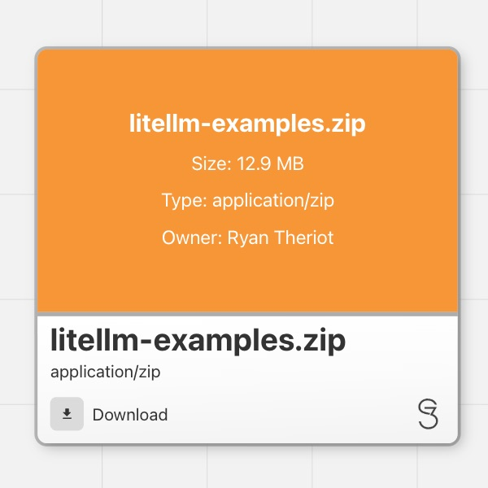

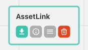

| Name | Type | Icon | Description |
|------|------|------|-------------|
| Download Asset | Button |  | Download the linked file |

---

## BoardLink

Paste a SAGE3 board URL onto the canvas to create a BoardLink. It displays a minimap preview of the linked board, giving you a visual snapshot of its layout. Click `Enter Board` to navigate directly to that board. Useful for organizing multi-board workflows or linking related workspaces. BoardLinks are easy to identify by their blue backgrounds.

<!-- TODO: Screenshot of BoardLink app -->
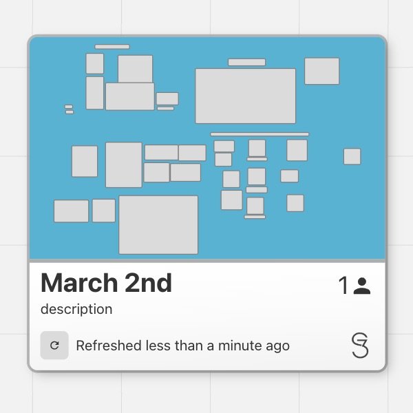

<!-- TODO: Screenshot of BoardLink toolbar -->
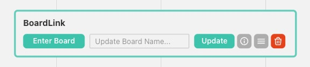

| Name | Type | Icon | Description |
|------|------|------|-------------|
| Enter Board | Button |  | Navigate to the linked board |
| Update Board Name | Text Input | | Edit the displayed board name (other-server links only) |
| Update | Button | | Submit the updated board name (other-server links only) |

---

## Calculator

A simple calculator for performing basic arithmetic. Supports addition, subtraction, multiplication, and division. A built-in history lets you review past calculations.

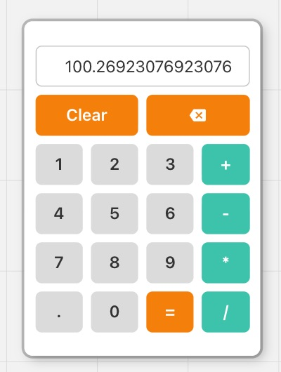

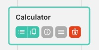

| Name | Type | Icon | Description |
|------|------|------|-------------|
| View History | Button |  | Opens a drawer showing past calculations |
| Copy Result | Button |  | Copies the current result to your clipboard |

---

## Chat

A messaging application for communicating with other users on the board. Chat windows can be placed anywhere on the canvas, letting you organize multiple conversations spatially alongside your other work.

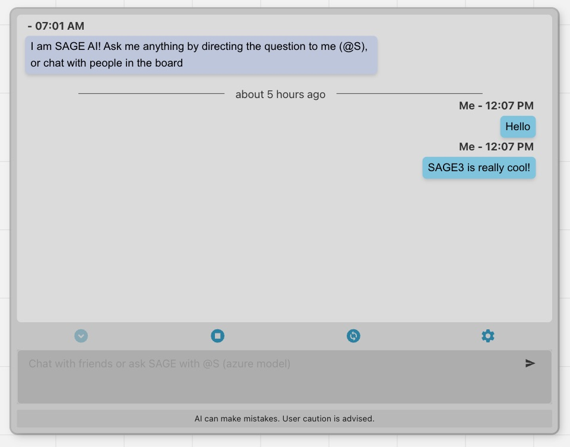

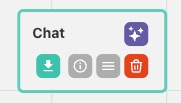

| Name | Type | Icon | Description |
|------|------|------|-------------|
| Download Transcript | Button |  | Downloads the full chat history as a `.txt` file |

---

## Clock

Displays the current time for any timezone. Useful for distributed teams working across different time zones or for displaying clocks on shared display walls.

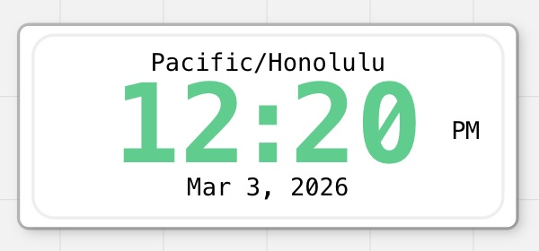

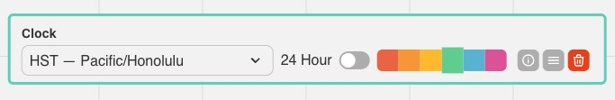

| Name | Type | Icon | Description |
|------|------|------|-------------|
| Timezone | Dropdown | | Select a timezone |
| 24 Hour | Toggle | | Switch between 12-hour and 24-hour format | 
| Color | Color Picker | | Change the clock digit color |

---

## CoBrowser

A shared web browser that streams a live Firefox session to all users on the board. Unlike a standard Webview (where each user loads the page independently), CoBrowser gives everyone a synchronized view of the same browser instance, including scroll position, interactions, and audio. The owner can choose to let all users control the browser, or lock it so only they can interact. Works in both the Electron desktop client and standard web browsers.

> **Note:** CoBrowser requires a VEO server to be configured on the SAGE3 server. Contact your server administrator if it is unavailable.

<!-- TODO: Screenshot of CoBrowser app -->
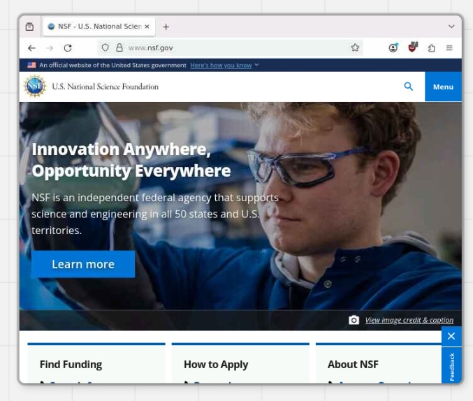

<!-- TODO: Screenshot of CoBrowser toolbar -->
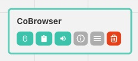

| Name | Type | Icon | Description |
|------|------|------|-------------|
| Lock / Unlock Control | Toggle | | (Owner only) When locked, only the owner can interact with the browser. When unlocked, all users can control it. |
| Paste Clipboard | Button | | Pastes your local clipboard text into the browser session |
| Toggle Audio | Toggle |   | Enable or disable audio from the browser session |

---

## CodeEditor

A collaborative code editor for writing and reviewing code in real time. Changes are synchronized across all users, making it ideal for pair programming, code reviews, or group problem-solving. Supports many languages including Python, JavaScript, TypeScript, C/C++, Java, HTML, CSS, JSON, Markdown, R, and YAML.

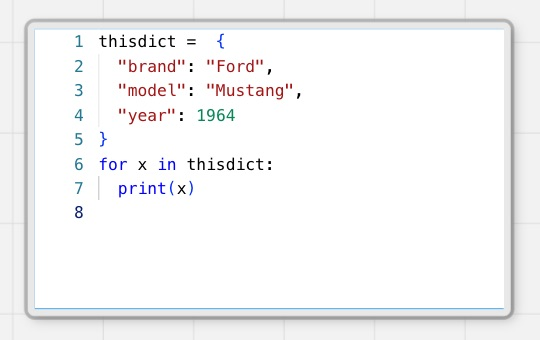

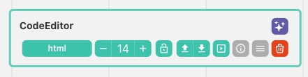

| Name | Type | Icon | Description |
|------|------|------|-------------|
| Language | Dropdown | | Select the programming language |
| Font Size - | Button |  | Decrease the font size |
| Font Size + | Button |  | Increase the font size |
| Read Only / Edit | Toggle |   | Toggle between locked and editable modes |
| Save to Asset Manager | Button |  | Upload the code to the server's asset manager |
| Download | Button |  | Download the code as a file |
| Preview | Button |  | For Markdown or HTML, opens a rendered preview |

---

## CSVViewer

> *Opens automatically when a CSV file is uploaded to the board.*

A tabular viewer for CSV files. The table is rendered using virtualization for efficient handling of large datasets. View-only -- data manipulation is not supported.

<!-- TODO: Screenshot of CSVViewer app -->
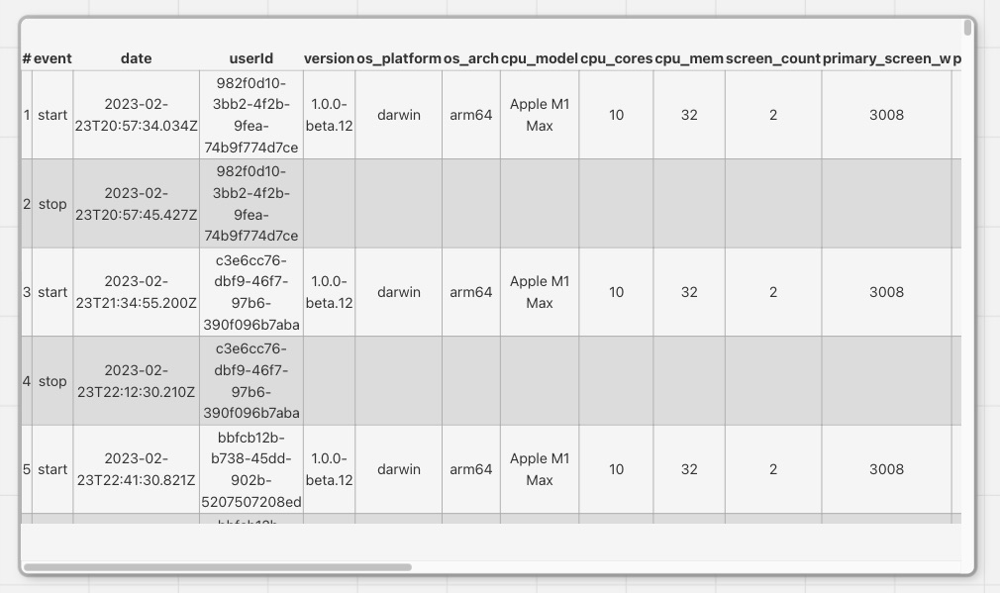

<!-- TODO: Screenshot of CSVViewer toolbar -->
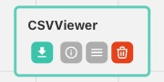

| Name | Type | Icon | Description |
|------|------|------|-------------|
| Download CSV | Button |  | Download the original CSV file |

---

## DeepZoomImage

> *Opens automatically when a large image is uploaded and processed into DeepZoom format.*

A viewer for DeepZoom images -- a tiled format for displaying extremely large, high-resolution images efficiently. Large images uploaded to the asset manager are processed and converted to DeepZoom format automatically. Pan and zoom smoothly through the image at any scale.

<!-- TODO: Screenshot of DeepZoomImage app -->
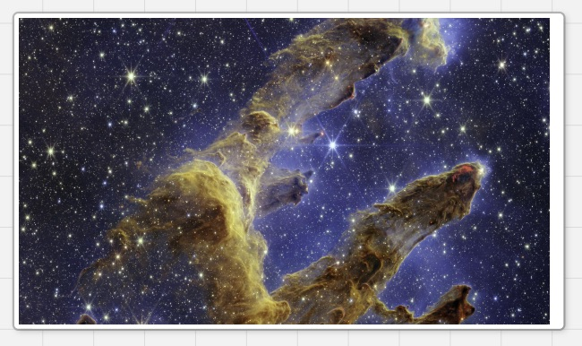

**Toolbar:** Default toolbar only (Zoom to App, Duplicate, Close).

---

## Drawing

A collaborative drawing application built on the TLDraw library. Draw freehand, create shapes, and add text on a shared canvas. All actions are synchronized in real time across users, making it great for brainstorming, sketching diagrams, or visual communication.

<!-- TODO: Screenshot of Drawing app -->
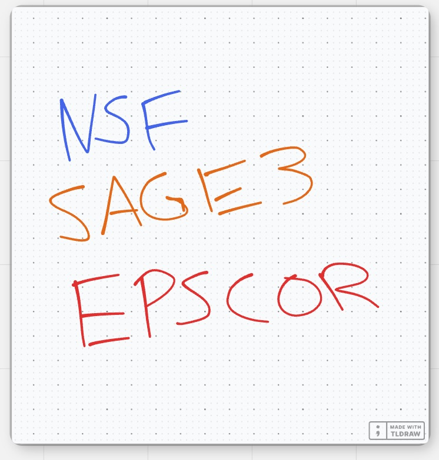

<!-- TODO: Screenshot of Drawing toolbar -->
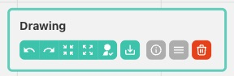

| Name | Type | Icon | Description |
|------|------|------|-------------|
| Undo | Button |  | Undo the last action |
| Redo | Button |  | Redo the last undone action |
| Zoom to Fit | Button |  | Fit the entire canvas into the window |
| Zoom to 100% | Button |  | Reset zoom level |
| Follow Me | Toggle |  | Other users' views follow your camera position |
| Export Image | Button |  | Export the drawing as an image on the board |

---

## ImageViewer

> *Opens automatically when an image is uploaded to the board.*

Displays uploaded images in common formats (JPEG, PNG, etc.). After uploading, images are scaled to multiple resolutions and converted to WebP for fast display. The viewer dynamically selects the best resolution based on window size, display DPI, and board zoom level. The original file is preserved for download. Supports AI-generated annotation overlays when available.

<!-- TODO: Screenshot of ImageViewer app -->
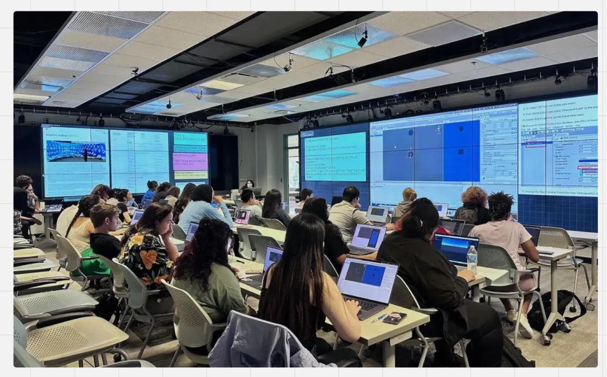

<!-- TODO: Screenshot of ImageViewer toolbar -->
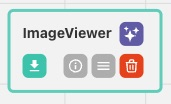

| Name | Type | Icon | Description |
|------|------|------|-------------|
| Download Image | Button |  | Download the original image file |
| Annotations | Toggle |  | Toggle AI-generated annotation boxes (when available) |

---

## Map

An interactive map powered by MapGL. Navigate by panning and zooming with the mouse or keyboard. Navigation is synchronized across all users so everyone sees the same view. Switch between street and satellite views, search for locations by address, and overlay GeoJSON or GeoTIFF data layers from uploaded assets.

<!-- TODO: Screenshot of Map app -->
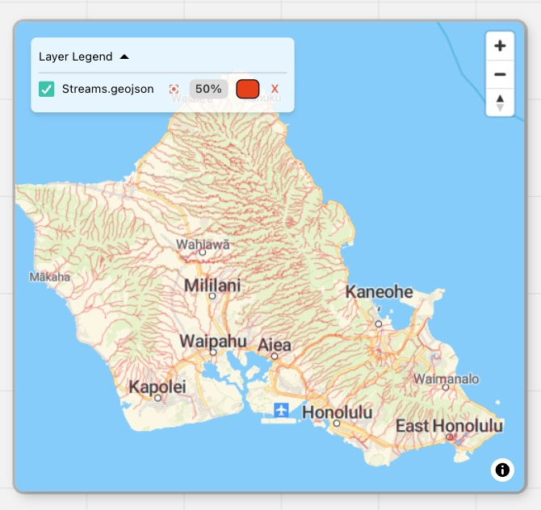

<!-- TODO: Screenshot of Map toolbar -->
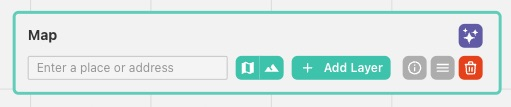

| Name | Type | Icon | Description |
|------|------|------|-------------|
| Address Search | Text Input | | Search for a place or address to center the map |
| Street Map | Button |  | Switch to the OpenStreetMap base layer |
| Satellite Map | Button |  | Switch to the satellite imagery base layer |
| Add Layer | Button |  | Overlay GeoJSON or GeoTIFF data from the asset manager |

---

## Notepad

A collaborative rich-text editor for writing formatted documents together in real time. Supports text styling (bold, italic, underline, strikethrough), font sizes, colors, alignment, and lists. Edits from all users are merged seamlessly. The finished document can be downloaded as an HTML file.

<!-- TODO: Screenshot of Notepad app -->
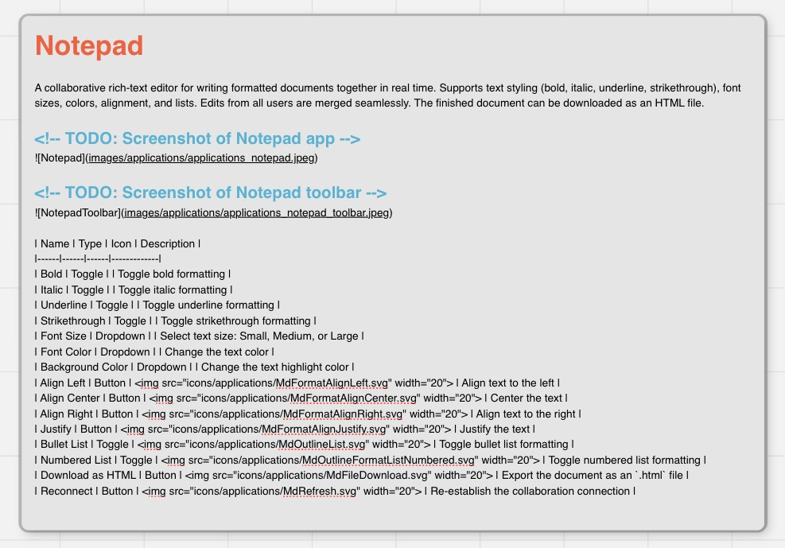

<!-- TODO: Screenshot of Notepad toolbar -->
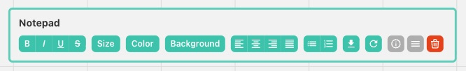

| Name | Type | Icon | Description |
|------|------|------|-------------|
| Bold | Toggle | | Toggle bold formatting |
| Italic | Toggle | | Toggle italic formatting |
| Underline | Toggle | | Toggle underline formatting |
| Strikethrough | Toggle | | Toggle strikethrough formatting |
| Font Size | Dropdown | | Select text size: Small, Medium, or Large |
| Font Color | Dropdown | | Change the text color |
| Background Color | Dropdown | | Change the text highlight color |
| Align Left | Button |  | Align text to the left |
| Align Center | Button |  | Center the text |
| Align Right | Button |  | Align text to the right |
| Justify | Button |  | Justify the text |
| Bullet List | Toggle |  | Toggle bullet list formatting |
| Numbered List | Toggle |  | Toggle numbered list formatting |
| Download as HTML | Button |  | Export the document as an `.html` file |
| Reconnect | Button |  | Re-establish the collaboration connection |

---

## PDFViewer

> *Opens automatically when a PDF is uploaded to the board.*

View PDF documents uploaded to the asset manager. PDFs are processed server-side into images at multiple resolutions for fast display. Navigate through pages, display multiple pages simultaneously to maximize screen space, and download the original PDF.

<!-- TODO: Screenshot of PDFViewer app -->
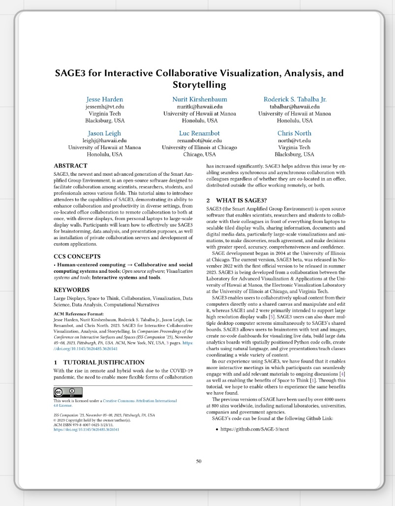

<!-- TODO: Screenshot of PDFViewer toolbar -->
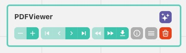

| Name | Type | Icon | Description |
|------|------|------|-------------|
| Remove Page | Button |  | Decrease the number of visible pages |
| Add Page | Button |  | Increase the number of visible pages |
| First Page | Button |  | Jump to the first page |
| Previous Page | Button |  | Go to the previous page |
| Next Page | Button |  | Go to the next page |
| Last Page | Button |  | Jump to the last page |
| Back 10 | Button |  | Jump 10 pages backward |
| Forward 10 | Button |  | Jump 10 pages forward |
| Download PDF | Button |  | Download the original PDF file |

---

## Poll

Create polls and vote on options in real time. Set a question, add multiple answer choices, and let participants vote. Results are displayed as a horizontal bar graph that updates live as votes come in.

<!-- TODO: Screenshot of Poll app -->
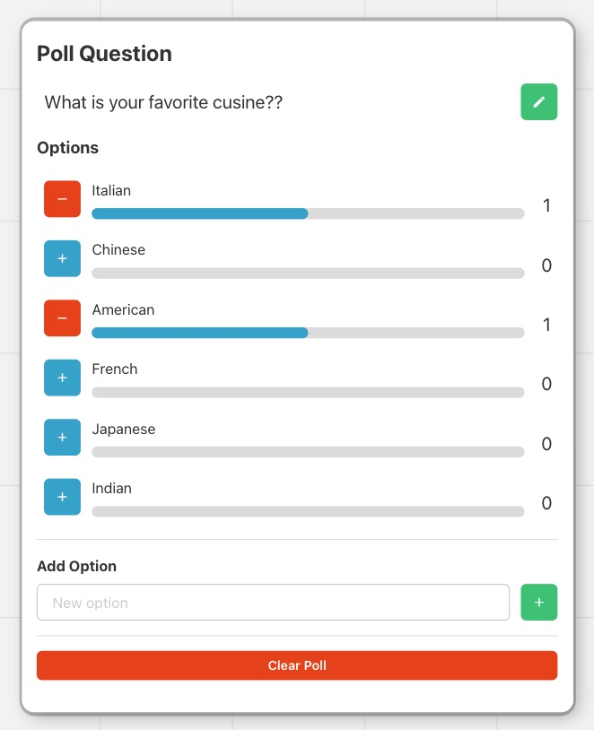

**Toolbar:** Default toolbar only (Zoom to App, Duplicate, Close).

---

## SageCell

A computational code cell backed by a Jupyter kernel. Write and execute Python, R, or Julia code with results displayed directly in the cell. Supports rich output formats including text, Markdown, images, PDF, HTML, and Plotly visualizations. Cells can be resized, moved, and duplicated for rapid prototyping. Code is synchronized across users. Uses the Monaco editor for a modern coding experience.

<!-- TODO: Screenshot of SageCell app -->
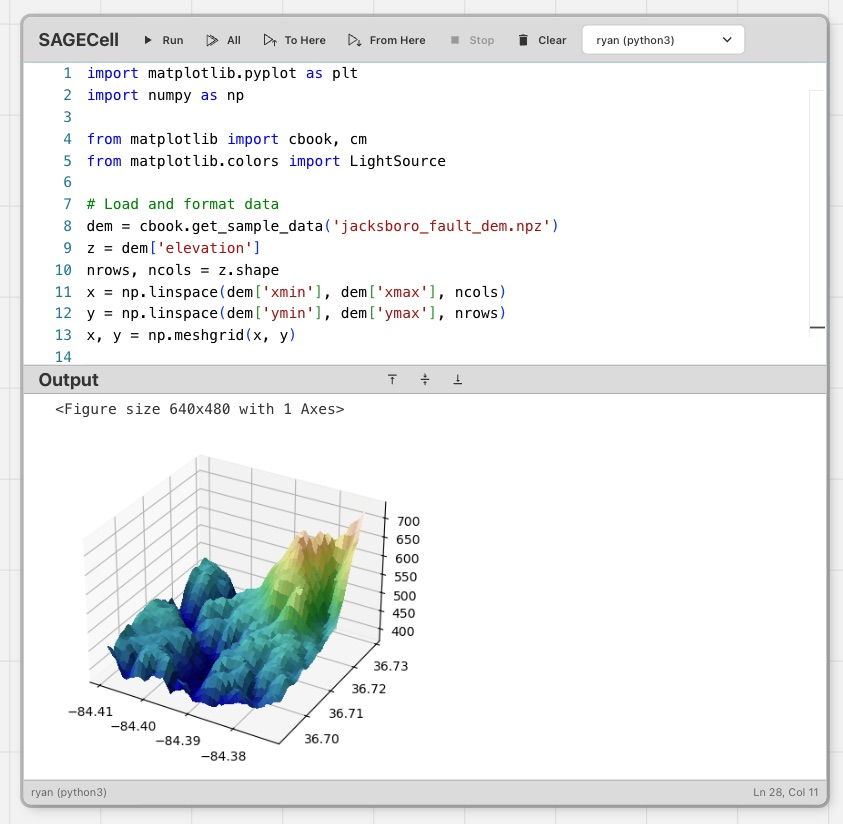

<!-- TODO: Screenshot of SageCell toolbar -->
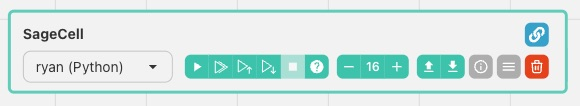

| Name | Type | Icon | Description |
|------|------|------|-------------|
| Create Kernel | Button |  | Create a new Jupyter kernel |
| Select Kernel | Dropdown |  | Choose an existing kernel (Python, R, Julia) |
| Run | Button |  | Execute the current cell |
| Run All | Button |  | Execute all SageCell apps on the board |
| Run To Here | Button |  | Execute all cells ranked above this one |
| Run From Here | Button |  | Execute all cells ranked below this one |
| Stop | Button |  | Interrupt the running execution |
| Help | Button |  | Open the SageCell help reference |
| Font Size - | Button |  | Decrease the font size |
| Font Size + | Button |  | Increase the font size |
| Save to Asset Manager | Button |  | Upload the code to the asset manager |
| Download | Button |  | Download the code as a `.py`, `.R`, or `.jl` file |

---

## Screenshare

Share your screen or a specific application window with everyone on the board. Multiple users can share simultaneously, and each stream appears as its own resizable window on the canvas. Video quality adjusts automatically to available bandwidth. Sessions are limited to 75 minutes by default, but a new session can be started immediately.

<!-- TODO: Screenshot of Screenshare app -->
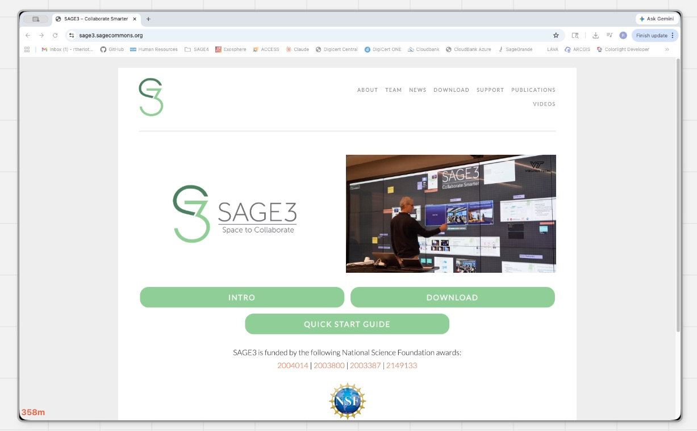

<!-- TODO: Screenshot of Screenshare toolbar -->
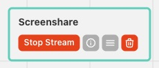

| Name | Type | Icon | Description |
|------|------|------|-------------|
| Stop Stream | Button |  | End the screen sharing session (visible to the stream owner only) |

---

## Stickie

Virtual sticky notes for quick text entry. Choose from multiple colors, resize the note, and adjust the font size. Notes can be locked to prevent editing by other users. Content can be saved or downloaded as Markdown. Uploading a `.md` file from the asset manager will open it as a new Stickie.

<!-- TODO: Screenshot of Stickie app -->
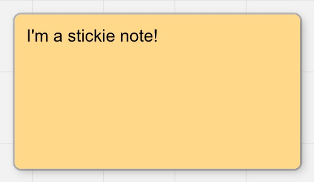

<!-- TODO: Screenshot of Stickie toolbar -->
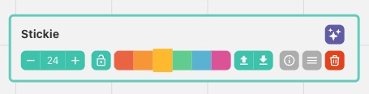

| Name | Type | Icon | Description |
|------|------|------|-------------|
| Font Size - | Button |  | Decrease the font size |
| Font Size + | Button |  | Increase the font size |
| Lock / Unlock | Toggle |   | Prevent or allow editing by other users (owner only) |
| Color | Color Picker |  | Change the stickie color |
| Save to Asset Manager | Button |  | Upload the note as a `.md` file |
| Download as Markdown | Button |  | Download the note as a `.md` file |

---

## Timer

A countdown timer synchronized across all users. Set a duration, then start, pause, or reset the timer. Changes are reflected immediately for all participants. Useful for timeboxing activities, presentations, or group exercises. Multiple timers can run simultaneously.

<!-- TODO: Screenshot of Timer app -->
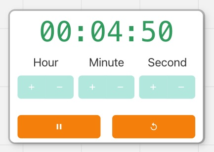

**Toolbar:** Default toolbar only (Zoom to App, Duplicate, Close).

---

## VideoViewer

> *Opens automatically when a video is uploaded to the board.*

Play web-compatible video files (MP4 preferred). Playback position is synchronized across users on a best-effort basis. Videos are muted by default to prevent audio feedback. You can capture a frame as a screenshot, which creates a new ImageViewer on the board.

<!-- TODO: Screenshot of VideoViewer app -->
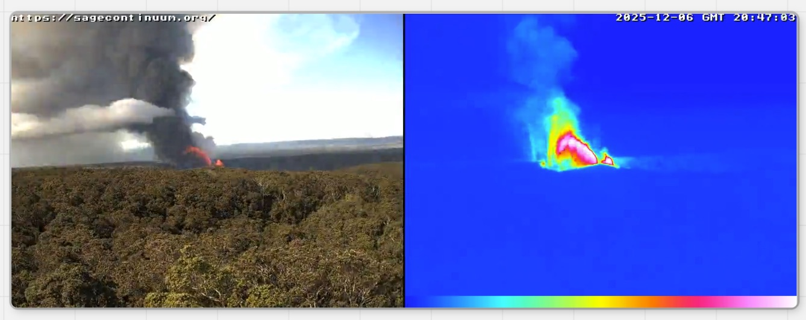

<!-- TODO: Screenshot of VideoViewer toolbar -->
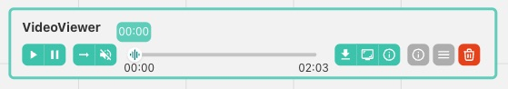

| Name | Type | Icon | Description |
|------|------|------|-------------|
| Play / Pause | Toggle |   | Control playback |
| Loop | Toggle |  | Toggle looping |
| Mute / Unmute | Toggle |   | Toggle audio |
| Seek | Slider |  | Scrub through the video with time display |
| Download Video | Button |  | Download the original video file |
| Screenshot | Button |  | Capture the current frame as an image on the board |
| Info | Button |  | View file metadata |

---

## WebpageLink

Paste a URL onto the board to create a WebpageLink. It fetches and displays metadata from the URL (title, description, and preview image), giving you context about the linked content. From there, you can open the page in a Webview on the board, in your system browser, or copy the URL.

<!-- TODO: Screenshot of WebpageLink app -->

<!-- TODO: Screenshot of WebpageLink toolbar -->
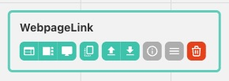

| Name | Type | Icon | Description |
|------|------|------|-------------|
| Open in SAGE3 | Button |  | Open the URL in a new Webview app on the board |
| Stream Webview | Button |  | Stream the webview content (Electron client) |
| Open in Desktop | Button |  | Open the URL in your system browser |
| Copy URL | Button |  | Copy the URL to your clipboard |
| Save to Asset Manager | Button |  | Save the link as a `.url` file |
| Download Link | Button |  | Download as a `.url` file |

---

## Webview

An embedded web browser within the board. Enter any URL to load a web page directly on the canvas. Navigation (back, forward, URL changes) is synchronized across users, though scroll position is local to each user. Webviews are muted by default. Hold `Ctrl` (or `Cmd` on Mac) and click a link to open it in a new Webview. Best used with public content such as dashboards, documentation, or Google Docs.

<!-- TODO: Screenshot of Webview app -->
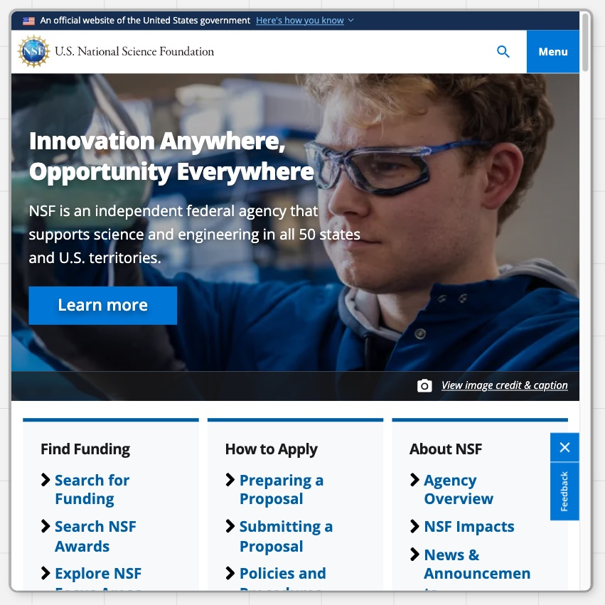

**Toolbar (Electron client):**

<!-- TODO: Screenshot of Webview toolbar -->
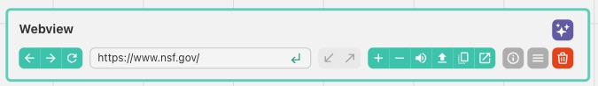

| Name | Type | Icon | Description |
|------|------|------|-------------|
| Back | Button |  | Navigate back |
| Forward | Button |  | Navigate forward |
| Reload | Button |  | Refresh the current page |
| URL Bar | Text Input | | View or change the current URL |
| Revert to Shared URL | Button |  | Reset to the URL shared with all users |
| Update Shared URL | Button |  | Push your current URL to all users |
| Zoom In | Button |  | Increase the page zoom level |
| Zoom Out | Button |  | Decrease the page zoom level |
| Mute | Toggle |  | Toggle audio |
| Save URL | Button |  | Save the URL to the asset manager |
| Copy URL | Button |  | Copy the URL to your clipboard |
| Open in Desktop | Button |  | Open the URL in your system browser |

**Toolbar (Web browser client):**

| Name | Type | Icon | Description |
|------|------|------|-------------|
| Open | Button |  | Open the URL in a new browser tab |
| Copy URL | Button |  | Copy the URL to your clipboard |
