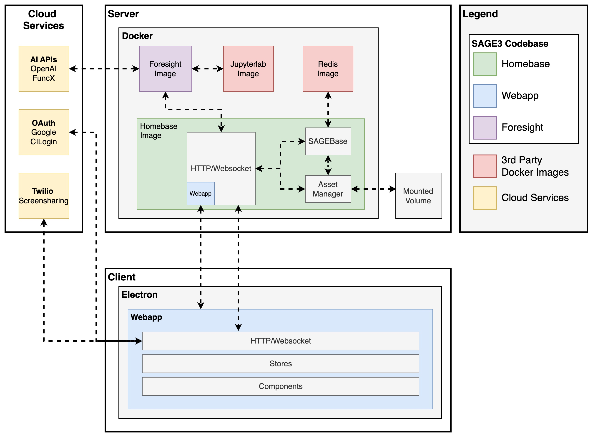
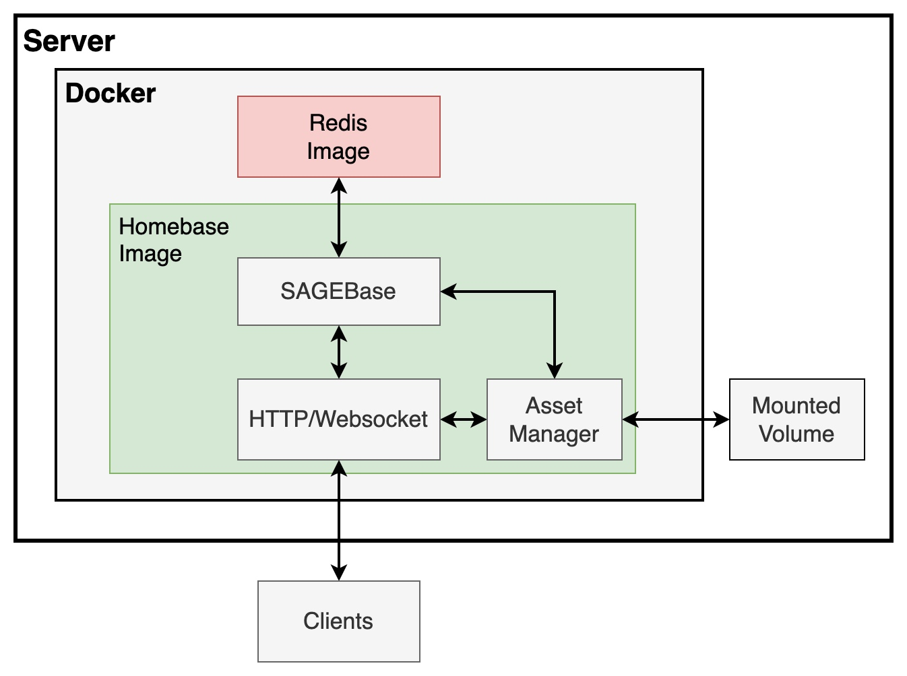
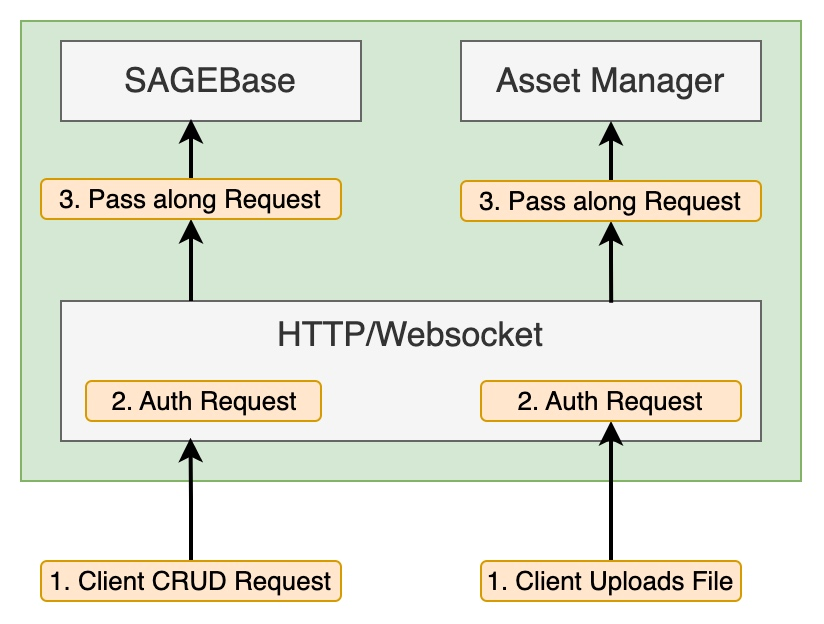
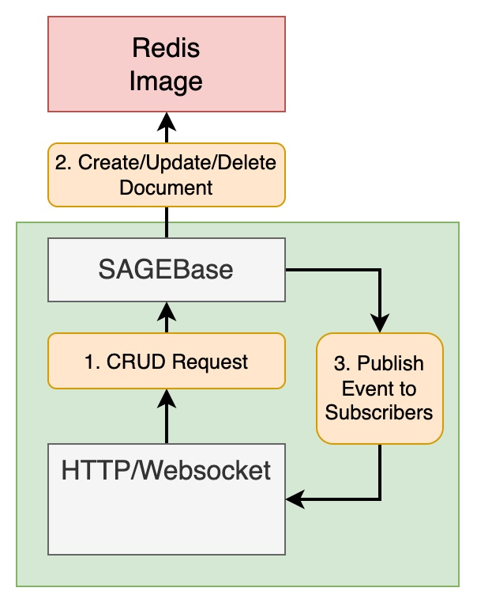
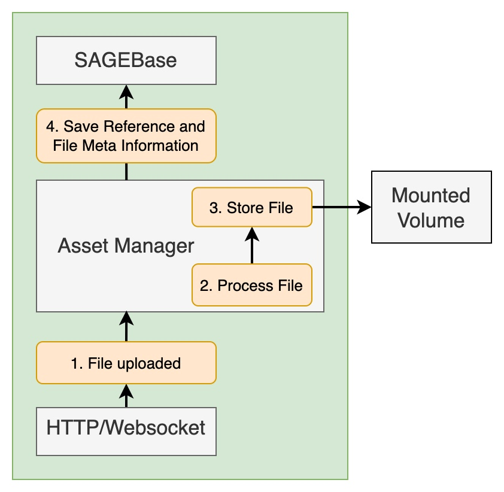

# Architecture Overview

SAGE3 is a distributed real-time collaborative platform. The backend is composed of three Node.js servers, a React web frontend, a Python AI service, and supporting infrastructure (Redis, Jupyter, ChromaDB). All servers are written in TypeScript except the AI service which is Python.



---

## System Components

| Component | Language | Purpose |
|---|---|---|
| **Homebase** | TypeScript / Node.js | Main API server — REST, WebSocket, auth, collections |
| **Homebase-YJS** | TypeScript / Node.js | Real-time collaborative editing (Y.js CRDT + WebRTC) |
| **Homebase-Files** | TypeScript / Node.js | File upload, processing, and static serving |
| **Webapp** | TypeScript / React | Browser frontend |
| **Seer** | Python / FastAPI | AI agent service (LLMs, image analysis, PDF, web) |
| **Redis Stack** | — | Primary database and pub/sub message bus |
| **Jupyter** | Python | Kernel execution for SageCell |
| **ChromaDB** | — | Vector database for AI semantic search |

All external traffic enters through a **Traefik** reverse proxy that routes requests based on path:
- `/yjs`, `/rtc` → Homebase-YJS
- `/api/assets/upload`, `/api/assets/static` → Homebase-Files
- Everything else → Homebase

---

# 1. Backend

## 1.A Homebase (Main Server)

Homebase is the primary backend server. It manages authentication, the Redis database, real-time WebSocket subscriptions, and serves the React webapp.



```
webstack/apps/homebase/
webstack/libs/backend/
```

### 1.A.1 HTTP / WebSocket API

Homebase exposes a REST API built with Express.js and a WebSocket channel for real-time subscriptions.

- **HTTP (REST):** Standard CRUD operations on all collections (`GET`, `POST`, `PUT`, `DELETE`).
- **WebSocket:** Clients subscribe to collections or individual documents and receive live `CREATE`, `UPDATE`, `DELETE` events whenever data changes.
- **File uploads:** Handled via the Homebase-Files server (see 1.C), but coordinated through the main API.



```
webstack/apps/homebase/src/api/
webstack/libs/backend/src/libs/generics/
```

### 1.A.2 SAGEBase

SAGEBase is SAGE3's Redis abstraction layer. It provides a document-oriented database API on top of Redis, with built-in pub/sub for real-time change notifications.



Key concepts:
- **Collections** hold typed JSON **Documents**.
- Documents support `CREATE`, `READ`, `UPDATE`, `DELETE` operations.
- Subscriptions fire on `CREATE`, `UPDATE`, `DELETE` events and are used to push changes to all connected WebSocket clients.
- Every document includes `_id`, `_createdAt`, `_createdBy`, `_updatedAt`, `_updatedBy` fields managed automatically.

Example usage:

```typescript
const sbConfig: SAGEBaseConfig = {
  projectName: 'SAGE3',
  redisUrl: 'redis://localhost:6379',
};
await SAGEBase.init(sbConfig);

type Car = { make: string; model: string; year: number };

const cars = await SAGEBase.Database.collection<Car>('cars', { model: '', year: 0 });

cars.subscribe((message) => {
  // Called on CREATE, UPDATE, DELETE
});

const ref = await cars.addDoc({ make: 'Subaru', model: 'WRX', year: 2019 }, '');
await ref.update({ year: 2020 });
await ref.delete();
```

SAGEBase is also published as a standalone npm package: [@sage3/sagebase](https://www.npmjs.com/package/@sage3/sagebase)

```
webstack/libs/sagebase/
```

### 1.A.3 Collections

SAGE3 maintains the following collections in Redis:

| Collection | Description |
|---|---|
| `apps` | All open application instances on all boards |
| `boards` | Board metadata (name, room, layout, whiteboard state) |
| `rooms` | Room metadata (name, visibility, PIN) |
| `users` | Registered user profiles |
| `assets` | File asset metadata (path, type, size, derived data) |
| `presence` | Live user cursors, viewports, and activity |
| `message` | Board-level chat messages |
| `plugins` | Uploaded plugin applications |
| `roommembers` | Room membership records |
| `annotations` | Whiteboard drawing strokes |
| `links` | App-to-app property links (Linker app) |
| `insight` | AI analysis results |

### 1.A.4 Authentication

Authentication is handled via [Passport.js](https://www.passportjs.org). Supported strategies:

- **Google OAuth** — sign in with Google account
- **Apple** — Sign in with Apple
- **CILogon** — federated institutional login (universities and research labs)
- **JWT** — machine-to-machine access (used by pysage3 and automation scripts)
- **Guest** — anonymous access with a display name
- **Spectator** — read-only observer access

Sessions use RS256 JWT tokens. Configuration is managed in `sage3-prod.hjson`.

### 1.A.5 Asset Manager

The Asset Manager handles file uploads, processing, and storage. Files are organized by room and accessible across all boards in that room.



On upload, files are processed depending on type:
- **Images** → scaled to multiple resolutions, converted to WebP for efficient display. Large images are additionally tiled into DeepZoom format.
- **PDFs** → each page rendered as images at multiple resolutions.
- **Video / Audio / CSV / Other** → stored as-is with metadata extracted via EXIFTool.

```
webstack/apps/homebase/src/api/routers/custom/asset.ts
webstack/apps/homebase/src/processors/
```

## 1.B Homebase-YJS (Collaborative Editing Server)

A dedicated server for Y.js CRDT-based collaborative editing and WebRTC signaling.

- **Y.js WebSocket (`/yjs`)** — enables conflict-free real-time collaborative editing for apps like Notepad and CodeEditor. Multiple users can type simultaneously with automatic merge.
- **WebRTC signaling (`/rtc`)** — room-based signaling for peer-to-peer connections used by the Drawing (TLDraw) app's collaborative canvas.

```
webstack/apps/homebase-yjs/
```

## 1.C Homebase-Files (File Server)

A dedicated server for file upload and static asset delivery.

- Handles `POST /api/assets/upload` for file uploads (via Multer).
- Serves `GET /api/assets/static/:file` for direct file access.
- Runs separately to avoid blocking the main Homebase server during large uploads.

```
webstack/apps/homebase-files/
```

## 1.D Seer (AI Agent Service)

Seer is a Python FastAPI server that provides AI-powered features for SAGE3. It connects to external LLM providers and processes AI requests forwarded from Homebase.

**LLM providers** are not hard-coded. Seer reads the server's capability-driven model registry (`services.models`, see [AI Configuration](Server-Deployment.md#ai-configuration)) at start-up and picks a model by matching a request's **task** to a model's declared **capabilities**. How each provider is spoken to is inferred from its config: a `url` plus a model `api_version` means **Azure OpenAI**, a `url` alone means any **OpenAI-compatible** endpoint (LiteLLM, vLLM, Ollama, …), and no `url` means **openai.com**. Adding a provider is a configuration change, not a code change.

**AI agents:**
| Agent | Endpoint | Description |
|---|---|---|
| Chat | `POST /ask` | General LLM Q&A with message history |
| Summary | `POST /summary` | Summarize the linked content |
| Code | `POST /code` | Code assistance and explanation |
| Image | `POST /image` | Image understanding and bounding box detection |
| Image generation | `POST /image-generation` | Generic image generation; the prompt is used as written |
| Web | `POST /web`, `POST /webshot` | Web page scraping, summarization and screenshots |
| PDF | `POST /pdf` | PDF document analysis and Q&A |
| Mesonet | `POST /mesonet` | Hawaii sensor / weather data queries |
| Ideator | `POST /dimensions`, `/node`, `/abstract`, `/user-dimension`, `/summarize`, `/prose`, `/ideator/image` | Brainstorming support for the SageIdeator app |

`GET /status` reports service health.

> **Image generation vs. the Ideator.** `POST /image-generation` is the generic path used by any app: it sends the caller's prompt unchanged. `POST /ideator/image` is SageIdeator's, and *composes* a brainstorming prompt from ideator concepts (dimensions, the brainstorming prompt) before generating. They share the client-construction code but not the prompt, so the ideator's framing does not leak into ordinary image requests.

**Per-request user credentials.** A request may carry a `userllm` block (`apiKey`, optional `baseUrl`, `modelId`) when the user has supplied their own key in the web app. When present it takes precedence over the configured providers for that one request. Such models are **never cached** — the model cache is keyed by provider name, which every user of a personal key shares, so caching would hand one user's client and key to the next request. The key is used and discarded; it is never persisted, and `UserLLM` carries a redacting representation so a log line that prints a request shows `apiKey='***'`. See [Users bringing their own key](Server-Deployment.md#users-bringing-their-own-key).

Seer uses ChromaDB for semantic vector caching and communicates back to SAGE3 using the `pysage3` Python client library.

```
seer/
```

## 1.E Redis

SAGE3 uses [Redis Stack](https://redis.io/docs/stack/about/) which includes the RedisJSON and RediSearch modules.

- **RedisJSON** — stores documents as native JSON (no serialization roundtrip).
- **RediSearch** — enables field-level querying and indexing within collections.
- **Pub/Sub** — used by SAGEBase to broadcast document change events to all subscribed WebSocket clients.

Redis key naming follows the pattern:
```
SAGE3:DB:<collection>:<document-uuid>
```

## 1.F JupyterLab / Kernel Server

SAGE3 integrates with JupyterLab to provide SageCells — code cells placed directly on the board backed by Jupyter kernels.

- The **Kernel Server** (`kernelserver`) is a Python FastAPI service that manages kernel lifecycle (create, list, interrupt, shutdown).
- A **JupyterLab** instance provides the actual Python/R/Julia execution environment.
- SageCell communicates with kernels via the Kernel Server API on Homebase at `/api/kernels`.

---

# 2. Frontend

SAGE3's frontend is a React 18 web application written in TypeScript. It is served by Homebase and runs in the browser or in the SAGE3 Electron desktop client.

## 2.A Electron Client

The SAGE3 Electron client wraps the web app in a desktop application for macOS, Windows, and Ubuntu. It enables additional capabilities not available in a standard browser:

- **Webview streaming** — stream the content of a Webview app to other users.
- **Multi-display support** — span across tiled display walls.
- Command line arguments for display configuration (`--monitor`, `--fullscreen`, `--width`, `--height`, etc.).

See the [Electron Client](Electron-client.md) page for development details.

## 2.B Webapp (React)

The React frontend is organized as an Nx monorepo library structure.

```
webstack/apps/webapp/          # React entry point and routing
webstack/libs/frontend/        # Stores, hooks, and shared UI components
webstack/libs/applications/    # All SAGE3 app modules (22 supported apps + experimental)
webstack/libs/shared/          # Types, schemas, utilities (shared by frontend + backend)
```

### Routes

| Route | Page |
|---|---|
| `/` | Login |
| `/home` | Room and board selection |
| `/board/:roomId/:boardId` | Main collaboration board |
| `/account` | User settings |
| `/admin` | Admin dashboard (admin users only) |

### 2.B.1 HTTP / WebSocket Communication

```
webstack/libs/frontend/src/lib/api/http/api-https.ts   # REST calls
webstack/libs/frontend/src/lib/api/ws/api-socket.ts    # WebSocket subscriptions
```

### 2.B.2 Zustand Stores

All frontend state is managed through [Zustand](https://github.com/pmndrs/zustand) stores. Components never call the API directly — they read and write through stores.

```
webstack/libs/frontend/src/lib/stores/
```

| Store | Description |
|---|---|
| `AppStore` | Open applications on the current board (CRUD, batch ops) |
| `BoardStore` | Board metadata and operations |
| `RoomStore` | Room listing and management |
| `UIStore` | Board UI state: scale, position, selected apps, panel visibility, lasso state |
| `AssetStore` | Asset library (files uploaded to the room) |
| `UsersStore` | Registered users and their profiles |
| `PresenceStore` | Live user cursors and viewport positions |
| `MessageStore` | Board chat messages |
| `PluginStore` | Uploaded plugin apps |
| `InsightStore` | AI analysis results |
| `AnnotationStore` | Whiteboard drawing strokes |
| `LinkStore` | App-to-app property links |
| `KernelStore` | Jupyter kernel sessions |
| `TwilioStore` | Screen sharing video state |

### 2.B.3 React Hooks

Custom hooks for common patterns:

```
webstack/libs/frontend/src/lib/hooks/
```

- `useAuth` — authentication state and login helpers
- `useUser` — current user profile
- `useCursorBoardPosition` — converts screen cursor position to board coordinates
- `useHotkeys` — keyboard shortcut registration
- `useHexColor` — Chakra UI color token resolution
- `useRouteNav` — navigation helpers (go to board, go home)
- `useWindowResize` — responsive layout triggers
- `usePeer` — WebRTC peer connection management

### 2.B.4 Application Framework

Each SAGE3 app is a self-contained module in `webstack/libs/applications/src/lib/apps/<AppName>/`:

- **`index.ts`** — Zod schema defining the app's state shape, default values, and display name.
- **`AppName.tsx`** — Two React components exported: `AppComponent` (the window) and `ToolbarComponent` (the toolbar).
- **`styling.css`** — Optional app-specific CSS.

The app registry is auto-generated at `webstack/libs/applications/src/lib/apps.ts` and updated by running `yarn regen`.

---

# 3. Supporting Services

## 3.A Traefik (Reverse Proxy)

[Traefik](https://traefik.io) handles TLS termination and routes incoming HTTPS traffic to the correct backend service based on URL path and priority rules. In production, all services are accessible through a single HTTPS port (443).

## 3.B OAuth Providers

User authentication is delegated to third-party identity providers via [Passport.js](https://www.passportjs.org):
- **Google** — OAuth 2.0
- **Apple** — Sign in with Apple
- **CILogon** — OpenID Connect for institutional (university) accounts
- **Keycloak** — Self-hosted OpenID Connect identity provider
- **Guest / Spectator** — no external provider required

Configuration lives in the `auth` section of `sage3-prod.hjson`. See [Server Deployment](Server-Deployment.md) for setup.

## 3.C Twilio (Screen Sharing)

[Twilio Video](https://www.twilio.com/en-us/video) provides TURN server infrastructure for WebRTC peer-to-peer connections used by screen sharing. Without Twilio, screen sharing may not work across NATs or firewalls. It is optional but recommended for production deployments.

## 3.D Fluentd (Logging)

[Fluentd](https://www.fluentd.org) aggregates server-side logs from all services. The logging verbosity is configurable (`all`, `partial`, `none`) in `sage3-prod.hjson`.
