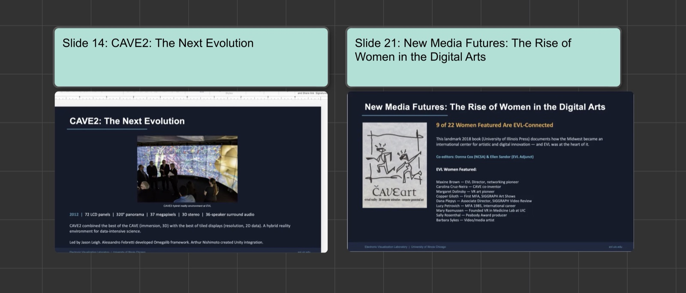

## Features

### Capture Presentation Slide

When someone presents slides in a Zoom meeting, the SAGE3 client can put each slide on the board you are viewing in one click: choose **Capture Presentation Slide** in the SAGE3 menu bar (tray) icon's menu. The command is available only while a board is open.



What happens:

- The client captures the Zoom meeting window at full resolution. The window can be behind other windows, but not minimized.
- If your AI model (in your SAGE3 settings) can see images, it finds the slide in the capture, which is then cropped to the slide only. When the model also reads the slide's number or title, a note with them is added above the slide.
- Without a vision-capable model, or when no slide is found, the whole window is added.
- The image is added a little larger than a pasted image. The first capture goes in the free space closest to the center of your view; the next ones line up to its right. After a pause of 5 minutes, a new row starts below.
- A message on the board shows the progress, then the result.

On macOS, the first capture asks for the **Screen Recording** permission (System Settings > Privacy & Security > Screen & System Audio Recording). After allowing it, restart SAGE3. Guests can't add captures, since they can't upload files.

## Sources

The development team mainly uses the `dev` branch to develop new features and fix bugs. The main branch is updated for main releases.

### TLDR

```bash
git clone https://github.com/SAGE-3/next
cd next
git checkout dev
cd webstack/clients/electron
npm install
npx electron electron.js -s https://mini.sage3.app
```

## Running

You can run the Electron client from sources, the main source file is `electron.js` (in `webstack/clients/electron` folder).
```bash
npx electron electron.js -h
```

```
Usage: electron [options]

Options:
  -V, --version              output the version number
  -d, --display <n>          Display client ID number (int) (default: 0)
  -f, --fullscreen           Fullscreen (boolean) (default: false)
  -m, --monitor <n>          Select a monitor (int) (default: null)
  -n, --no_decoration        Remove window decoration (boolean) (default: false)
  -s, --server <s>           Server URL (string) (default: "https://minim1.evl.uic.edu/#/home")
  -x, --xorigin <n>          Window position x (int) (default: 226)
  -y, --yorigin <n>          Window position y (int) (default: 38)
  -c, --clear                Clear window preferences (default: false)
  --allowDisplayingInsecure  Allow displaying of insecure content (http on https) (default: true)
  --allowRunningInsecure     Allow running insecure content (scripts accessed on http vs https) (default:
                             true)
  --cache                    Clear the cache at startup (default: false)
  --console                  Open the devtools console (default: false)
  --debug                    Open the port debug protocol (port number is 9222 + clientID) (default:
                             false)
  --experimentalFeatures     Enable experimental features (default: false)
  --height <n>               Window height (int) (default: 944)
  --disable-hardware         Disable hardware acceleration (default: false)
  --show-fps                 Display the Chrome FPS counter (default: false)
  --profile <s>              Create a profile (string)
  --width <n>                Window width (int) (default: 1061)
  -h, --help                 display help for command
```

## Build

You can generate binaries from Electron using the `electron-packager`package.

### Mac

```
npx electron-packager ./ --platform=darwin --arch=x64 --icon=s3.icns --overwrite --protocol=sage3 --protocol-name="SAGE3 application"
```

### Windows

```
npx electron-packager . --platform=win32 --arch=x64 --icon=s3.ico --overwrite
```


## Sign

To distribute binaries, they should be notarized and signed so they can be installed smoothly on users' machines.
We provide a series of `build_*` scripts, that you can use starting points.
You will need a developer certificate for the operating system you want to target (macOS developer certificate, Windows developer certificate, ...).

### Mac

Using a combination of `electron-packager`, `electron-notarize`, `electron-osx-sign`  and `electron-installer-dmg` we can build installable binaries (DMG file  containing a signed binary application). This is currently automated using GitHub actions on github.com.

We use the `update-electron-app` package to trigger an update check, download and restart.
Internally, that uses the 'autoUpdater' API from Electron to check for an update.

### Win

Packages used: `electron-packager`, `electron-winstaller`

TODO: signed binary steps (need help)

## Deploy

We trigger a new version of the binaries but committing sources in `webstack/clients/electron`

- Automatic updates (macOS only for now) are handled by creating a git tag in the `dev` branch.
- Edit the package.json to increase the version number
- git tag 1.0.10
- git push origin 1.0.10
- Find the new update in the github release page: https://github.com/SAGE-3/next/releases
