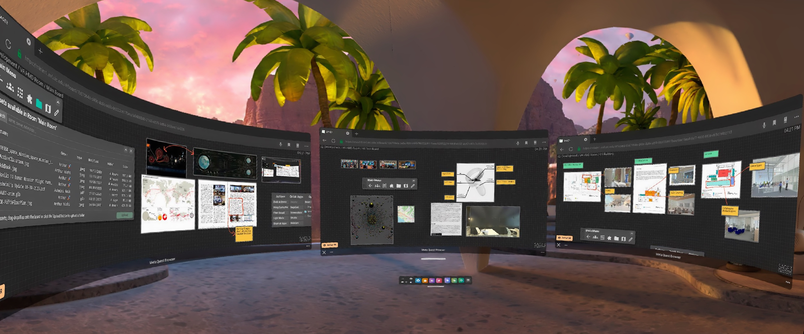
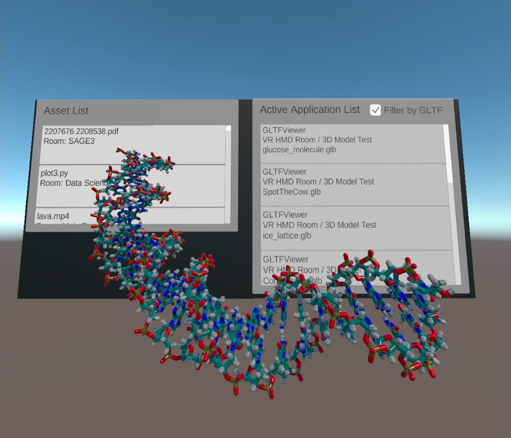
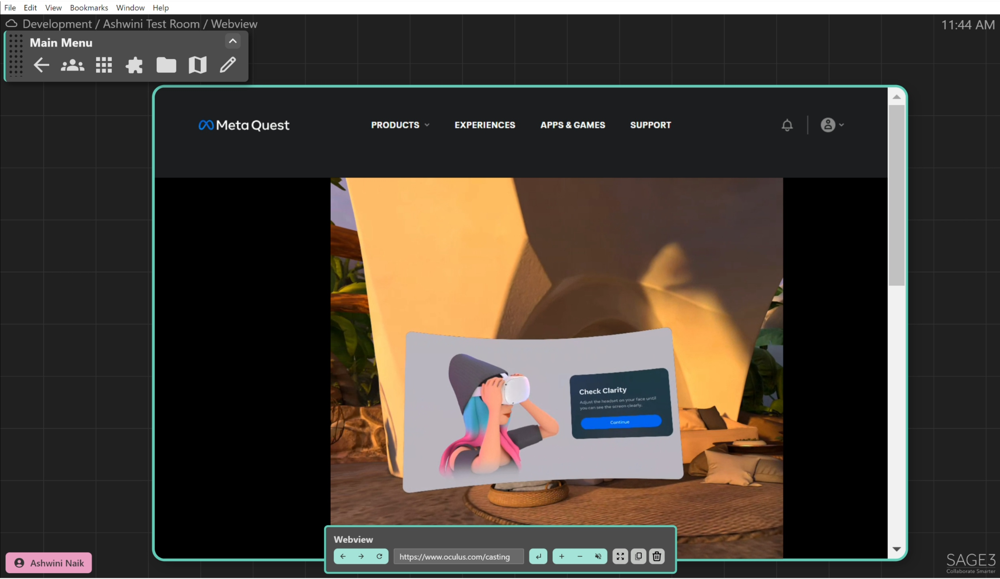

# Extended Reality (XR) Integration

SAGE3 supports Extended Reality (XR) environments through native (stock) applications available 'out-of-the-box' as well as through a C# API for more advanced application development.

## SAGE3 using Built-In Applications
### Viewing SAGE3 in Meta Quest Browser
SAGE3 can be viewed and interacted with in virtual reality (VR) using the Meta Quest 2's built in web browser 'Meta Quest Browser.' This provides the same functionality that can be found using a standard web browser.

The Quest controllers can be used to navigate and interact with SAGE2 rooms and boards. Also supports Tracked Keyboard in the Quest 2 and Quest Pro to more easily enter text.

The multi-browser support in the Meta Quest Browsers allows more immersion by surrounding the user in up to three different SAGE3 boards at a time.




### Streaming VR to SAGE3

A standalone application to view SAGE3 assets and applications in VR. Currently works on Oculus Quest1 & Quest2 and displays a list of all the open applications and assets on the SAGE3 client it is configured for (Currently configured for dev server). Can view small models of interest in the application. Works for models up to 102 mB. The ability to render bigger models is still a work in progress. Uses VRTK v4 SDK in order to deploy the application from Unity to Quest2. Integrated Unity's XR interaction toolkit with VRTK v4 in the application. We can now use the right controller trigger button on both Quest 1 and Quest 2 devices to interact with the application.


_Fig. 1: A DNA molecule rendered using the SAGE3 VR application in Quest2_

### SAGE3 Webview Testing with Quest2

We can directly stream our Quest2 content into SAGE3 web view using the steps below.

Steps:
1. Make sure the Quest2 device and computer are on the same network.
2. Open Webview in SAGE3 on the computer.
3. Navigate to oculus.com/casting in the Webview.
4. Login to your Oculus account (a shareable account).
5. Login with the same account on the Quest2 device (You may already be logged in if the device has been in use).
5. On your device navigate to the Camera icon and click on the Cast Button, select Computer, and start casting.
6. On your device open any application you wish to use.

The content will now be streamed into SAGE3. Anybody who can log in to the Oculus account with the same credentials within SAGE3 webview can now view the Quest2 content on their SAGE3 board.


_Fig. 2: Casting a Quest2 App into SAGE3_

## Unity Applications with SAGE3 API Integration
A series of [example applications](https://github.com/SAGE-3/sageCSharpUnityAPI) are available using the wsSAGE C# API to connect to a SAGE3 server and both retrieve information about specific SAGE3 rooms, boards, assets, and running applications as well as sending information back to a SAGE3 server to interact with a board or specific applications.

The current list of example project:
### API Tester
A basic application to test general functionality of the C# API. Connects to a SAGE3 server and displays the current list of Rooms, Board, Assets, and Active Applications.

### glTF Model Viewer
An ongoing use case scenario to test bi-directional communication between the glTF 3D Model Viewer Application in SAGE3 and a Unity application (either as a standalone or VR application).

The example Unity project connects to a SAGE3 server, retrieves the list of available assets and active applications, and filters applications by type to display only glTF Viewers.

The glTF model is then downloaded from the SAGE3 server, parsed and loaded in real-time in Unity, then displayed as a 3D model. The camera view from SAGE3 is synced with the camera in Unity by using the 'subscribe' board feature of the wsSAGE API.

## wsSAGE C# API
C# API for communicating between Unity and SAGE3 servers. This API is a framework to simplify communication to a SAGE3 server by providing an object-based C# wrapper around the JSON websocket requests and responses. This API and example projects are available at [sageCSharpUnityAPI](https://github.com/SAGE-3/sageCSharpUnityAPI).

The example scene (Assets/Scenes/APITester.scene) and ([Assets/wsSAGE/SAGEAPIExampleTester.cs](https://github.com/SAGE-3/sageCSharpUnityAPI/blob/master/Assets/wsSAGE/SAGEAPIExampleTester.cs)) is a good place to get started. We will be deconstructing the API calls in SAGEAPIExampleTester.cs in following sections.

Websocket communication is implemented using NativeWebSocket (https://github.com/endel/NativeWebSocket) since it supports Headers which are required to authenticate with a SAGE3 server.

In the following examples, the more SAGE3 API calls will be shown in addition to the internal websocket information to help better illustrate how the API works.

### Connecting to a SAGE3 Server
Initial connection to a SAGE3 server is done using the wsSAGE3.cs script found in the [sageCSharpUnityAPI](https://github.com/SAGE-3/sageCSharpUnityAPI). The example APITester.scene will automatically connect to a localhost SAGE3 server using the following command:

```csharp
sageAPI.ConnectToSAGE3("localhost:4200", false);
```

Where 'localhost:4200' is the IP address and port of the SAGE3 server. The second parameter is a bool which specifies if the target server using a secure (wss) or non-secure (ws) websocket connection. The main live SAGE3 servers are using a secure wss connection while localhost development servers typically use non-secure ws websockets.

In addition to specifying the address and secure flag, you will also need to have a valid API token which is read from 'Assets/Keys/token.json'

This API call resolves to a websocket connection request with looks like:

```csharp
// Authorization Header read as a JSON string
Dictionary<string, string> headers = new Dictionary<string, string>();
headers.Add("Authorization", "Bearer " + token);

client = new WebSocket("ws://localhost:4200/api", headers);
```

With the 'token' read from token.json which looks like:

```json
{
    "token": "sampletokentext_abcdefg123456789"
}
```

Once you have a successful connection to a SAGE3 server, you can begin getting information from the server using GET requests.

### GET Rooms
One of the first GET requests you'll probably want to do after connecting to a SAGE3 server is get the Room information since this can be useful to reference the Room ID in later requests.

In the SAGE3 C# API, all GET requests require a callback function that will be called when the response to the GET request is received.

```csharp
// Callbacks from SAGEAPI
Action<object> getRoomsCallback;

void Start()
{
    sageAPI = GetComponent<wsSAGE3>();

    // Assign callbacks to a function
    getRoomsCallback += GetRoomsCallback;

    // Send the GET request
    sageAPI.GetRooms(getRoomsCallback);
}

void GetRoomsCallback(object callbackData)
{
    RoomQuery roomQuery = (RoomQuery)callbackData;

    // Iterate through room list
    foreach(Room room in roomQuery.data)
    {
        // Print out the name of the room
        Debug.Log(room.data.name);
    }
}
```

When wsSAGE.GetRooms() is called, it sends a websocket GET request to the SAGE3 server in JSON format:

```json
{
    "route": "/api/rooms/",
    "method": "GET",
    "id": "fd739d22-0763-477e-abfe-6b0b5503d1aa"
}
```

Where "id" is an auto generated GUID string which identifies this GET request. This ID is used to match the GET response with the callback function.

Once the GET Rooms response is received, wsSAGE will parse the JSON file into a C# object 'RoomQuery' which is an object representation of the original JSON response. The full list of C# Serializable class objects derived from the JSON responses can be found in ([Assets/wsSAGE/SAGEJsonHelper.cs](https://github.com/SAGE-3/sageCSharpUnityAPI/blob/master/Assets/wsSAGE/SAGEJsonHelper.cs)).

Example JSON Response to GET Rooms:
```json
{
"data":
    [
        {
        "_createdAt": 1663722087929,
        "_createdBy": "-",
        "_id": "0fffd2cd-9158-4fa5-9d28-4f929cc2367f",
        "_updatedAt": 1663722087929,
        "_updatedBy": "-",
        "data":
            {
            "color": "green",
            "description": "Builtin default room",
            "isListed": true,
            "isPrivate": false,
            "name": "Main Room",
            "ownerId": "-",
            "privatePin": ""
            }
        }
    ],
"id": "fd739d22-0763-477e-abfe-6b0b5503d1aa",
"success": true
}
```

Example of using the wsSAGE C# API to access RoomQuery data (compared to original JSON):

```csharp
RoomQuery roomQuery = (RoomQuery)callbackData;

// Iterate through room list
foreach(Room room in roomQuery.data)
{
    long _createdAt = room._createdAt;
    string _createdBy = room._createdBy;
    string _id = room._id;
    string _updatedBy = room._updatedBy;

    string color = room.data.color;
    string description = room.data.description;
    bool isListed = room.data.isListed;
    bool isPrivate = room.data.isPrivate;
    string name = room.data.name;
    string ownerId = room.data.ownerId;
    string privatePin = room.data.privatePin;
}
```

### GET Boards
Very similar to how GET Rooms above works.

In the SAGE3 C# API, all GET requests require a callback function that will be called when the response to the GET request is received.

```csharp
// Callbacks from SAGEAPI
Action<object> getBoardsCallback;

void Start()
{
    sageAPI = GetComponent<wsSAGE3>();

    // Assign callbacks to a function
    getRoomsCallback += GetBoardsCallback;

    // Send the GET request
    sageAPI.GetBoards(getBoardsCallback);
}

void GetBoardsCallback(object callbackData)
{
    BoardQuery boardQuery = (BoardQuery)callbackData;

    // Iterate through board list
    foreach(Board board in boardQuery.data)
    {

    }
}
```

When wsSAGE.GetBoards() is called, it sends a websocket GET request to the SAGE3 server in JSON format:

```json
{
    "route": "/api/boards/",
    "method": "GET",
    "id": "8fa971db-d96e-43a9-ac35-250917954428"
}
```

Where "id" is an auto generated GUID string which identifies this GET request. This ID is used to match the GET response with the callback function.

Once the GET Boards response is received, wsSAGE will parse the JSON file into a C# object 'BoardQuery' which is an object representation of the original JSON response. The full list of C# Serializable class objects derived from the JSON responses can be found in ([Assets/wsSAGE/SAGEJsonHelper.cs](https://github.com/SAGE-3/sageCSharpUnityAPI/blob/master/Assets/wsSAGE/SAGEJsonHelper.cs)).

Example JSON Response to GET Boards:
```json
{
"data":
    [
        {
        "_createdAt": 1663722087932,
        "_createdBy": "-",
        "_id": "863c9963-5d7b-4823-8e3b-97a8d28efb1d",
        "_updatedAt": 1674190753657,
        "_updatedBy": "5b54824d-f260-46e6-b826-0c04101ab6b1",
        "data":
            {
            "color": "green",
            "description": "Builtin default board",
            "isPrivate": false,
            "name": "Main Board",
            "ownerId": "-",
            "privatePin": "",
            "roomId": "0fffd2cd-9158-4fa5-9d28-4f929cc2367f",
            "whiteboardLines":
                [
                    {
                    "id": "1668717021049",
                    "isComplete": true,
                    "points":
                        [
                        1504637.22369295,
                        1505441.5915868,
                        1504629.98847042,
                        1505438.93645927
                        ],
                    "userColor": "red",
                    "userId": "5b54824d-f260-46e6-b826-0c04101ab6b1"
                    }
                ]
            }
        }
    ],
"id": "8fa971db-d96e-43a9-ac35-250917954428",
"success": true
}
```

Example of using the wsSAGE C# API to access BoardQuery data (compared to original JSON):

```csharp
BoardQuery boardQuery = (BoardQuery)callbackData;

// Iterate through board list
foreach(Board board in boardQuery.data)
{
    long _createdAt = board._createdAt;
    string _createdBy = board._createdBy;
    string _id = board._id;
    string _updatedBy = board._updatedBy;

    string color = board.data.color;
    string description = board.data.description;
    bool isPrivate = board.data.isPrivate;
    string name = board.data.name;
    string ownerId = board.data.ownerId;
    string privatePin = board.data.privatePin;
    string roomId = board.data.roomId;
}
```

### GET Assets
Similar to how other GET requests (Board, Room) works.

In the SAGE3 C# API, all GET requests require a callback function that will be called when the response to the GET request is received.

```csharp
// Callbacks from SAGEAPI
Action<object> getAssetsCallback;

void Start()
{
    sageAPI = GetComponent<wsSAGE3>();

    // Assign callbacks to a function
    getAssetsCallback+= GetAssetsCallback;

    // Send the GET request
    sageAPI.GetAssets(getAssetsCallback);
}

void GetAssetsCallback(object callbackData)
{
    AssetQuery query = (AssetQuery)callbackData;

    // Iterate through board list
    foreach(Asset asset in query.data)
    {

    }
}
```

When wsSAGE.GetAssets() is called, it sends a websocket GET request to the SAGE3 server in JSON format:

```json
{
    "route": "/api/assets/",
    "method": "GET",
    "id": "8fa971db-d96e-43a9-ac35-250917954428"
}
```

Where "id" is an auto generated GUID string which identifies this GET request. This ID is used to match the GET response with the callback function.

Once the GET Assets response is received, wsSAGE will parse the JSON file into a C# object 'AssetQuery' which is an object representation of the original JSON response. The full list of C# Serializable class objects derived from the JSON responses can be found in ([Assets/wsSAGE/SAGEJsonHelper.cs](https://github.com/SAGE-3/sageCSharpUnityAPI/blob/master/Assets/wsSAGE/SAGEJsonHelper.cs)).

Example JSON Response to GET Assets:
```json
{
"data":
    [
        {
        "_createdAt": 1669714984516,
        "_createdBy": "b25d1553-5937-445a-9490-3ae102c6aad5",
        "_id": "07bcc7b8-5714-47d2-ab70-5aeeecded01c",
        "_updatedAt": 1669714984516,
        "_updatedBy": "b25d1553-5937-445a-9490-3ae102c6aad5",
        "data":
            {
            "dateAdded": "2022-11-29T09:43:03.245Z",
            "dateCreated": "2022-11-29T09:43:03.000Z",
            "derived":
                {
                "aspectRatio": 2.54992076069731,
                "filename": "dist/apps/homebase/assets/ef889e61-c348-4c03-8a09-3e22cfe2f7d7.PNG",
                "fullSize": "api/assets/static/ef889e61-c348-4c03-8a09-3e22cfe2f7d7-full.jpg",
                "height": 631,
                "url": "api/assets/static/ef889e61-c348-4c03-8a09-3e22cfe2f7d7-201.webp",
                "width": 1609
                },
            "destination": "dist/apps/homebase/assets",
            "file": "ef889e61-c348-4c03-8a09-3e22cfe2f7d7.PNG",
            "metadata": "ef889e61-c348-4c03-8a09-3e22cfe2f7d7.PNG.json",
            "mimetype": "image/png",
            "originalfilename": "fig 11.PNG",
            "owner": "b25d1553-5937-445a-9490-3ae102c6aad5",
            "path": "dist/apps/homebase/assets/ef889e61-c348-4c03-8a09-3e22cfe2f7d7.PNG",
            "room": "9e78d7d8-e4f8-4277-969d-3ef35851830c",
            "size": 1374669
            }
        },
        {
        "_createdAt": 1668050991683,
        "_createdBy": "42868120-5230-4355-abf0-234b9490f1b2",
        "_id": "836b9b01-7649-4b54-950a-eb83cb5ec418",
        "_updatedAt": 1668050991683,
        "_updatedBy": "42868120-5230-4355-abf0-234b9490f1b2",
        "data":
            {
            "dateAdded": "2022-11-10T03:29:51.618Z",
            "dateCreated": "2010-09-29T00:37:20.000Z",
            "derived":
                {
                "aspectRatio": 1.77777777777778,
                "filename": "f21227e2-1a3e-4704-8d52-e270cc75470a.mov",
                "fullSize": "/api/assets/static/f21227e2-1a3e-4704-8d52-e270cc75470a.mov",
                "height": 720,
                "sizes":
                    [
                    ],
                "url": "/api/assets/static/f21227e2-1a3e-4704-8d52-e270cc75470a.mov",
                "width": 1280
                },
            "destination": "dist/apps/homebase/assets",
            "file": "f21227e2-1a3e-4704-8d52-e270cc75470a.mov",
            "metadata": "f21227e2-1a3e-4704-8d52-e270cc75470a.mov.json",
            "mimetype": "video/quicktime",
            "originalfilename": "CS527_F2010_P1_gingerabbitHD.mov",
            "owner": "42868120-5230-4355-abf0-234b9490f1b2",
            "path": "dist/apps/homebase/assets/f21227e2-1a3e-4704-8d52-e270cc75470a.mov",
            "room": "1b67064a-d40c-4b0c-a6f6-96322c617bea",
            "size": 81059467
            }
        }
    ],
"id": "8fa971db-d96e-43a9-ac35-250917954428",
"success": true
}
```

The example above shows two assets: a .png image and a .mov video.

Example of using the wsSAGE C# API to access RoomQuery data (compared to original JSON):

```csharp
AssetQuery assetQuery = (AssetQuery)callbackData;

// Iterate through asset list
foreach(Asset asset in assetQuery.data)
{
    long _createdAt = asset._createdAt;
    string _createdBy = asset._createdBy;
    string _id = asset._id;
    string _updatedBy = asset._updatedBy;

    string dateAdded = asset.data.dateAdded;
    string dateCreated = asset.data.dateCreated;
    string destination = asset.data.destination;

    // This is a SAGE3 generated filename used internally
    // to uniquely identify this asset
    // I.e. Would be used to access this file from the server
    string file = asset.data.file;

    string metadata = asset.data.metadata;
    string mimetype = asset.data.mimetype;

    // This is the original name of the file uploaded
    string originalfilename = asset.data.originalfilename;

    string owner = asset.data.owner;
    string path = asset.data.path;
    string zoom = asset.data.zoom;
    long size = asset.data.size;
}
```

#### Getting a Specific Asset
Once you have the asset information, you can use the 'asset.data.file' field to create a GET request to get that asset:

```
[url to server]/api/assets/static/[asset.data.file]
```

In Unity, you can get an asset using Coroutines:

```csharp
void Start()
{
    // Example asset path based on data from an AssetQuery:: 
    string assetURL = "http://localhost:4200/api/assets/static/098c93dd-cc04-4b3b-92e3-5d40acdaad0b.glb"
    StartCoroutine("GetAssetFromURL", assetURL);
}


IEnumerator GetAssetFromURL(string assetURL)
{
    UnityWebRequest www = UnityWebRequest.Get(assetURL);

    // Sets the authorization header (includes same token used to connect to server)
    www.SetRequestHeader("Authorization", "Bearer " + token);

    // Sends the request
    yield return www.SendWebRequest();

    if (www.return == UnityWebRequest.Result.Success)
    {
        byte[] assetAsBytes = www.downloadHandler.data;
        // Convert from byte[] based on what the asset is....
    }
}
```

### GET Apps

### SUB Boards