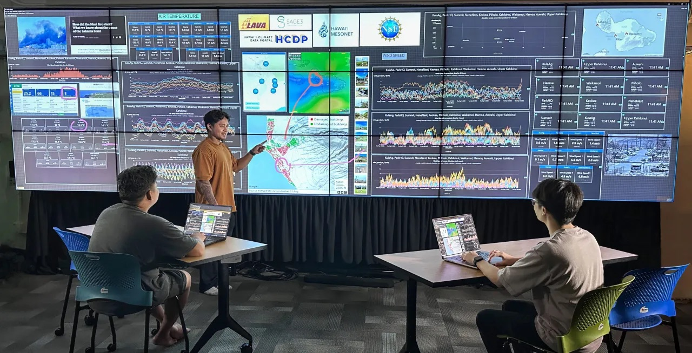

# SAGE3: Smart Amplified Group Environment

[SAGE3](https://sage3.sagecommons.org/) is an open-source platform designed to help individuals and teams collaborate effectively, with each other and with AI, to accelerate understanding, problem-solving, and discovery. Built on over 20 years of National Science Foundation-funded research, SAGE3 is grounded in a deep understanding of how people work together across disciplines and interact with diverse streams of data.

Whether working side-by-side on expansive shared display walls or contributing remotely from a laptop, SAGE3 enables flexible co-located and distributed collaboration. It transforms static data into shared understanding, powering more informed, creative, and collective decision-making.

- **Website:** [sage3.sagecommons.org](https://sage3.sagecommons.org/)
- **Download Client:** [SAGE3 Desktop App](https://sage3.sagecommons.org/?page_id=719)
- **Source Code:** [github.com/SAGE-3/next](https://github.com/SAGE-3/next)
- **Discord:** [Join the community](https://discord.gg/sage3)

---

## What Can You Do With SAGE3?

- **Hyper Screen Sharing** -- Share multiple laptop/desktop screens simultaneously and wirelessly. No dongles required.
- **Seamless Content Sharing** -- Upload content at home and present it on a display wall at work. Drag content across boards spanning multiple displays.
- **Rich Content Types** -- Work with sticky notes, images, videos, PDFs, Google Docs, maps, web pages, and more on an infinite canvas.
- **AI Collaboration** -- Chat with other users and with AI to brainstorm, summarize documents, ask questions about PDFs and images, and ideate visually. Models are configurable per server (OpenAI, Azure OpenAI, self-hosted Llama, and other OpenAI-compatible endpoints).
- **Spatialized Data Science** -- Create 2D data science canvases with SAGECells -- spatialized Python code cells backed by Jupyter kernels. Multiple developers can work on different cells simultaneously.
- **No-Code Dashboards** -- Build custom data dashboards by dragging and dropping URLs of existing web portals directly into SAGE3.

---

## Documentation

### For Users
- [Quick Start Guide](Quick-Start-Guide.md) -- Get up and running
- [SAGE3 Features](Home.md) -- Platform overview
- [Applications](Applications.md) -- Built-in app catalog
- [Keyboard Shortcuts](Shortcuts.md)
- [FAQ](FAQ.md)

### For Server Administrators
- [Server Deployment](Server-Deployment.md) -- Install and configure a SAGE3 server
- [Server Update](Server-update.md) -- Upgrade between versions

### For Developers
- [Architecture](Architecture.md) -- System design and components
- [Development Setup](Development-setup.md) -- Local dev environment
- [Application Development](Application-Development.md) -- Build SAGE3 apps
- [API Usage](API-usage) -- Frontend stores and hooks
- [API Reference](API-Reference.md) -- HTTP and WebSocket API
- [SAGE3 API in SageCell](SAGE3-API-in-SageCell.md) -- Python API
- [JSON Session Format](JSON-Session-Format.md) -- Board export format
- [Electron Client](Electron-client.md) -- Desktop client development

### Extended Platforms
- [Extended Reality (XR) Integration](Extended-Reality-(XR)-Integration.md)

---

## Funding

SAGE3 is funded by the National Science Foundation:
[2004014](https://www.nsf.gov/awardsearch/showAward?AWD_ID=2004014) |
[2003800](https://www.nsf.gov/awardsearch/showAward?AWD_ID=2003800) |
[2003387](https://www.nsf.gov/awardsearch/showAward?AWD_ID=2003387)

## License

SAGE3 is open-source and free for academic, research, and internal business use. Commercial use requires a separate license. The Software is intellectual property owned by the University of Illinois at Chicago, the University of Hawai'i, and Virginia Polytechnic Institute and State University. Full text [here](License.md).
