# Quick Start Guide

Get up and running with SAGE3 in a few minutes.

[PDF Quick Start Guide](https://sage3.sagecommons.org/wp-content/uploads/2026/01/SAGE3-New-User-Guide-Jan-2026.pdf)

---

## 1. Get the Client

SAGE3 works in a **standard web browser** (Chrome recommended) and as a **desktop Electron client** (macOS, Windows, Ubuntu).

The Electron client unlocks additional features: CoBrowser (shared Firefox session), Webview streaming, and multi-display wall support.

- **Download the desktop client:** [sage3.sagecommons.org](https://sage3.sagecommons.org/?page_id=719)
- **Web browser:** navigate directly to a server URL (no install required)

---

## 2. Connect to a Hub

Open the SAGE3 client (or go to a hub URL in your browser). The Electron client comes pre-loaded with the public SAGE3 hub:

- **Chicago** — chicago.sage3.app
- **Hawaii** — manoa.sage3.app
- **Virginia Tech** — sage3.cs.vt.edu

You can also type in a custom server URL if your organization runs a private SAGE3 server. SAGE3 will validate the URL before connecting.

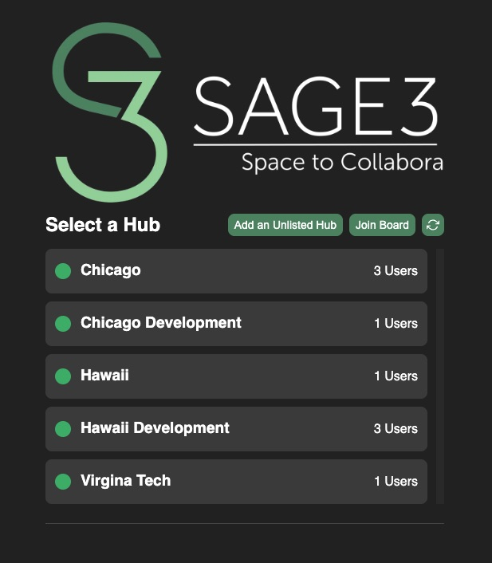

---

## 3. Log In

SAGE3 supports several login methods depending on what the specific SAGE3 hub has enabled:

- **Google** — Sign in with your Google account
- **CILogon** — Federated login for university and research institution accounts
- **Apple** — Sign in with Apple
- **KeyCloak** -- Sigin with keycloak credentials.
- **Guest** — No account required; enter a display name to join

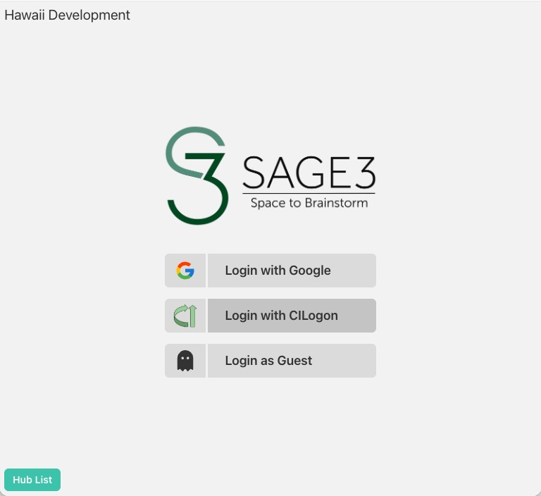

> Guest accounts are temporary. They are removed when the server restarts.

---

## 4. The Home Page: Rooms and Boards

After logging in you'll see the **Home page** — a list of rooms on the server.

### Rooms
A **Room** is a shared workspace. Rooms have their own file library (asset manager). A room can be public (visible to everyone) or private (PIN-protected).

- Click a room to view its boards.
- Click **+ Create Room** to create a new one.
- Private rooms show a lock icon — you'll need the PIN to enter.

### Boards
A **Board** is an infinite canvas inside a room where apps are placed and collaboration happens.

- Click a board to enter it.
- Click **+ Create Board** to create a new one.
- Boards can also be PIN-protected independently of the room.

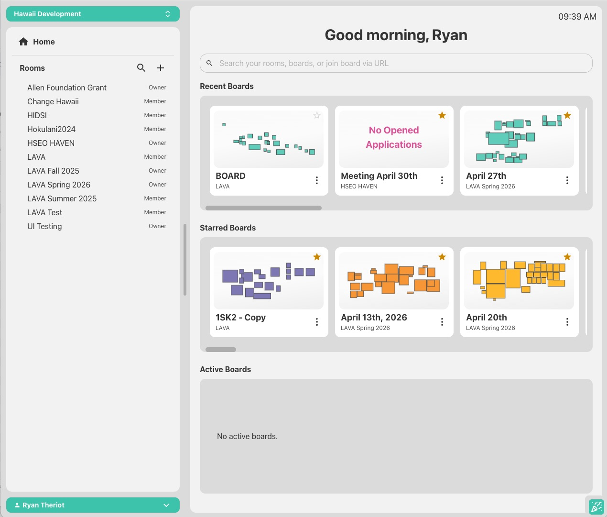

---

## 5. The Board

Once you enter a board, you'll see the **infinite canvas**. This is where everything happens.

### Navigating the Board

| Action | How |
|---|---|
| Pan | Left-click and drag on the background |
| Zoom in/out | Mouse wheel or two-finger trackpad scroll |
| Zoom to fit all apps | Navigation panel → "Show All Apps" |
| Zoom to a specific app | Select the app, press `Z` |
| Revert zoom | `Shift + Z` |
| Reset view | Right-click → Reset View |

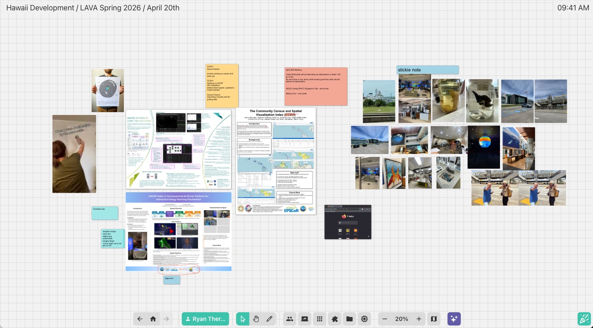

---

## 6. Board Interface

The board interface uses a set of collapsible menus anchored to the bottom of the screen.

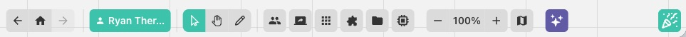

### Navigation Buttons 
Three buttons for navigating backward in board history, returning to the Home page, or navigating forward in board history.

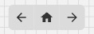

### Main Button
The Main Menu provides access to support features, board functions, and user settings.

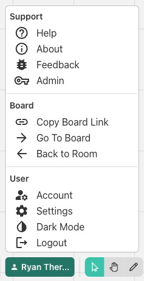

### Interaction Buttons
Sets the user's interaction mode to one of three options: Selection, Grab, or Annotation.

Selection mode is the default. It allows users to fully interact with all applications on the board.

Grab mode disables most interaction with board elements, but allows the user to pan and zoom freely.

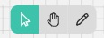

Annotation mode provides tools for drawing freehand on the board and adding arrows.

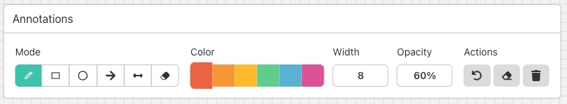

### Users Panel
Lists all users on the board as color-coded avatars. Click an avatar to follow that user's view or jump to their cursor.

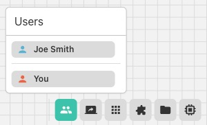

### Screenshare Panel
Lists all currently opened screenshares on the board, listed by usernames. Clicking a username will center your view on that specific screenshare. Clicking **Start Sharing** will open a Screenshare app and initiate your screenshare. If you are currently sharing your screen it will show **Stop Sharing**, allowing you to end your current screenshare.

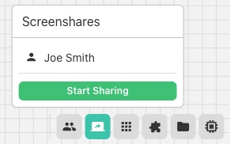

### Applications Panel
Lists all available applications. Click to open an app at the center of your view, or **drag** the app name to place it at a specific location on the board.

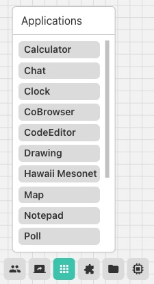

### Plugins Panel
Lists custom plugin applications uploaded to the server.  Click to open a plugin at the center of your view, or **drag** the app name to place it at a specific location on the board. To upload a new Plugin click the **Upload** button.

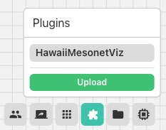

### Assets Panel
Shows all files uploaded to the current room.
- **Drag** a file name onto the board to open it in its default viewer.
- **Double-click** a file name to open it at the center of your view.
- Click **Upload** to add files (supports folder upload).
- Or simply **drag files from your desktop** directly onto the board.

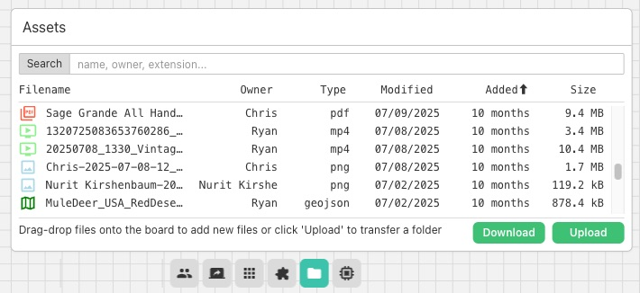

### Kernels Panel
Lists all the kernels available to this board and allows creating new ones. Kernels can be utilized by the SAGECell app to run Python, Julia, and R Code.

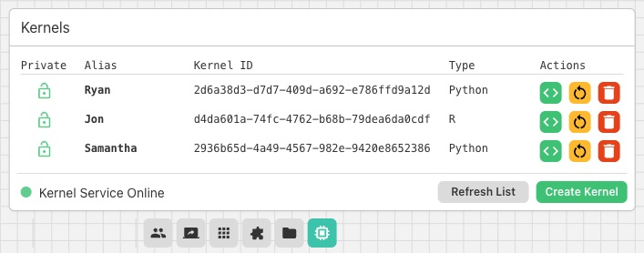

### Map Panel
Contains a **minimap** showing all apps on the board and user positions. Clicking on an app in the **minimap** will center your view on the app.  Also includes zoom controls and the **Show All Apps** button, which will shift your view to have all applicaitons within view.

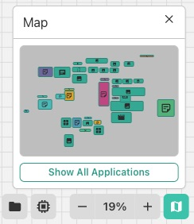

---

## 7. Opening Applications

Applications are content windows on the board. There are two ways to open them:

**From the Applications Panel:**
- Click an app name → opens at the center of your view
- Drag an app name → places it where you drop it

**By dropping files on the board:**
- Drop an image → **ImageViewer**
- Drop a PDF → **PDFViewer**
- Drop a video → **VideoViewer**
- Drop a CSV → **CSVViewer**
- Drop a Markdown file → **Stickie**
- Drop an unsupported file → **AssetLink** (download button)

**By pasting content onto the board:**
- Paste a URL → **WebpageLink** (metadata preview card)
- Paste text → **Stickie** note

---

## 8. Working with Apps

**Select an app:** Move your cursor on top of the app and left click it. A teal outline appears and the toolbar shows below it. When an app is selected you can interact with it's content.

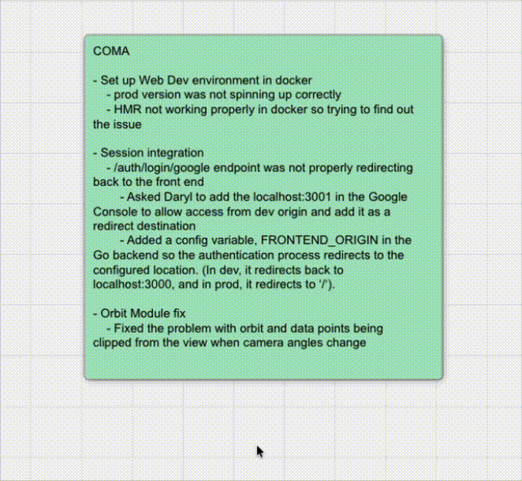

**Move an app:** Left click, hold, and drag an *unselected* app. (Deselect first by left clicking the board's background or pressing `ESC`.)

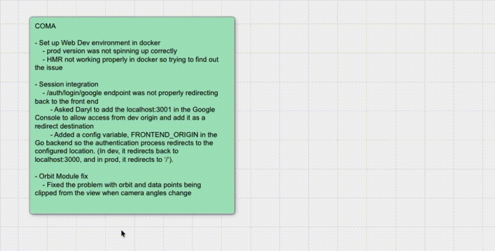

**Resize an app:** Select an app and drag any edge or corner of the app window.

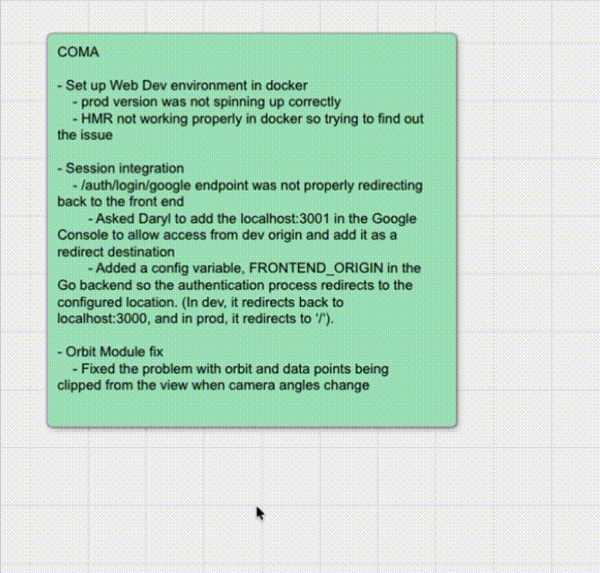

**Lasso:** Hold `Shift` and drag on the board background to draw a lasso selection. Then move, duplicate, or close the selected group.

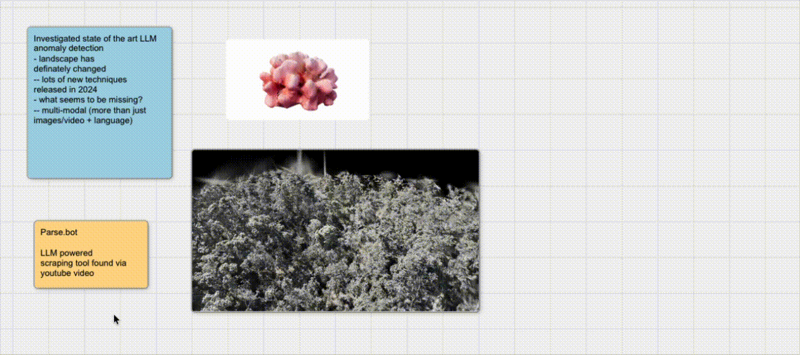

---

## 9. Uploading Files

Three ways to upload:

1. **Drag from desktop** → drop directly onto the board → file uploads and the appropriate app opens where you dropped it.
2. **Assets panel → Upload button** → select files or a folder.
3. **In-app save** → apps like CodeEditor, Stickie, and Notepad have a "Save to Asset Manager" button in their toolbar.

Uploaded files are available to all boards in the same room.

**What happens on upload:**
- Images → processed to multiple resolutions (WebP) for fast display. Very large images also get converted to DeepZoom format.
- PDFs → rendered page-by-page at multiple resolutions.
- All others → stored as-is.

---

## 10. Collaborating with Others

All board changes are synchronized in real time across every connected user.

**See other users:**
- Colored cursors show where everyone is working.
- Open the **Users panel** to see all users as avatars.

**Follow a user:**
- Click their avatar in the Users panel → select **Follow** to mirror their view continuously. Useful for presentations.

**Wall display users:**
- Users on a shared display wall should set their type to **Wall** (in Account settings). This shows a bounding box outline of the wall's viewport to all other users, helping them understand what is visible on the big screen.

**Annotations:**
- Open the Annotation panel, pick a color, and draw freehand on the board. Your annotations are visible to everyone.

---

## 11. Quick Reference: Common Tasks

| Task | How |
|---|---|
| Create a sticky note | Press `Shift + S` or drag "Stickie" from the Applications panel |
| Create a SageCell | Right-click board → SageCell |
| Share your screen | Open the Screenshare panel and click **Start Sharing** |
| Open a web page | Paste a URL onto the board |
| Write collaborative notes | Open "Notepad" from the Applications panel |
| Run Python code | Open "SageCell", select a kernel, write code, press `Shift + Enter` |
| Save a file | Drag from the Asset panel onto the board, or use in-app upload buttons |
| Zoom to all apps | `Navigation panel → Show All Apps` |
| Hide the interface | Right-click board → Show Interface (toggle off) |

---

## 12. Keyboard Shortcuts

See the full [Shortcuts](Shortcuts.md) page. Most-used shortcuts:

| Action | Shortcut |
|---|---|
| Zoom to selected app | `Z` |
| Revert zoom | `Shift + Z` |
| New Stickie | `Shift + S` |
| Draw mode (Pen) | `3` |
| Quick command bar | `Cmd + K` / `Ctrl + K` |
| Deselect / cancel | `ESC` |
| SageCell: run code | `Shift + Enter` |
| PDF: next page | `→` or `↓` |
| PDF: previous page | `←` or `↑` |
| Help | `?` |

---

## Next Steps

- [SAGE3 Features](Home.md) — full feature overview
- [Applications](Applications.md) — detailed documentation for every app
- [Shortcuts](Shortcuts.md) — complete keyboard shortcut reference
- [FAQ](FAQ.md) — common questions and answers
- [Server Deployment](Server-Deployment.md) — deploy your own SAGE3 server
