# SAGE3 API in SageCell

## Introduction

The SAGE API is now (partially) exposed in SageCell in Python. That means you can access all the content of the board, create apps, move and resize apps, get state of the apps and modify them, open assets, and more. The kernels are managed by SAGE3's internel JupyterLab instance.

## Setup

The first thing to do is to create a Python kernel to run your code. For this, open the 'Kernel' panel from the main menubar. You can move this panel any where on the board. It also sticks to the sides of the window if you resize the SAGE3 client.

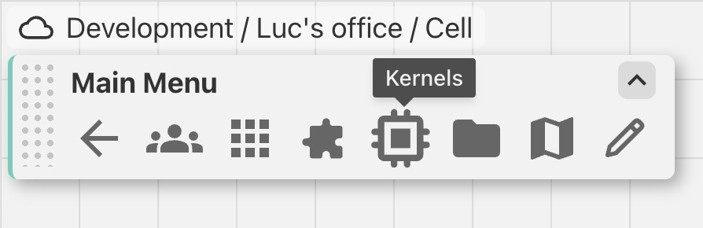

By default, no kernel are running. You can create public and private kernels to execute your code. Click the 'Create Kernel' button
and select a kernel type and an alias for your kernel. A private kernel can be only used by you. Also, kernels can only be used in
the board they have been created in.

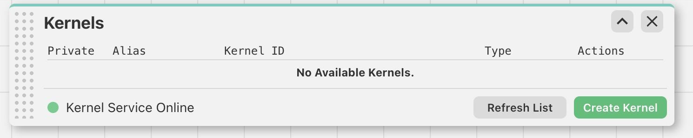

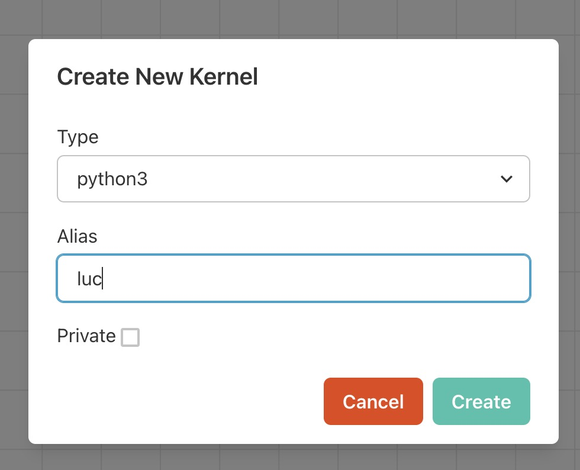

Now your new kernel is listed in the 'Kernel' panel. Three buttons are available for each kernel:
 - **Create cell**: will create a 'SageCell' application linked to this kernel of execution. Multiple SageCell can share the same kernel of execution
 - **Restart kernel**: restart the Jupyter kernel, if stuck for instane
 - **Delete kernel**: delete the kernel from the Jupyter server

## Coding

### Python Kernel

Clicking 'Create Cell' in the 'Kernel' panel, creates a SageCell in the center of the view. The cell is linked to the kernel. You can see the kernel alias (name) in the top of the cell, or when selecting the application, you see the kernel name in the application toolbar. You can switch kernel by selecting another kernel in the pulldown menu.

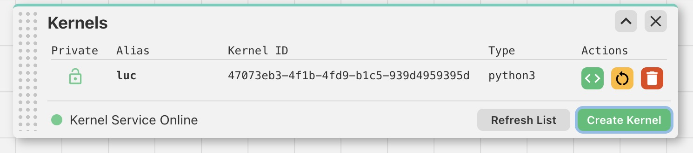

The cell is empty by default. You can also create cells by uploading (drag/drop) python files (with the extension .py). The python files are stored in the asset manager for later use.

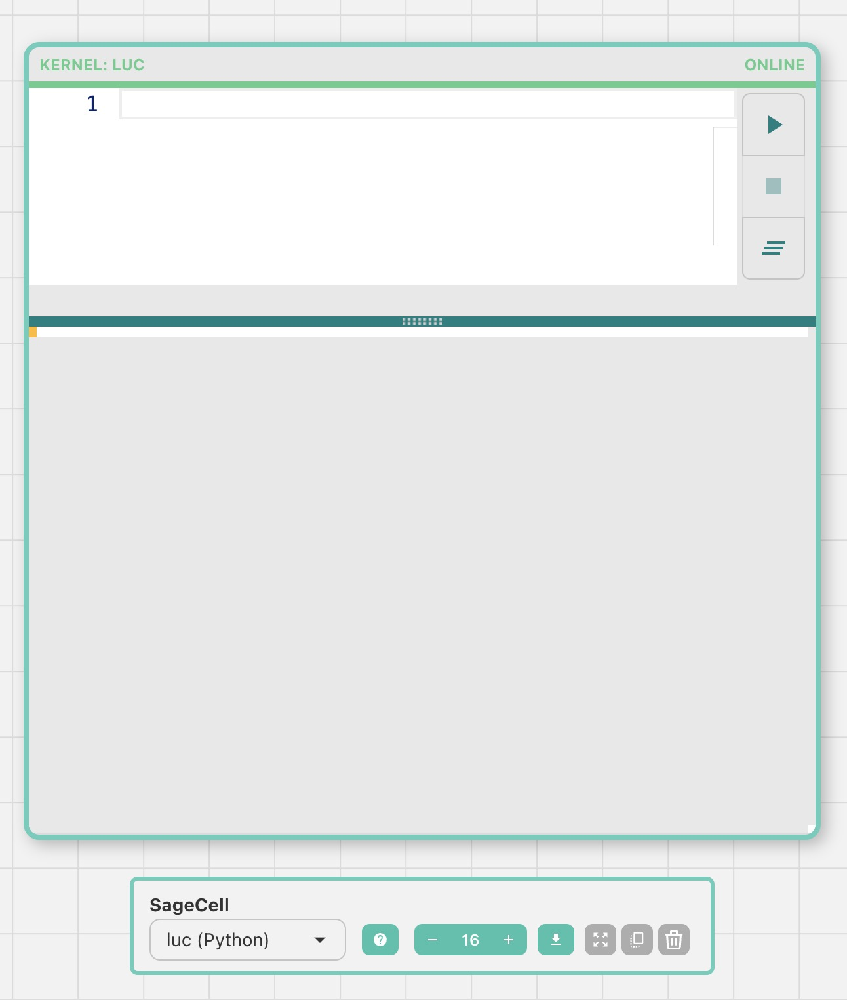

You can type python code in the cell and evaluate the code by pressing 'Shift-Enter' or the 'Execute' button on the left.
The results are shown in the pane below the code. We use the docker image 'jupyter/datascience-notebook' with Python 3.9 and
a variety of python packages are pre-installed (matplotlib, plotly, etc).

### API Setup

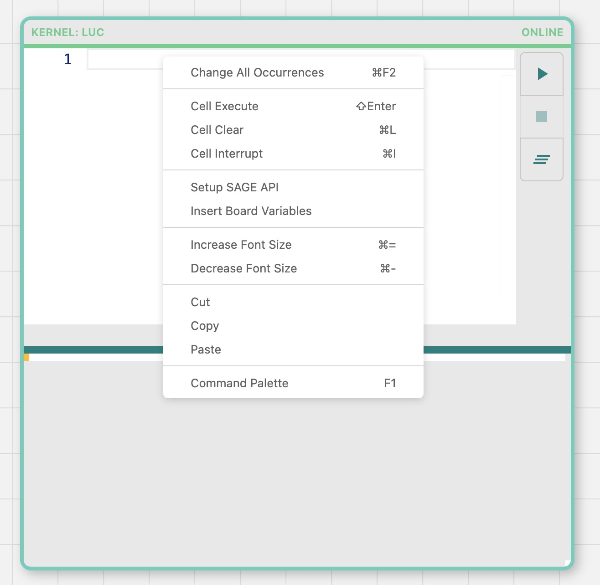

To enable the SAGE3 API inside a cell, you need to import a utility package (PySage3) and a few variables (the room and board identifiers
 and the identifier of the cell you are running in). This is facilitated by the context menu (right-click) in the cell. 'Insert board Variables) just adds the above mentioned variables. The 'Setup SAGE API' clears the cell and adds all the needed code to start interacting 
with the board.

```python
# Import dependencies
from foresight.config import config as conf, prod_type
from foresight.Sage3Sugar.pysage3 import PySage3
# Context variables
room_id = 'ea45732f-36ce-4cc8-8e07-f6536c4e8779'
board_id = '9e87bff1-6946-44eb-87b4-3bb167cb1a7c'
app_id = 'e83cc1b7-9d81-4a11-b012-b65abd93c9fb'
# Create a handle to the SAGE3 system
ps3 = PySage3(conf, prod_type)
```

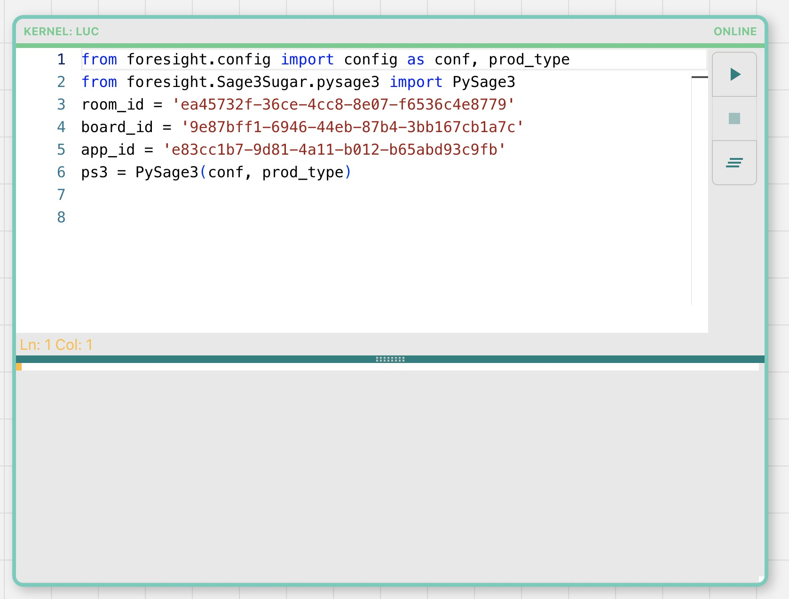

The PySage3 API gets you a handle to a series of functions to query the SAGE3 system (more functions will be added over time).

### API Usage

For instance, to get the list of running applications (smartbits are utility objects to interact with an application):
```python
smartbits = ps3.get_smartbits(room_id, board_id)
for _, sm in smartbits:
    print(sm.app_id, sm.data.type, sm.state)
```

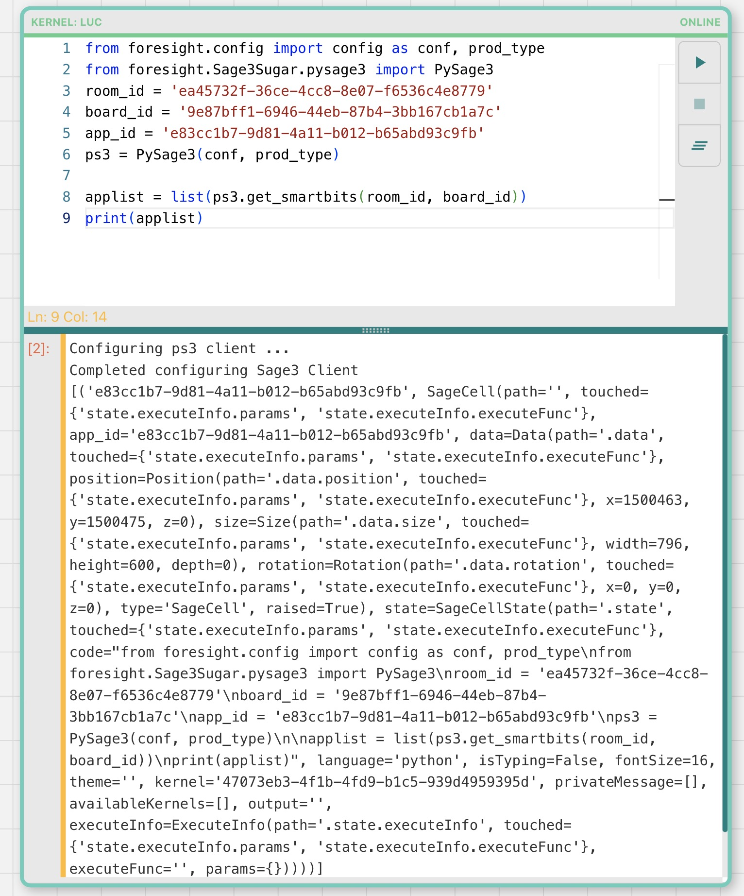

To get information about an application, iterate over the application list and match to the 'app_id' provided:
```python
applist = ps3.get_smartbits(room_id, board_id)
for _, app in applist:
    if app.app_id == app_id:
        cell = app
        psize = [cell.data.position.x, cell.data.position.y, cell.data.size.width, cell.data.size.height]
print('Cell position and size', psize)
```

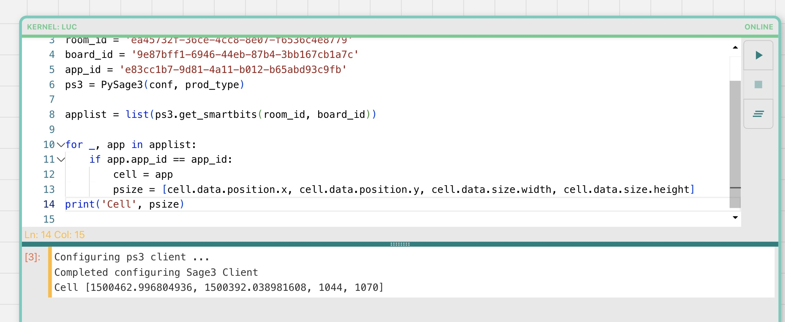

### Create an application

Having the position and size of the current application (cell), you can now create application on the canvas around the cell

```python
# Setup a new position
stickie_w = 600
stickie_h = 200
pad = 20
# Position to the right of the current app
right = {'x': psize[0] + psize[2] + pad, 'y': psize[1], 'z': 0}
# Create a stickie application
state = {"text": "Some python....", 'color': 'yellow', 'fontSize': '24'}
# Call to SAGE3 API
res = ps3.create_app(room_id, board_id, 'Stickie', state, {'size': {'width': stickie_w, 'height': stickie_h, 'depth': 0}, 'position': right})
info = res.json()
if info['success']:
    # Save the ID of the application
    app1 = info['data'][0]['_id']
```

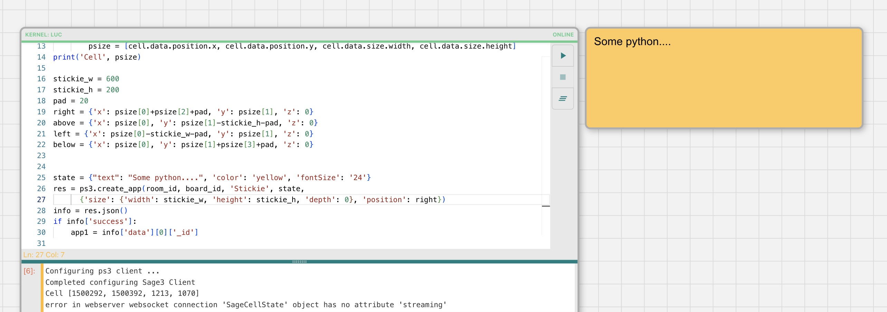

You can decide to delete the new application
```python
ps3.delete_app(app1)
```

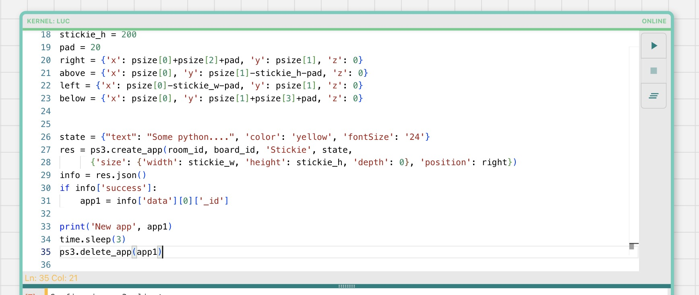

### Application positioning

Various positions around the cell can be defined as:
```python
stickie_w = 600
stickie_h = 200
pad = 20
right = {'x': psize[0] + psize[2] + pad, 'y': psize[1], 'z': 0}
above = {'x': psize[0], 'y': psize[1] - stickie_h - pad, 'z': 0}
left = {'x': psize[0] - stickie_w - pad, 'y': psize[1], 'z': 0}
below = {'x': psize[0], 'y': psize[1] + psize[3] + pad, 'z': 0}
```

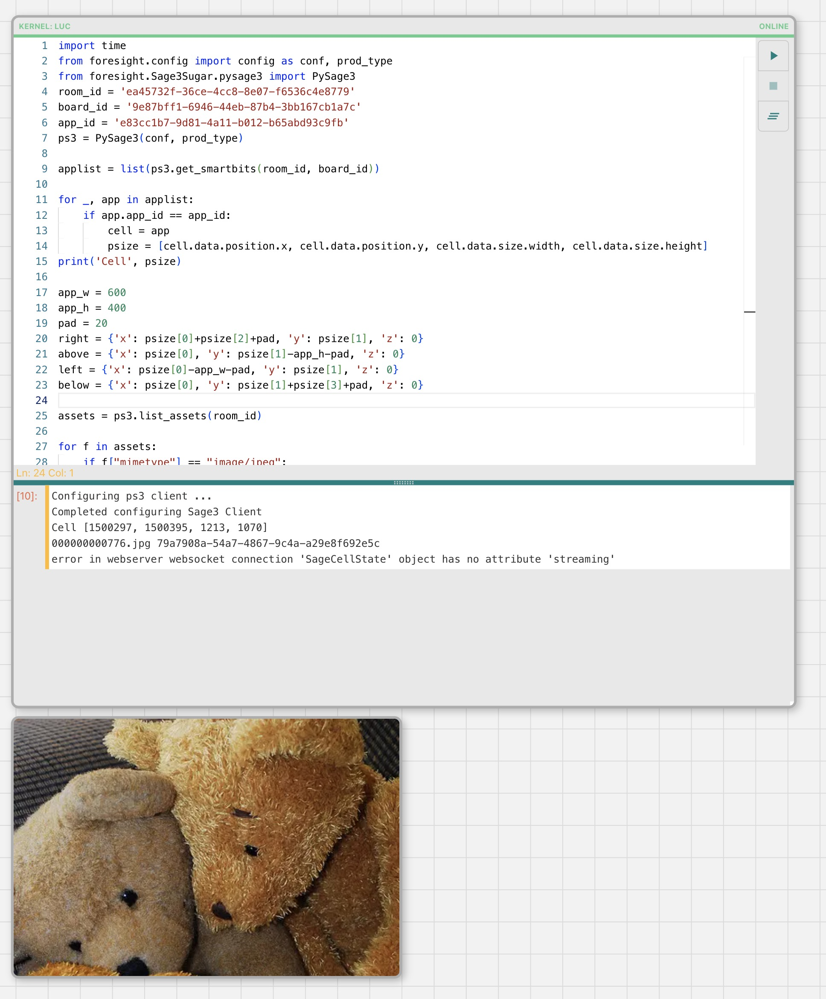

### Opening an asset

You can search an asset and open the matching viewing application. For instance, opening an ImageViewer application
for an image file. Remember that each application class has different state values required. Refer to the documentation
for more information.

```python
# Get the assets available in this room (shared across boards)
assets = ps3.list_assets(room_id)

for f in assets:
    if f["mimetype"] == "image/jpeg":
        if f["filename"] == "000000000139.jpg":
            assetid = f["_id"]
            state = {"assetid": assetid}
            ps3.create_app(room_id, board_id, "ImageViewer", state, {'size': {'width': 600, 'height': 400, 'depth': 0}, 'position': below})
```
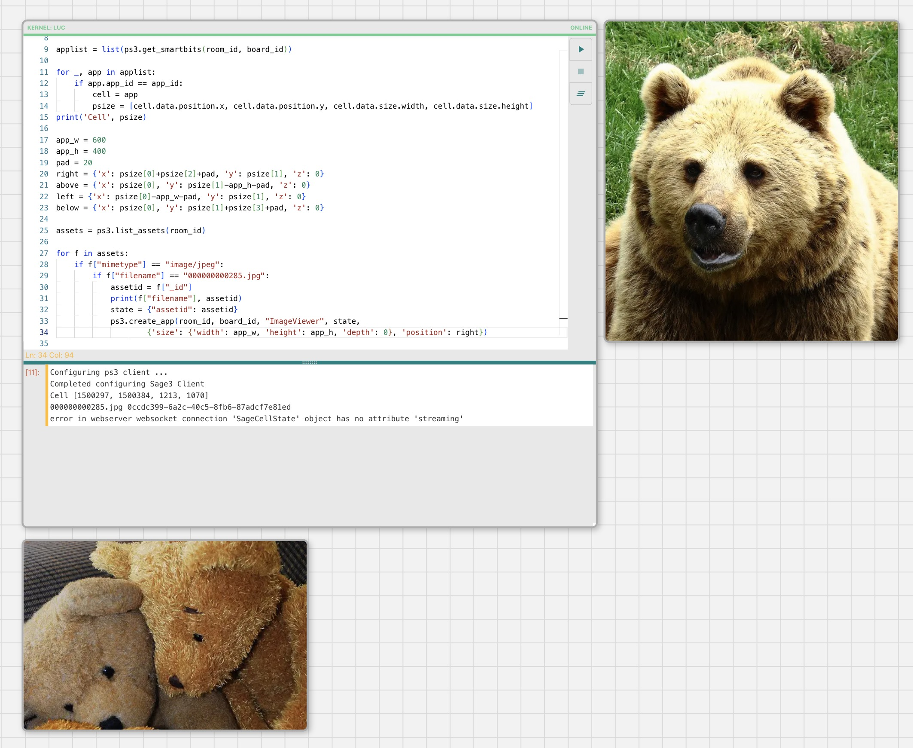


### Opening a data file

You upload data files into the asset manager, such as CSV files. Then, you can load the data into a Pandas dataframe.

```python
# load panda library
import pandas as pd

# Get the assets available in this room (shared across boards)
assets = ps3.list_assets(room_id)

for f in assets:
    if f["filename"] == 'airtravel.csv':
        print('Asset:', f["_id"], 'filename:', f['filename'], 'size:', f['size'], 'type:', f['mimetype'])
        # the asset I want to retrieve
        assetid = f["_id"]
        # build the url
        url = ps3.get_public_url(assetid)
        # load the dataframe
        frame = pd.read_csv(url)
        print('Frame> ', frame)
```

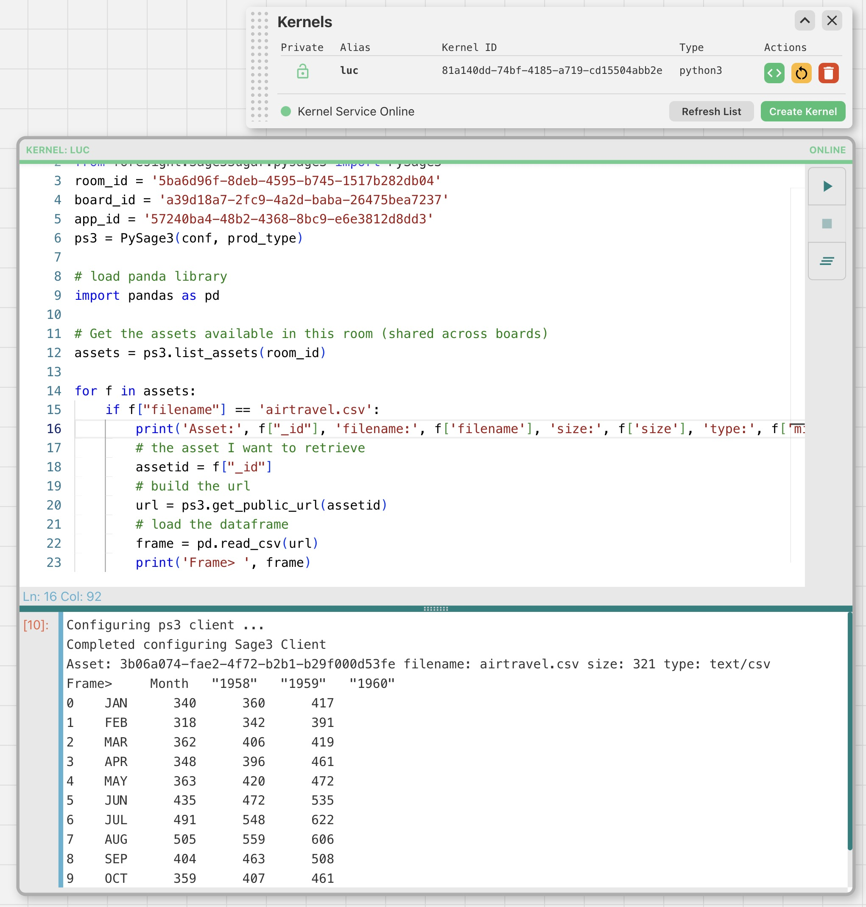

### Move and resize applications

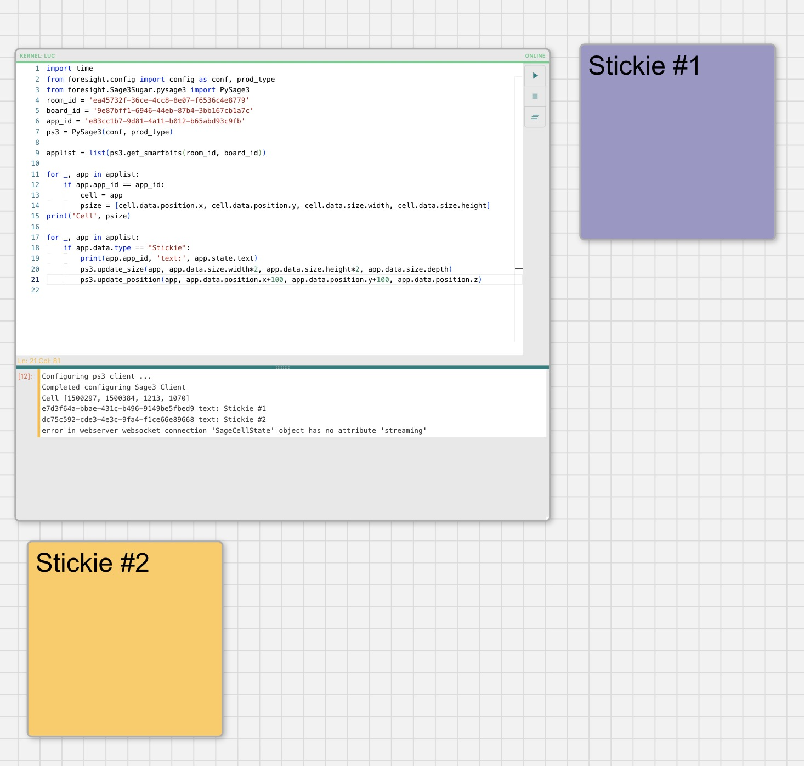

You can move and resize applications. For instance here, we are scaling the size of each stickies by a factor of 2, and moving
each one 100 pixels right and 100 pixels down.

```python
applist = ps3.get_smartbits(room_id, board_id)
for _, app in applist:
    if app.data.type == "Stickie":
        ps3.update_size(app, app.data.size.width*2, app.data.size.height*2, app.data.size.depth)
        ps3.update_position(app, app.data.position.x+100, app.data.position.y+100, app.data.position.z)
```

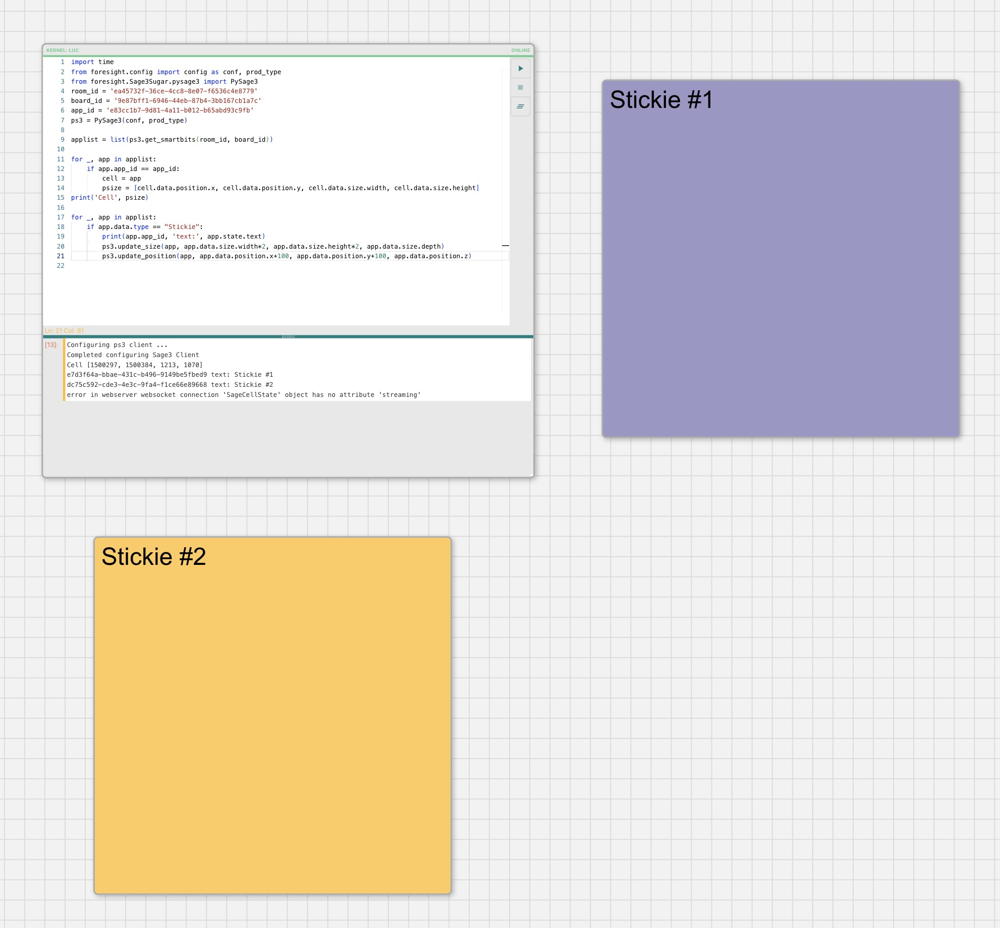

### Get applications state

Get the list of application in a board, and then list the state object for each one. Each application has a different state object, so explore with caution. You can use the 'get_smartbits' function to get the list of applications which are managed as smartbits (state defined with `pydantic`). The low level API is `get_apps` which returns a list of dictionaries.

```python
smartbits = ps3.get_smartbits(room_id, board_id)
for _, sm in smartbits:
    print(sm.app_id, sm.data.type, sm.state)
```

```python
apps = ps3.get_apps(room_id, board_id)
for app in apps:
    print("App:", app["_id"], app["data"]["type"])
    if app["data"]["type"] == "Stickie":
        print("   data> text:", app["data"]["state"]["text"])
    if app["data"]["type"] == "SageCell":
        print("   data> language:", app["data"]["state"]["language"])
    if app["data"]["type"] == "ImageViewer":
        print("   data> asset:", app["data"]["state"]["assetid"])
    if app["data"]["type"] == "PDFViewer":
        print("   data> page#:", app["data"]["state"]["currentPage"])
    if app["data"]["type"] == "GLTFViewer":
        print("   data> P/A/D:",
            app["data"]["state"]["p"], app["data"]["state"]["a"], app["data"]["state"]["d"])
```

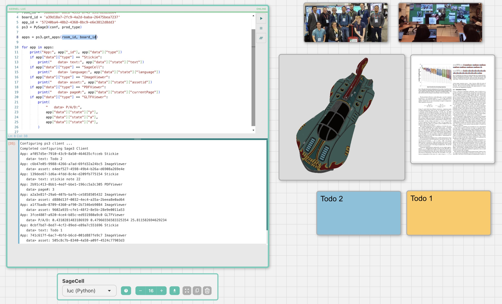

### Get applications tags

SAGE3 maintains a collection called 'Insight' that stores tags for each application. Tags are just strings stored in an array. You can get the tags for a specific application, or all the tags for all the applications in the board.

```python
# All the tags for all the apps
alltags = ps3.get_alltags()
print("Tags for the apps:", alltags)

# Get and update the tags for Stickies
for app in apps:
    print("App:", app["_id"], app["data"]["type"])
    tags = ps3.get_tags(app["_id"])
    print("   tags:", tags)
    if app["data"]["type"] == "Stickie":
        # add new labels
        all = tags + ["text", "stickie"]
        # remove duplicates
        all = list(set(all))
        # Send the new tags to the server
        ps3.update_tags(app["_id"], all)
```

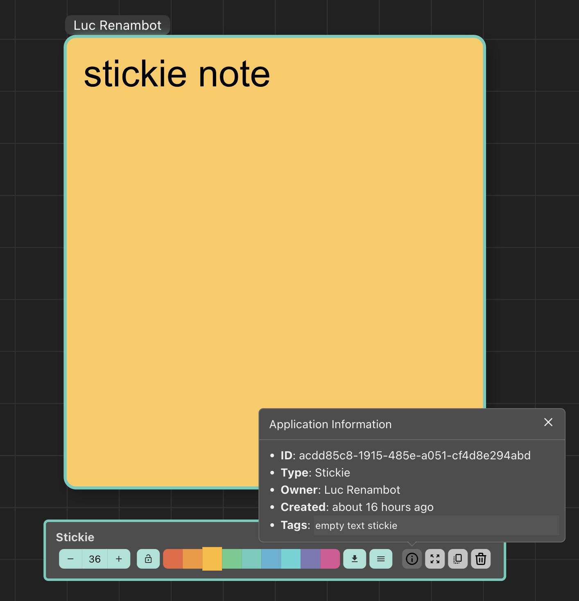

### Uploading a file

Use the `upload_file` function to upload a file to the asset manager. The file is uploaded to the room's asset manager. The function returns the asset ID of the uploaded file. Pass the room ID, the filename, and the file content as a string.

```python
filedata = """time, revenue, cost
t1, 20,  155
t2, 130, 20
t3, 10, 25
t4, 20, 30
t5, 10, 112
"""
ps3.upload_file(room_id, "test.csv", filedata)
```

## API

The current objects and functions:
 - PySage3 class: main SAGE3 object
   - `def __init__(self, conf, prod_type)`
 - create_app
   - `def create_app(self, room_id, board_id, app_type, state, app=None)`
 - delete_app
   - `def delete_app(self, app_id)`
 - update_size
   - `def update_size(self, app, width=None, height=None, depth=None)`
 - update_position
   - `def update_position(self, app, x=None, y=None, z=None)`
 - update_rotation
   - `def update_rotation(self, app, x=None, y=None, z=None)`
 - list_assets
   - `def list_assets(self, room_id=None)`
 - get_public_url
   - `def get_public_url(self, asset_id)`
 - get_app
   - `def get_app(self, app_id: str = None) -> dict`
 - get_apps
   - `def get_apps(self, room_id: str = None, board_id: str = None) -> List[dict]`
 - get_apps_by_room
   - `def get_apps_by_room(self, room_id: str = None) -> List[dict]`
 - get_apps_by_board
   - `def get_apps_by_board(self, board_id: str = None) -> List[dict]`
 - get_smartbits
   - `def get_smartbits(self, room_id: str = None, board_id: str = None) -> dict`
 - get_smartbits_by_type
   - `def get_smartbits_by_type(self, app_type: str, room_id: str = None, board_id: str = None) -> list`
 - get_types_count
   - `def get_types_count(self, apps: list = None) -> dict`
 - clean_up
   - `def clean_up(self)`
 - get_tags
   - `def get_tags(self, app_id)`
 - update_tags
   - `def update_tags(self, app_id, tags)`
 - get_alltags
   - `def get_alltags(self)`
 - upload_file
   - `def upload_file(self, room_id, filename, filedata)`


Reference: https://github.com/SAGE-3/next/blob/dev/foresight/foresight/Sage3Sugar/pysage3.py

