# Server Deployment

**Updated January 2025**

The SAGE3 server can be deployed on a Window, Mac or Linux machine with a fully qualified name and a SSL certificate to support HTTPS. It includes a series of containers running the services required for the SAGE3 platform (using docker compose).

- For reference, SAGE3 is composed of  
  - \`redis-server\`: in-memory database  
  - \`node-server\`: web server  
  - \`fluentd-server\`: logging server  
  - \`kernelserver\`: jupyter kernel management  
  - \`jupyter\`: jupyter server  
  - \`chromadb\`: Vector database for AI services  
  - \`seer\`: Python backend for AI services  

To update a server, here are the files to keep/move/backup:

- Your assets (images, PDF, movies, …) are in the `configurations/node/assets` sub folder.
  - Files to save if you want to backup your server.
- Your plugins are in the `configurations/node/plugins` sub folder.
  - Files to save if you want to backup your server.
- The database data (rooms, boards, users, …) is in `configurations/redis/data/dump.rdb` file
  - File to save if you want to backup your server.

## Requirements

- Windows, MacOS, or Linux operating system
- Docker installation
- Fully Qualified Domain Name (FQDN)
  - i.e. A hostname recognized on a public network or your institutions private network
    - Ex. myserver.mycompany.com
    - Ex. myserver.cs.university.edu
- SSL Certificates for server (or wildcard certificate for a domain)
- Optional services:
  - Google OAuth credentials, for authentication
  - CILogin OAuth credentials, for authentication
  - Apple with 'Sign in with Apple' credentials, for authentication
  - Twilio API registration, for screen sharing
  - LLM provider credentials (API keys and/or endpoints), for AI services — see [AI Configuration](#ai-configuration)

## Installation

Linux is the main platform for SAGE3 production deployment. MacOS and Windows are supported for development and testing. The following instructions are for Linux, MacOS, and Windows.

### Linux

We are mostly using Ubuntu, but the instructions should be similar for other distributions.

1. Install Docker for ubuntu

- Do not install `Docker Desktop` for Ubuntu. Instead, install `Docker Engine` for Ubuntu
- Have a `sudo` capable user account (not root)

```bash
# Open a Terminal

# Install docker
sudo apt-get install docker.io docker-compose-plugin

# Add the user to the docker group
sudo usermod -aG docker [username]

# Create the new group
newgrp docker

# Close terminal and open a new one
```

- Test docker installation

```bash
# Open a Terminal

# Check docker status
docker ps
CONTAINER ID   IMAGE     COMMAND   CREATED   STATUS    PORTS     NAMES

# Run the test container hello-world
docker run --rm hello-world

# It pulls hello-world image
# It runs the image
# It deletes the container after it is done
```

2. Install NodeJS 20.xx

- Installation using NodeSource repository

```bash
# Open a Terminal

curl -fsSL https://deb.nodesource.com/setup_20.x | sudo -E bash -
sudo apt-get install -y nodejs
```

- Test NodeJS installation

```bash
# Open a Terminal
node -v
```

3. Download a SAGE3 server package:

- [SAGE3 AMD64 Server Package for Intel CPUs](https://github.com/SAGE-3/next/releases/download/server-latest/SAGE3-amd64.tgz) — this permanent link always serves the newest release; versioned packages are listed under [Releases](https://github.com/SAGE-3/next/releases).

```bash
# Open a Terminal

# Download the package into your user's home folder
cd ~
curl -LO https://github.com/SAGE-3/next/releases/download/server-latest/SAGE3-amd64.tgz

# Optional: verify the download
curl -LO https://github.com/SAGE-3/next/releases/download/server-latest/SAGE3-amd64.tgz.sha256
sha256sum -c SAGE3-amd64.tgz.sha256

# Extract file — the archive extracts to a folder named after the packaged version
tar xvfz SAGE3-amd64.tgz
cd SAGE3-1.6
```

4. Copy your SSL Certificates to the configurations folder. There should be two files, your PRIVATE key and the CERTIFICATE file

```bash
# Open a Terminal

# Copy SSL Certs to the SAGE3 Keys folder. Remember these names for later when setting up the configuration file (step 7).
cp PRIVATE_KEY_FILE ~/SAGE3-1.6/configurations/node/keys
cp CERTIFICATE_FILE ~/SAGE3-1.6/configurations/node/keys
```

5. Generate JWT Keys and Token

```bash
# Open a Terminal

# Switch to the SAGE3 Node Keys Directory
cd ~/SAGE3-1.6/configurations/node/keys

# Generate JWT Keys and Token
./genJWT_keys.sh
./genJWT_token.sh
```

6. Edit the `.env` File

```bash
# Open a Terminal

# Change directory to the SAGE3 Server Folder
cd ~/SAGE3-1.6

# Edit .env file and add the name of your server and the token you just generated. Leave other variables as is.
vim .env
SAGE3_SERVER=YOUR_SERVERS_HOST_NAME
TOKEN= # token value copied without “” from: configurations/node/keys/token.json
CHROMA_SERVER_AUTHN_CREDENTIALS=...
CHROMA_CLIENT_AUTH_CREDENTIALS=...
```

7. Edit the Configuration file `sage3-prod.hjson`

```bash
# Open a Terminal

# Change directory to the SAGE3 Server Node Folder
cd ~/SAGE3-1.6/configurations

# Edit the sage3-prod.hjson file with your preferred editor
# The file is documented with instructions.
vim sage3-prod.hjson
```

9. Pull the Docker Images

```bash
# Open a Terminal

# Change to the SAGE3 Server Directory
cd ~/SAGE3-1.6

# Pull images
docker compose pull

# Might take a while but results should be:
 ✔ redis-server Pulled                                                                            0.3s 
 ✔ node-server Pulled                                                                             0.3s 
 ✔ seer Pulled                                                                                    0.3s 
 ✔ fluentd-server Pulled                                                                          0.3s 
 ✔ jupyter Pulled                                                                                 1.1s 
 ✔ chromadb Pulled                                                                                0.3s 
 ✔ kernelserver Pulled                                                                            0.2s 
```

10. Start the Server

```bash
# Open a Terminal

# Change to the SAGE3 Server Directory
cd ~/SAGE3-1.6

# Start Server
./GO

# To Stop the Server
./STOP
```

### Windows

1. Install [Docker Desktop for Windows](https://www.docker.com/products/docker-desktop/)

2. Install Windows Subsystem for Linux WSL using distribution Ubuntu 22.04
```
# Open Powershell
wsl --install -d Ubuntu-22.04
```
  - (optional) You can install [Visual Studio Code WSL Extension](https://marketplace.visualstudio.com/items?itemName=ms-vscode-remote.remote-wsl) to edit files inside WSL.

3. Install Node.js within the WSL subsystem

```
# Open Powershell and switch to WSL
wsl

# Ensure Curl is installed
sudo apt-get install curl

# Install Node.js repository
curl -sL https://deb.nodesource.com/setup_20.x | sudo -E bash -
# Install Node.js
sudo apt-get install -y nodejs
# Test
node -v
```

4. Download the [SAGE3 AMD64 Server Package](https://github.com/SAGE-3/next/releases/download/server-latest/SAGE3-amd64.tgz) and extract it within the WSL subsystem

```
# Open Powershell and switch to WSL
wsl

# Download the package into your user's home folder
cd ~
curl -LO https://github.com/SAGE-3/next/releases/download/server-latest/SAGE3-amd64.tgz

# Optional: verify the download
curl -LO https://github.com/SAGE-3/next/releases/download/server-latest/SAGE3-amd64.tgz.sha256
sha256sum -c SAGE3-amd64.tgz.sha256

# Extract file — the archive extracts to a folder named after the packaged version
tar xvfz SAGE3-amd64.tgz
cd SAGE3-1.6
```

5. Copy your SSL Certificates to the configurations folder. There should be two files, your PRIVATE key and the CERTIFICATE file

```
# Open Powershell and switch to WSL
wsl

# Copy SSL Certs to the SAGE3 Keys folder. Remember these names for later when setting up the configuration file (step 8).
cp PRIVATE_KEY_FILE ~/SAGE3-1.6/configurations/node/keys
cp CERTIFICATE_FILE ~/SAGE3-1.6/configurations/node/keys
```

6. Generate JWT Keys and Token

```
# Open Powershell and switch to WSL
wsl

# Switch to the SAGE3 Node Keys Directory
cd ~/SAGE3-1.6/configurations/node/keys

# Generate JWT Keys and Token
./genJWT_keys.sh
./genJWT_token.sh
```

7. Edit the `.env` File

```
# Open Powershell and switch to WSL
wsl

# Change directory to the SAGE3 Server Folder
cd ~/SAGE3-1.6

# Edit .env file with your preferred editor
vim .env
SAGE3_SERVER=YOUR_SERVERS_HOST_NAME
TOKEN= # token value copied without “” from: configurations/node/keys/token.json
```

8. Edit the Configuration file `sage3-prod.hjson`

```
# Open Powershell and switch to WSL
wsl

# Change directory to the SAGE3 Server Node Folder
cd ~/SAGE3-1.6/configurations/node

# Edit the sage3-prod.hjson file with your preferred editor
# The file is documented with instructions.
vim sage3-prod.hjson
```

9. Start Docker Desktop within Windows

10. Pull the Docker Images

```
# Open Powershell and switch to WSL
wsl

# Change to the SAGE3 Server Directory
cd ~/SAGE3-1.6

# Pull images
sudo docker compose pull

# Might take a while but the results should be similar to:
Pulling redis-server ... done
Pulling node-server  ... done
Pulling python       ... done
Pulling jupyter      ... done
Pulling fluentd      ... done
pulling fastapi      ... done
```

11. Start the Server

```
# Open Powershell and switch to WSL
wsl

# Change to the SAGE3 Server Directory
cd ~/SAGE3-1.6

# Start Server
./GO

# To Stop the Server
./STOP
```

### MacOS

1. Install [Docker Desktop for macOS](https://www.docker.com/products/docker-desktop/)

- Make sure to select the architecture (M1 or Intel) that matches your machine

2. Install NodeJS 20.xx

- Navigate to [NodeJS Downloads](https://nodejs.org/en/download/) and download the latest v20.x of NodeJS for your machine

3. Download a SAGE3 server package:

- [SAGE3 ARM64 Server Package for Arm CPUs (Apple Silicon, Ampere, ...)](https://github.com/SAGE-3/next/releases/download/server-latest/SAGE3-arm64.tgz) and extract it
- [SAGE3 AMD64 Server Package for Intel CPUs](https://github.com/SAGE-3/next/releases/download/server-latest/SAGE3-amd64.tgz) and extract it

These permanent links always serve the newest release; versioned packages are listed under [Releases](https://github.com/SAGE-3/next/releases).

```
# Open a Terminal

# Download the package into your user's home folder
cd ~
curl -LO https://github.com/SAGE-3/next/releases/download/server-latest/SAGE3-arm64.tgz

# Optional: verify the download
curl -LO https://github.com/SAGE-3/next/releases/download/server-latest/SAGE3-arm64.tgz.sha256
shasum -a 256 -c SAGE3-arm64.tgz.sha256

# Extract file — the archive extracts to a folder named after the packaged version
tar xvfz SAGE3-arm64.tgz
cd SAGE3-1.6
```

4. Copy your SSL Certificates to the configurations folder. There should be two files, your PRIVATE key and the CERTIFICATE file

```
# Open a Terminal

# Copy SSL Certs to the SAGE3 Keys folder. Remember these names for later when setting up the configuration file (step 7).
cp PRIVATE_KEY_FILE ~/SAGE3-1.6/configurations/node/keys
cp CERTIFICATE_FILE ~/SAGE3-1.6/configurations/node/keys
```


5. Generate JWT Keys and Token

```
# Open a Terminal

# Switch to the SAGE3 Node Keys Directory
cd ~/SAGE3-1.6/configurations/node/keys

# Generate JWT Keys and Token
./genJWT_keys.sh
./genJWT_token.sh
```

6. Edit the `.env` File

```
# Open a Terminal

# Change directory to the SAGE3 Server Folder
cd ~/SAGE3-1.6

# Edit .env file with your preferred editor
vim .env
SAGE3_SERVER=YOUR_SERVERS_HOST_NAME
TOKEN= # token value copied without “” from: configurations/node/keys/token.json
```

7. Edit the Configuration file `sage3-prod.hjson`

```
# Open a Terminal

# Change directory to the SAGE3 Server Node Folder
cd ~/SAGE3-1.6/configurations

# Edit the sage3-prod.hjson file with your preferred editor
# The file is documented with instructions.
vim sage3-prod.hjson
```

8. Start Docker Desktop for macOS

9. Pull the Docker Images

```
# Open a Terminal

# Change to the SAGE3 Server Directory
cd ~/SAGE3-1.6

# Pull images
docker compose pull

# Might take a while but the results should be similar to:
 ✔ redis-server Pulled                                                                            0.3s 
 ✔ node-server Pulled                                                                             0.3s 
 ✔ seer Pulled                                                                                    0.3s 
 ✔ fluentd-server Pulled                                                                          0.3s 
 ✔ jupyter Pulled                                                                                 1.1s 
 ✔ chromadb Pulled                                                                                0.3s 
 ✔ kernelserver Pulled                                                                            0.2s 
```

10. Start the Server

```
# Open a Terminal

# Change to the SAGE3 Server Directory
cd ~/SAGE3-1.6

# Start Server
./GO

# To Stop the Server
./STOP
```

## Configuration

The server configuration file is located here: `/configurations/node/sage3-prod.hjson`.

This is a JSON file that support comments and slightly more relaxed syntax.
Make sure to stop the server (./STOP) before editing the file, and restart the server afterwards (./GO)

This file allows you to configure your server to your specific needs.

```json
{
   // Is the server in production mode.
   // Leave as true if you are deploying your server.
  "production": true,

   // Name of the server to show in the UI
  "serverName": "My Local Server",

  // HTTP Settings
  "port": 443,
  "tlsVersion": "TLSv1.2",

  // SSL Certificate names
  "ssl": {
    // Located in the `/configurations/node/keys' folder
    "certificateFile": "localhost-server.crt",
    "certificateKeyFile": "localhost-server.key"
  },

  // These can be left alone, they are used to find the assets
  "root": ".",
  "public": "dist/apps/homebase/assets",
  "assets": "dist/apps/webapp/assets/",

  // Redis Database Config
  "redis": {
    // The Redis Database URL.
    // If using the default deployment, leave as such.
    "url": "redis://redis-server:6379"
  },

  // Fluentd log configuration
  "fluentd": {
    "server": "fluentd-server",
    "port": 24224,
    "databaseLevel": "partial" // all | partial | none
  },

  // Webserver configuration
  "webserver": {
    "logLevel": "all", // all | partial | none,
    "uploadLimit": "5GB" // file upload size limit in string, optional units: KB, MB, GB, TB
  },

  // Fastapi python server for kernels
  "kernels": {
    "url": "http://kernelserver:8000"
  },
  // Fastapi python server for agents
  "agents": {
    "url": "http://seer:9999"
  },
  // VEO VNC container orchestration server (optional, required for CoBrowser app)
  "veoServer": {
    "url": ""
  },

  // Feedback URL
  "feedback": {
    "url": "http://sage3-server-status.cis230038.projects.jetstream-cloud.org:3000/feedback"
  },

 // External Services
 "services": {
    // To enable screen sharing you must register for a Twilio account.
    // Video Rooms is the Twilio feature we use for ScreenSharing.
    // After setting this, ensure 'Screenshare' is in the 'features.apps` array.
    twilio: {
      // Your Account SID from www.twilio.com/console
      accountSid: "",
      // API Key.
      apiKey: "",
      // API Secret
      apiSecret: ""
    },
    // AI / LLM configuration — a capability-driven model registry.
    // See the "AI Configuration" section below for details.
    "models": {
      // One entry per provider. Each provider lists one or more models, and
      // each model declares what it can do via "capabilities":
      //   chat | code | vision | imagegen | embeddings
      "providers": {
        "azure": {
          "apiKey": "",
          "url": "https://my-resource.openai.azure.com",
          "models": {
            "chat": {
              "model_id": "gpt-5.2-chat",
              "capabilities": ["chat", "code", "vision"],
              "max_tokens": 4096,
              "context_window": 128000,
              "api_version": "2025-04-01-preview"
            },
            "imagegen": {
              "model_id": "gpt-image-1.5",
              "capabilities": ["imagegen"],
              "api_version": "2025-04-01-preview"
            }
          }
        },
        "openai": {
          "apiKey": "",
          "models": {
            "gpt4": {
              "model_id": "gpt-4-turbo",
              "capabilities": ["chat", "code", "vision"],
              "max_tokens": 4096,
              "context_window": 128000
            }
          }
        },
        // Any OpenAI-compatible endpoint (e.g. a LiteLLM / vLLM gateway hosting Llama)
        "litellm": {
          "url": "https://my-gateway.example.edu/",
          "models": {
            "llama4": {
              "model_id": "meta/llama-4-scout-17b-16e-instruct",
              "capabilities": ["chat", "code", "vision"],
              "max_tokens": 4096,
              "context_window": 32768
            }
          }
        }
      },
      // Shared retrieval infrastructure for PDF question-answering (not a
      // per-provider capability). NeMo Retriever embedding + reranking NIMs.
      "embed": {
        "url": "http://localhost:8000",
        "model": "nvidia/llama-nemotron-embed-1b-v2"
      },
      "rerank": {
        "url": "http://localhost:8001",
        "model": "nvidia/llama-nemotron-rerank-1b-v2"
      },
      // Optional: olmOCR PDF -> Markdown via a remote vLLM server.
      // Omit this block to fall back to pymupdf4llm text extraction.
      "pdf2md": {
        "url": "https://my-gateway.example.edu/olmocr/v1",
        "model": "allenai/olmOCR-2-7B-1025-FP8"
      },
      "settings": {
        // Provider used by default when a user has not picked one
        "default_provider": "azure",
        "timeout_seconds": 60,
        "max_retries": 3,
        "log_requests": true
      }
    }
  },

  // How to enable/disable some features for safety
  "features": {
    // Enable Plugins. Allows uploading of Webapps.
    plugins: true,
    // Which Apps to enable.  Available Apps:
    apps: ["Chat", "CodeEditor", "Map", "Notepad", "SageCell", "Stickie", "Screenshare", "Webview", "Poll", "Drawing", "Calculator", "Hawaii Mesonet"]
  },

  // Auth Configuration
  "auth": {
    // Secret HASH for the sessions. Change this to something unique.
    "sessionSecret": "SUPERSECRET!!$$",
    // Max age for a session per user. In milliseconds. 7 days
    "sessionMaxAge": 604800000,
    // Which login strategies to enable for the server.
    // Available: google, apple, cilogon, keycloak, ldap, guest, spectator, jwt
    // If you enable them ensure you add the relevant config information below.
    "strategies": [
      "google",
      "apple",
      "cilogon",
      "keycloak",
      "ldap",
      "guest",
      "spectator",
      "jwt"
    ],
    // A List of emails to enable those users to be admins.
    // This will enable a ADMIN page for these users.
    "admins": [ "toto@example.com", "john@google.com" ],
    // Guest configuration
    "guestConfig": {
      // Endpoint for the guest login. No need to change this
      "routeEndpoint": "/auth/guest"
    },
    // Spectator configuration
    "spectatorConfig": {
      // Endpoint for the spectator login. No need to change this
      "routeEndpoint": "/auth/spectator"
    },
    // Google configuration
    "googleConfig": {
      // Client ID from the Google Developer Console
      "clientID": "",
      // Client Secret from the Google Developer Console
      "clientSecret": "",
      // Endpoint for the google login
      "routeEndpoint": "/auth/google",
      // Callback URL for the google login
      "callbackURL": "/auth/google/redirect"
    },
    // Apple configuration
    "appleConfig": {
      // It is the service id name
      "clientID": "",
      // Your Apple developer team ID
      "teamID": "",
      // Key ID
      "keyID": "",
      // Private key file location
      "privateKeyLocation": "./keys/apple-key.p8",
      "callbackURL": "/auth/apple/redirect",
      "routeEndpoint": "/auth/apple"
    },
    // JWT configuration
    "jwtConfig": {
      // The issuer of the JWT
      "issuer": "sage3app@gmail.com",
      // The audience of the JWT
      "audience": "sage3.app",
      // Public key location. Leave this alone
      "publicKey": "./keys/jwt_public.pem",
      // JWT Route endpoint
      "routeEndpoint": "/auth/jwt"
    },
    // CILogon configuration
    "cilogonConfig": {
      // Client ID from CILogon
      "clientID": "",
      // Client Secret from CILogon
      "clientSecret": "",
      // Endpoint for the cilogon login
      "routeEndpoint": "/auth/cilogon",
      // Callback URL for the cilogon login
      "callbackURL": "/auth/cilogon/redirect"
    },
    // Keycloak (or any OpenID Connect provider) configuration
    "keycloakConfig": {
      // Full Keycloak realm URL — all OIDC endpoints are autodiscovered from this
      "issuerURL": "https://keycloak.example.com/realms/sage3",
      // Client ID created in the Keycloak realm
      "clientID": "sage3",
      // Client Secret (leave empty for public clients)
      "clientSecret": "",
      // Endpoint to initiate Keycloak login
      "routeEndpoint": "/auth/keycloak",
      // Must match the redirect URI configured in your Keycloak client
      "callbackURL": "/auth/keycloak/redirect"
    },
    // LDAP / Active Directory configuration
    "ldapConfig": {
      // ldap:// for plain (port 389) or ldaps:// for TLS (port 636)
      "url": "ldaps://ldap.example.com:636",
      // Service account used to search the directory (read access is enough)
      "bindDN": "cn=svc-sage3,ou=ServiceAccounts,dc=example,dc=com",
      "bindCredentials": "CHANGE_ME",
      // Base DN under which users are searched
      "searchBase": "ou=People,dc=example,dc=com",
      // {{username}} is replaced at login time.
      // OpenLDAP: "(uid={{username}})" — Active Directory: "(sAMAccountName={{username}})"
      "searchFilter": "(uid={{username}})",
      // Map LDAP group DNs (from the user's memberOf attribute) to SAGE3 roles.
      // Checked in priority order admin > user > spectator; omit a key to skip it.
      "groupMapping": {
        "admin": "cn=sage3-admins,ou=Groups,dc=example,dc=com",
        "user": "cn=sage3-users,ou=Groups,dc=example,dc=com",
        "spectator": "cn=sage3-readonly,ou=Groups,dc=example,dc=com"
      },
      // Role assigned when the user matches no groupMapping entry: admin | user | spectator
      "defaultRole": "spectator",
      // TLS options passed to Node.js tls.connect.
      // Set "rejectUnauthorized": false only for self-signed certs in dev/test.
      "tlsOptions": {
        "rejectUnauthorized": true
      }
    }
  },
  // Namespace for signing UUID v5 keys: generate yours or https://www.uuidtools.com/generate/v4
  "namespace": "XXXXXXXX-XXXX-XXXX-XXXX-XXXXXXXXXXXX"
}
```

### Authentication

Login methods are enabled through the `auth.strategies` list; each strategy reads its own config block (shown above). Google, Apple, and CILogon are OAuth services that require credentials from the respective provider; `guest` and `spectator` need no external setup; `jwt` is for API/service access using the keys generated during install.

**Keycloak** (`keycloakConfig`) works with Keycloak or any OpenID Connect provider. Create a client in your realm, set its redirect URI to `https://YOUR_SERVER/auth/keycloak/redirect`, and put the realm URL and client ID/secret in the config — all OIDC endpoints are autodiscovered from the issuer URL. To try it locally: `docker run -p 8080:8080 -e KC_BOOTSTRAP_ADMIN_USERNAME=admin -e KC_BOOTSTRAP_ADMIN_PASSWORD=admin quay.io/keycloak/keycloak:latest start-dev`, then create a realm and client at `http://localhost:8080`.

**LDAP / Active Directory** (`ldapConfig`) authenticates users with a username + password form against your directory (via `POST /auth/ldap`). It needs a read-only service account (`bindDN`/`bindCredentials`), a search base and filter to locate users (use `(sAMAccountName={{username}})` for Active Directory), and can optionally map directory groups to SAGE3 roles through `groupMapping` — users matching no mapped group get `defaultRole`. Use `ldaps://` in production; certificate checking is on by default via `tlsOptions`.

### AI Configuration

AI is configured under `services.models` as a **capability-driven model registry**. Instead of one fixed entry per provider, you declare any number of providers, each listing one or more models, and each model advertises what it can do. The web app and the Seer agent then pick a model by matching the **task** to the model's **capabilities** — so adding a provider or model is a config change, not a code change.

> Migrating from an older server? The previous `openai` / `llama` / `codellama` / `yolo` blocks have been replaced by the single `models` block shown above. Move your keys and endpoints into `models.providers`.

**Capabilities** a model can declare:

| Capability   | Used for                                                        |
|--------------|-----------------------------------------------------------------|
| `chat`       | General chat and document (PDF) question-answering              |
| `code`       | Code generation / explanation (CodeEditor, SageCell)            |
| `vision`     | Image question-answering (describe, compare, filter/select)     |
| `imagegen`   | Image generation                                                |
| `embeddings` | Text embeddings (Azure/OpenAI option for PDF retrieval)         |

**Tasks** are matched to capabilities automatically: `chat` → `chat`, `coding` → `code`, `image` → `vision`, `image_generation` → `imagegen`, and `pdf_processing` → `chat` (PDF retrieval uses the shared `embed`/`rerank` infrastructure below, so it does not require a per-provider `embeddings` model). The web app only offers a task to the user when the selected provider has a model with the required capability.

Each provider entry takes an `apiKey` and/or a `url`:

- `apiKey` only — a hosted service keyed by provider (e.g. OpenAI).
- `url` only — an unauthenticated or network-local endpoint (e.g. a self-hosted gateway).
- `url` + `apiKey` — an authenticated custom endpoint (e.g. Azure OpenAI, a LiteLLM/vLLM gateway). Any OpenAI-compatible endpoint works.

How the endpoint is spoken to is inferred from the config: a model with an `api_version` **and** a provider `url` is treated as **Azure OpenAI**; a `url` without `api_version` is treated as a generic **OpenAI-compatible** endpoint (`/v1` is appended automatically, so `"http://myhost:11434"` is enough for e.g. Ollama); no `url` at all means **openai.com**. The `model_id` must match the name the endpoint reports under `/v1/models`.

Per-model fields: `model_id` (the provider's actual model name), `capabilities` (array), and optional `max_tokens`, `api_version`, `cost_per_1k_input`, `cost_per_1k_output`. `context_window` is optional but **recommended for chat models** — it budgets how much PDF text is stuffed for summary questions. If unset it defaults to `32768` (with a warning in the Seer log), and long or multi-PDF summaries may be truncated.

**Shared PDF retrieval infrastructure** (top-level under `models`, not per provider):

- `embed` — NeMo Retriever embedding NIM (`{ url, model }`), used to index and search PDF text.
- `rerank` — NeMo Retriever reranking NIM (`{ url, model }`), used to re-order retrieved passages.
- `pdf2md` — *optional* olmOCR PDF→Markdown vLLM server (`{ url, model }`). The URL must include the `/v1` path (e.g. `http://host:8002/v1`) — olmocr appends only `/chat/completions` to it. If omitted, Seer falls back to `pymupdf4llm` text extraction.

> Switching embedding models requires a fresh Chroma collection, because the vector dimension changes.

**`settings`** holds the `default_provider` (used when a user has not chosen one) plus `timeout_seconds`, `max_retries`, and `log_requests`.

**To disable AI**, leave `models.providers` empty (or remove the `models` block).

See the `models` block in the configuration listing above for a complete example.

### Status and problem solving

To check if the state of the system, you can use `docker` commands:

- List the docker images present on the system:

```bash
> docker images
REPOSITORY                     TAG       IMAGE ID       CREATED        SIZE
REPOSITORY                             TAG               IMAGE ID       CREATED        SIZE
ghcr.io/sage-3/agents                  dev_arm64         ffaf2a339c7b   22 hours ago   3.73GB
ghcr.io/sage-3/next                    dev_arm64         1305e9592af5   22 hours ago   2.14GB
fluent/fluentd                         edge-debian       899f6c4f419f   5 weeks ago    235MB
chromadb/chroma                        0.5.16            ec7fe55aac18   2 months ago   479MB
redis/redis-stack-server               latest            a5ac850ed6cb   3 months ago   403MB
ghcr.io/sage-3/sagekernelserver        arm64             324f16bba2e9   6 months ago   1.07GB
quay.io/jupyter/datascience-notebook   2024-05-27        0752ac24b52d   7 months ago   5.53GB
```

- Check system status

```bash
> docker ps
CONTAINER ID   IMAGE                             COMMAND                  CREATED        STATUS                  PORTS                      NAMES
f1a2b3c4d5e6   traefik:v2                                        "/entrypoint.sh trae…"   22 hours ago   Up 22 hours             0.0.0.0:443->443/tcp       traefik
20a136469e25   ghcr.io/sage-3/sagekernelserver:arm64             "python src/main.py …"   22 hours ago   Up 22 hours (healthy)   8000/tcp                   sage3-10-kernelserver-1
b93c18e46325   ghcr.io/sage-3/next:arm64                         "docker-entrypoint.s…"   22 hours ago   Up 22 hours (healthy)   3000/tcp                   sage3-10-node-server-1
e3a6448d6df2   ghcr.io/sage-3/agents:arm64                       "fastapi run main.py…"   22 hours ago   Up 22 hours (healthy)   9999/tcp                   sage3-10-seer-1
5bc7b93c6bf5   quay.io/jupyter/datascience-notebook:2024-05-27   "tini -g -- start.sh…"   22 hours ago   Up 22 hours (healthy)   8888/tcp                   sage3-10-jupyter-1
b6a3ae3c7244   chromadb/chroma:0.5.16                            "/docker_entrypoint.…"   22 hours ago   Up 22 hours (healthy)   8000/tcp                   sage3-10-chromadb-1
4776cdcfedf9   redis/redis-stack-server:latest                   "redis-server /conf/…"   22 hours ago   Up 22 hours             6379/tcp                   sage3-10-redis-server-1
b2d60836dee3   fluent/fluentd:edge-debian                        "tini -- /bin/entryp…"   22 hours ago   Up 22 hours             5140/tcp, 24224/tcp        sage3-10-fluentd-server-1
```

Note: only Traefik publishes a host port (443). All the other services communicate over the internal Docker network using service names, so their ports are not reachable from the host. To poke at an internal service, go through its container, e.g. `docker compose exec seer curl localhost:9999/status` or `docker compose exec redis-server redis-cli`.

- See logs of a container

```bash
> docker logs sage3-10-node-server-1
Mode> production
HTTPS> listening on port 443
Google Login> Setup done
Apple Login> Setup done
JWT> Login setup done
Guest Login> Setup done
CILogon Login> Setup done
...
```

## Services

### Google Login

To enable Google Login for users from the Login page you must setup a Google Cloud account. Google OAuth is a free service that allows users to sign into SAGE3 with their Google Accounts.

1. Login to your Google account from the [Google Cloud Platform](https://cloud.google.com/) website.

2. Click `Console` in the upper right corner.

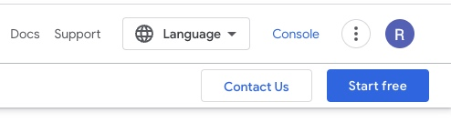
<br />
<br />

3. Create a `New Project` from the `Manage Resources` page. Can be found using the search box at the top of the page.

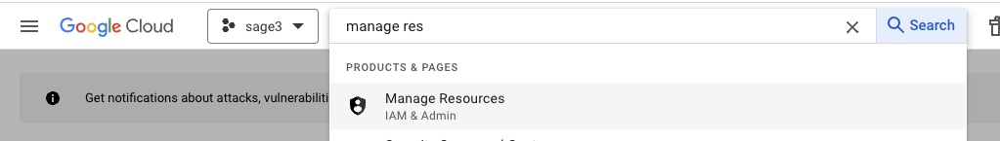
<br />
<br />

4. Click `CREATE PROJECT`.

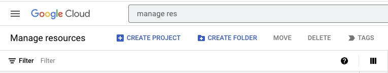
<br />
<br />

5. Enter the information and click `Create`. (The information here is just organization/hierarchy information.) It might take a few minutes for it to be created.

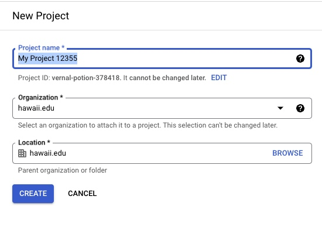

6. Go back to the homepage by clicking the Google Cloud icon in the upper left corner.

7. From the drop down menu at the top of the page select your newly created project.

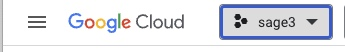
<br />
<br />

8. Open the `Credentials` page from the main dropdown menu.

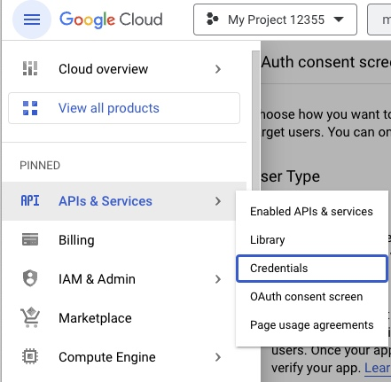
<br />
<br />

9. Click `Create Credentials` and select `OAuth client ID`

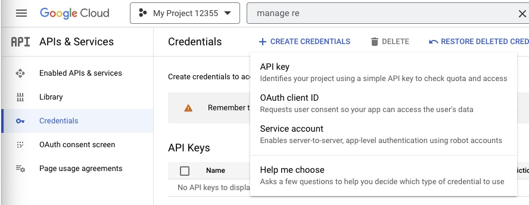
<br />
<br />

10. If it requests to `Configure Consent Screen` click the button. If not continue to step 15.

11. OAuth Consent Screen. Select External and click create. Enter the information below. All the other fields can be left blank.

- **App name:** The Name of the SAGE3 Server.
- **User support email:** The email of the person managing your SAGE3 server.
- **Authorized Domain:** The `domain` of your SAGE3 Server. (Ex. For `https://sage3.manoa.hawaii.edu` it is `hawaii.edu`)
- **Developer contact information:** The email of the person managing your SAGE3 server.

12. Scopes. Click `ADD OR REMOVE SCOPES` and select `../auth/userinfo.email` and `../auth/userinfo.profile` then click `UPDATE`. Then click `SAVE AND CONTINUE`

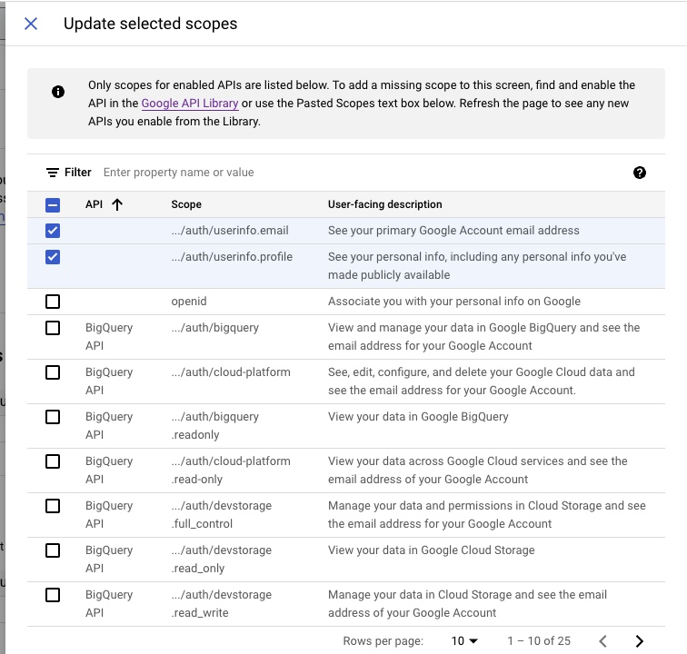
<br />
<br />

13. Test Users. Click `SAVE AND CONTINUE`

14. Summary. Click `BACK TO DASHBOARD`

15. Create OAuth client ID.

- **Application Type:** `Web application`.
- **Name:** The name of your OAuth 2.0 client. This name is only used to identify the client in the console and will not be shown to end users.
- **Authorized JavaScript origin:** Click `ADD URI` and enter you server's URL. (Ex. `https://sage3.manoa.hawaii.edu`)
- **Authorized Redirect URIs:** Click `ADD URI` and enter you server's URL with the route `/auth/google/redirect` attached. (Ex. `https://sage3.manoa.hawaii.edu/auth/google/redirect`)

16. Click `CREATE` and you should be shown the following screen with your `CLIENT_ID` and `CLIENT_SECRET`.

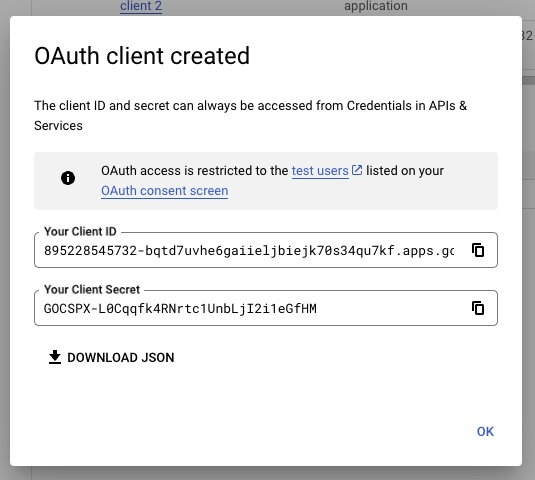
<br />
<br />

17. Copy the `CLIENT_ID` and `CLIENT_SECRET` into the SAGE3 Server Configuration file located here: `/configurations/node/sage3-prod.hjson`. They should be copied in the `auth.googleConfig` fields under `clientID` and `clientSecret`.

18. Ensure within the SAGE3 Server Configuration you have `google` listed in the `auth.strategies` array.

Test logging into your SAGE3 server using the `Login with Google` button on the homepage.

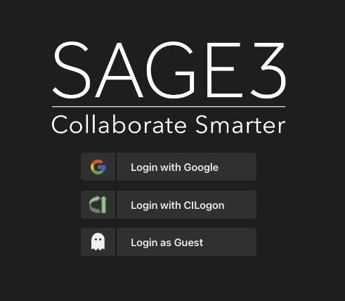
<br />
<br />

### Apple Login

- Need an Apple Developer Account: https://developer.apple.com/account
- Documentation:
  - Official documentation: "Sign in with Apple JS" https://developer.apple.com/documentation/sign_in_with_apple/sign_in_with_apple_js
  - Module documentation: https://github.com/ananay/apple-auth/blob/master/SETUP.md
- You will need several items:
  - Create a new App ID:
    - Navigate down to "Capabilities", and select "Sign in with Apple".
    - 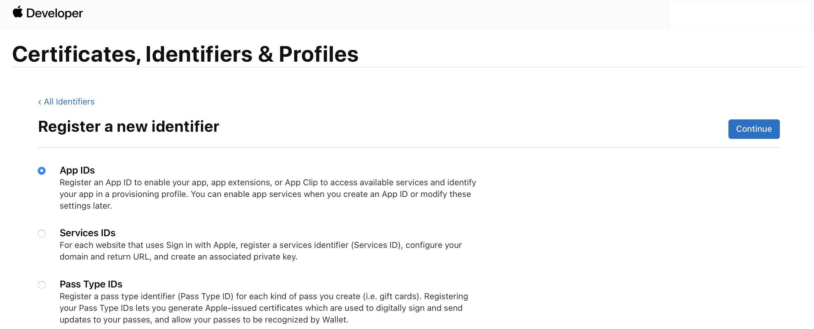
    - 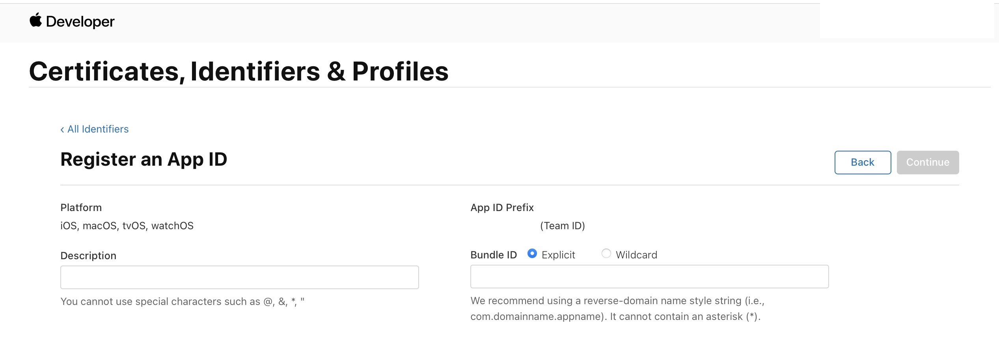
  - Create a service ID
    - Fill out the details, and click configure on "Sign in with Apple".
      - "Domains and Subdomains": the hostname of your server (e.g. `sage3.hawaii.edu`)
      - "Return URLs": the URL called back by Apple after login (e.g. https://sage3.hawaii.edu/auth/apple/redirect)
      - 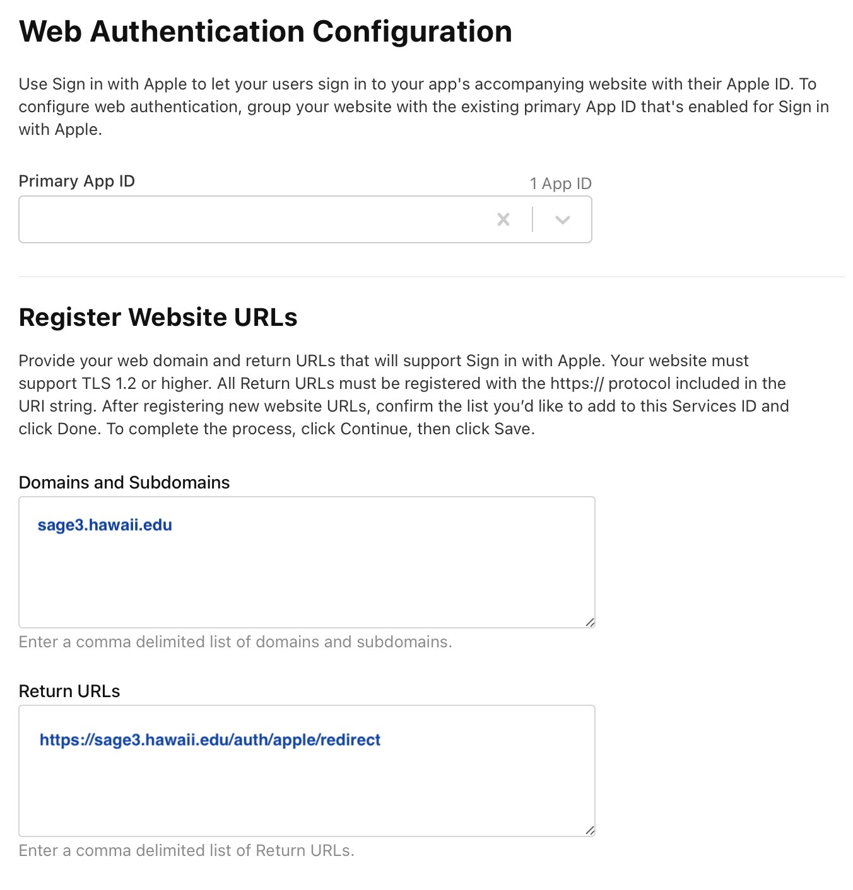
  - Create a key:
    - Go to the "Keys" section in your Developer account and create a key and configure on the "Sign in with Apple" option. Click continue and register. Click on `Download` (your only chance) and rename it `apple-key.p8`.
    - 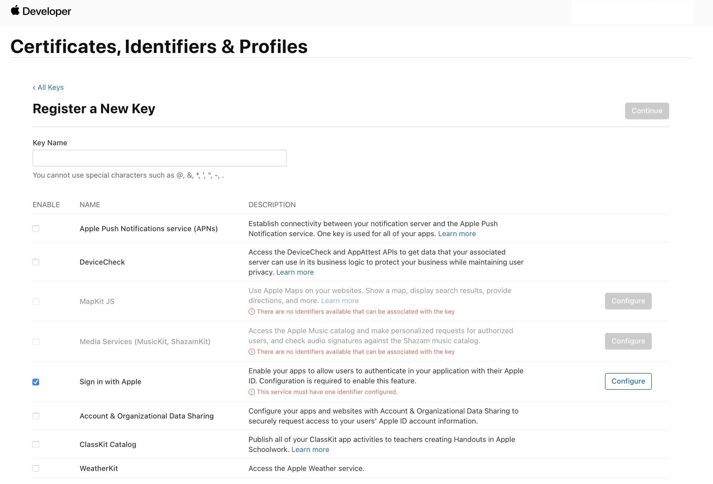
- Configuring SAGE3:

```json5
    // Apple configuration
    "appleConfig": {
      // This is actually called the "Service ID" that you created in the 'Identifiers' section
      "clientID": "something com.sage3.blabla",
      // Your Apple developer team ID: 10-character string, upper-case letters and numbers
      "teamID": "XXXXXXXXXX",
      // keyID is the identifier for the private key you generated: 10-character string, upper-case letters and numbers
      "keyID": "XXXXXXXXXX",
      // Private key file location that you downloaded
      "privateKeyLocation": "./keys/apple-key.p8",
      // The URL that Apple will call back after login, no need to change
      "callbackURL": "/auth/apple/redirect",
      "routeEndpoint": "/auth/apple"
    },
```

### CILogon

To enable CILogon Login for users from the Login page you must request a CILogon. CILogon provides a standards-compliant OpenID Connect (OAuth 2.0) interface to federated authentication for cyberinfrastructure.

Instructions to do so are located here:

[CILogon OpenID Connect (OAuth 2.0)](https://www.cilogon.org/oidc)

To register, use this link: [CILogon Client Registration](https://cilogon.org/oauth2/register)

- **Client Name:** The Client Name is displayed to end-users on the Identity Provider selection page.
- **Contact Email:** This email address is used for operational notices regarding your client and for validating your affiliation. A mailing list address for your operations team is recommended.
- **Home URL:** URL of the Server (Ex. https://sage3.manoa.hawaii.edu)
- **Callback URLs:** To ensure CILogon redirects back to the SAGE3 server after the user logins, postfix your server URL with: `/auth/cilogon/redirect`. (Ex. https://sage3.manoa.hawaii.edu/auth/cilogon/redirect)
- **Client Type:** Confidential
- **Scopes:** Ensure `openid` and `email` are selected.
- **Refresh Tokens:** No

After Registering the Client you should be shown a `Client Identifier` and `Client Secret`.

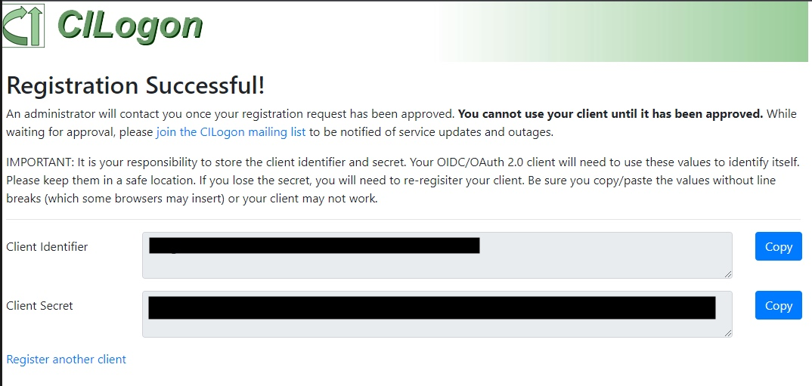

Copy this down somewhere safe. OpenID OIDC should email you at the `contact email` from above within a day or two to confirm your request has been approved.

With in the Server Configuration file `configurations/node/sage3-prod.hjson` under the `auth.cilogonConfig` paste the `Client Identifier` and the `Client Secret` into their respective fields. Also ensure the array `auth.strategies` contains `cilogon` to enable the feature.

Test logging into your SAGE3 server using the `Login with CILogon` button on the homepage.


<br />
<br />

Which should redirect to a page that looks like:

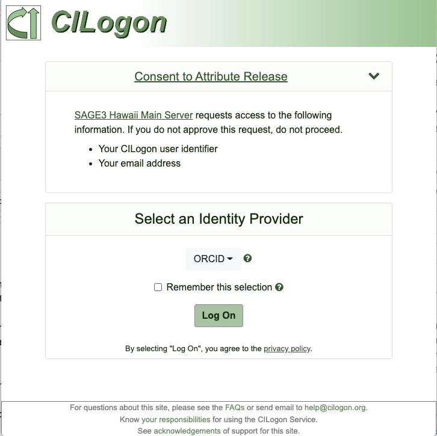
<br />
<br />

### Twilio

[Twilio](https://www.twilio.com) provides programmable communication tools for handling the Screenshare portion of SAGE3. It's an affordable option and allows multiple screenshares within board. SAGE3 uses Twilio's `Video Groups` and more information about it can be found [here](https://www.twilio.com/en-us/video/pricing).

To enable screen sharing on your SAGE3 server:

1. Signup for a Twilio Account. [Twilio Registration](https://www.twilio.com/try-twilio)

2. Verify your account.

3. After creating you should be shown the page below. Select:

- `Video`
- `Other`
- `With code`
- `JavaScript`
- `No, I want to use my own hosting service`

Then click `Get Started with Twilio`.

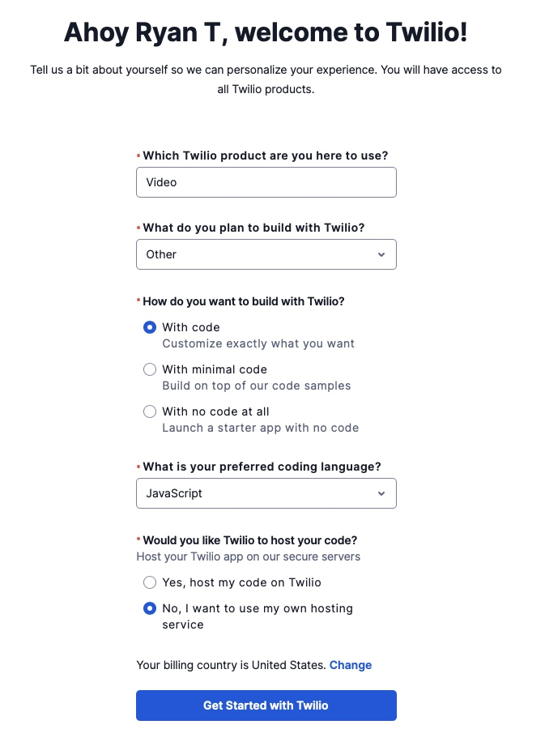
<br />
<br />

4. Navigate to the `Auth Token & API Keys`

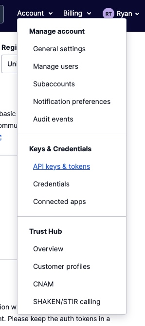
<br />
<br />

5. Click `Create API key`

6. Fill in the form.

- **Friendly name:** A friendly name for this `API Key` that shows in the Twilio console.
- **Region:** Select the region that is closest to the majority of your SAGE3 users.
- **Key type:** Standard

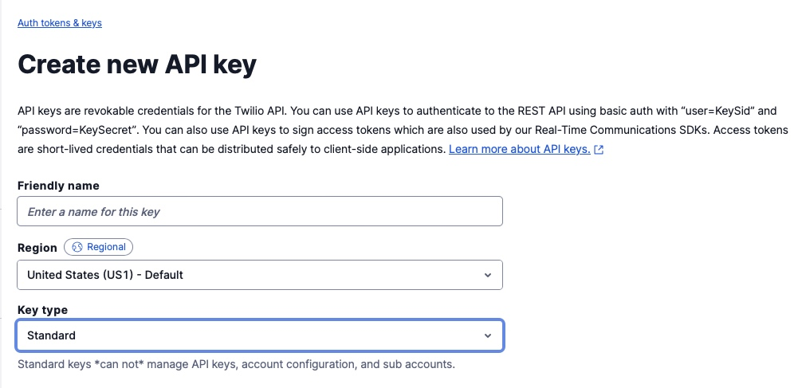
<br />
<br />

7. You will then be shown your `SID` and `Secret`. Copy these down somewhere safe. Click `Done`.

8. Navigate to the `Auth Token & API Keys`

9. Under `Live credentials` copy down the `Account SID`.

10. You will now have three keys/tokens. `Account SID`, `SID`, and `Secret`.

11. Copy these keys/tokens to the SAGE3 Server Configuration file located `/configurations/node/sage3-prod.hjson`. Under the `services.twilio` enter the three keys/tokens into the following fields:

- accountSid: `Account SID`
- apiKey: `SID`
- apiSecret: `Secret`

12. Ensure the "Screenshare" app is enabled by adding "Screenshare" to the `features.apps` array in the SAGE3 Server Configuration file located `/configurations/node/sage3-prod.hjson`.

### CoBrowser

CoBrowser is a shared web browser app that streams a live Firefox session to all users on the board. It requires a separate VEO server — a container orchestration service that manages the Firefox VNC instances.

To enable CoBrowser on your SAGE3 server:

1. Obtain access to or deploy a VEO server. Contact the SAGE3 team if you need access to a shared VEO instance.

2. Add the VEO server URL to your `sage3-prod.hjson` configuration file:

```json
// VEO VNC container orchestration server
"veoServer": {
  "url": "https://your-veo-server-url"
}
```

3. Add `"CoBrowser"` to the `features.apps` array in the same configuration file:

```json
"features": {
  "apps": ["CoBrowser", "Chat", ...]
}
```

4. Restart the server (`./STOP` then `./GO`) for changes to take effect.

Without the `veoServer` URL configured, the CoBrowser app will appear in the Applications panel but will not function.
